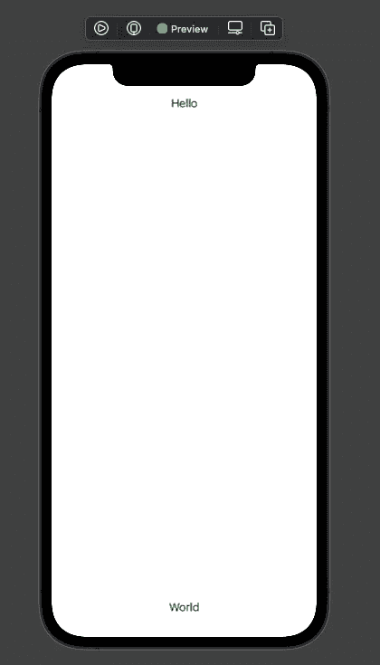
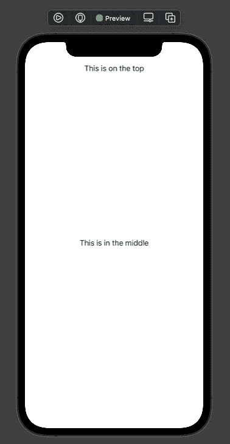
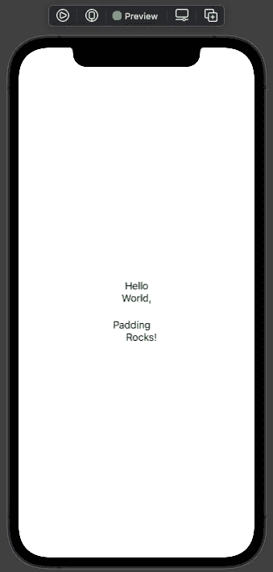
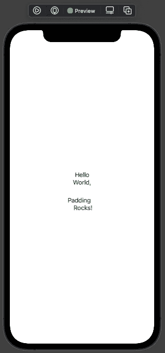

# 理解 Swift UI 中的分隔符和填充。

> 原文：<https://medium.com/geekculture/understanding-spacers-and-padding-in-swift-ui-e1fb5f6efa44?source=collection_archive---------5----------------------->


Photo by [Cookie the Pom](https://unsplash.com/@cookiethepom?utm_source=medium&utm_medium=referral) on [Unsplash](https://unsplash.com?utm_source=medium&utm_medium=referral)

又见面了！今天的文章将关注 Swift UI 中的间隔和填充。当您开始使用 Swift UI 设计用户界面时，您会注意到您添加的许多元素会根据您在其中创建元素的堆栈类型自动放置在屏幕上。那么，如果你想手动调整对象之间的间距以获得想要的外观，会发生什么呢？这就是垫片和衬垫发挥作用的地方。今天，我们将讨论这两个选项，以及在 UI 设计中何时使用它们。

**垫片:**

间隔是在用户界面设计中均匀分隔对象的好方法。在设计布局时，间隔条*并没有*提供最大的可调整性，但是它们确实提供了一种快速简单的方法来在你的 UI 中垂直或水平地均匀分布项目。您可以从下面的示例中了解如何在 Swift UI 中使用垫片:

```
struct SomeView: View {
   var body: some view {
      VStack {
         Text("Hello")
         Spacer()
         Text("World")
      }
   }
}
```



在这个例子中，我们在垂直堆栈中的两个文本对象之间放置了一个间隔符。这个间隔符要做的是将第一个文本对象放在栈顶，将第二个文本对象放在栈底。如果我们想要一个文本对象在栈顶，第二个文本对象在中间，我们将使用下面的语法:

```
struct SomeView: View {
   var body: some view {
      VStack {
         Text("This is on the top")
         Spacer()
         Text("This is in the middle")
         Spacer()
      }
   }
}
```



通过在两个文本对象之间放置一个间隔符，然后在最后一个文本对象下面放置另一个间隔符，我们将看到第一个对象放在堆栈的顶部，第二个对象放在中间。正如你所看到的，间隔是快速开始设计你的用户界面并让你的视图元素被恰当放置的好方法。

**填充:**

间隔器是 Swift UI belt 中的一个很好的工具，但是如果您想要更多地控制 UI 元素在视图上的确切位置，该怎么办呢？这就是填充材料发挥作用的地方。填充为开发人员提供了一种方式来指定他们希望在元素的前导、尾随、顶部和底部放置的确切填充量。这使得开发人员可以完全控制对象在视图中的最终位置，并允许在设计阶段进行惊人的定制。下面是一个没有任何修改的基本填充示例:

```
struct SomeView: View {
   var body: some view {
      Text("Hello World").padding()
   }
}
```


通过利用。padding()在 UI 元素上，Swift UI 将在整个对象周围放置系统计算的填充量。如果您想要在对象的特定一侧放置填充，比如说对象的顶部，您可以使用下面的示例来实现:

```
struct SomeView: View {
   var body: some view {
      VStack {
         Text("Hello").padding(.top)
         Text("World,").padding(.bottom)
         Text("Padding").padding(.trailing)
         Text("Rocks!").padding(.leading)
      }
   }
}
```



从这个例子中可以看出，我们只在第一个文本元素上放置了顶部填充，在第二个文本元素上放置了底部填充，在第三个文本元素上放置了尾部填充，在最后一个文本元素上放置了前导填充。

如果我们想在对象上设置特定的填充量，而不是使用系统计算的填充量，该怎么办？不要担心，因为 Swift UI 也为您提供了这方面的支持！只需在填充声明中声明元素的填充量，就可以设置特定的填充量。请参见下面的示例以供参考:

```
struct SomeView: View {
   var body: some view {
      VStack {
         Text("Hello").padding(.top, 10)
         Text("World").padding(.bottom, 20)
         Text("Padding").padding(.trailing, 15)
         Text("Still Rocks!").padding(.leading, 5)
      }
   }
}
```



从上面的例子可以看出，为元素的每一边设置特定的填充量再简单不过了！

**结论:**

今天，我们已经讲述了在 Swift UI 中利用间隔和填充设计定制 UI 的基础知识。如您所见，在使用 Swift UI 构建复杂的用户界面时，这些都是需要了解和理解的非常强大的代码。继续并测试我们今天讨论的内容，看看使用 Swift UI 开始设计有多简单！一定要看看我之前关于 Swift UI [这里](/geekculture/understanding-hstack-vstack-and-groups-in-swift-ui-e2f2e138f0e6)和[这里](https://abeck-lb.medium.com/need-to-know-property-wrappers-in-swift-ui-bc9f4ce6e328)的文章。如果您喜欢我的文章，请关注我的页面，因为我将继续深入探讨与 Swift UI 和 iOS 开发相关的更多主题！