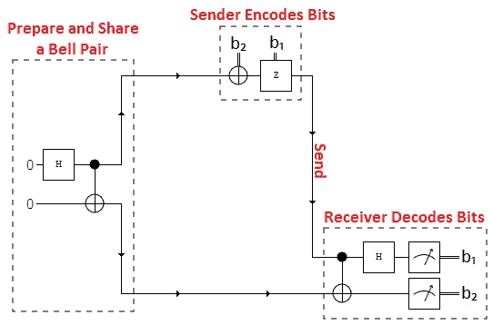
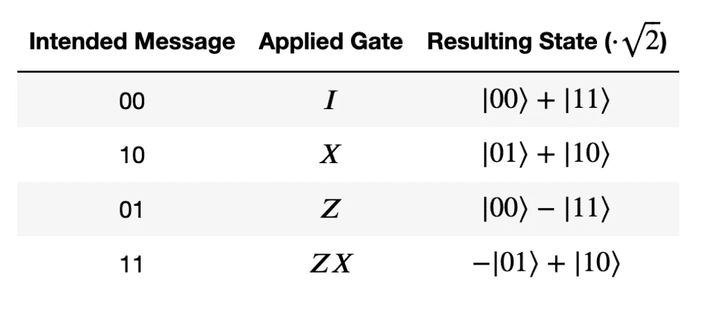
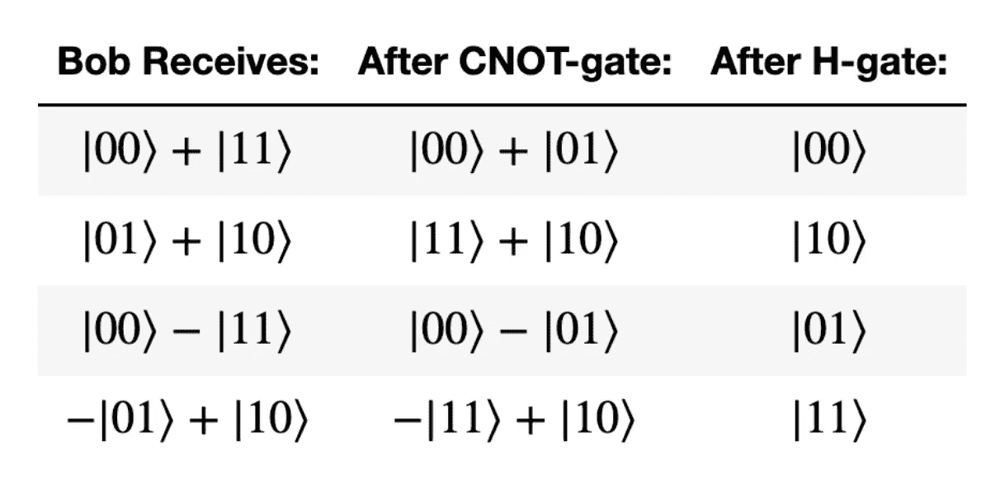
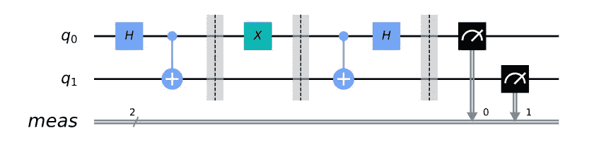

# 理解超密集编码

> 原文：<https://medium.com/geekculture/understanding-superdense-coding-c10b42adecca?source=collection_archive---------1----------------------->

## 一篇超密集编码这一非常重要的量子通信协议的深度讲解和教程。

Unsplash

# 这是什么？

超密集编码是一种量子通信协议，允许发送者仅利用一个量子比特向另一个用户发送两个经典比特的信息。

超密集编码由查尔斯·贝内特和斯蒂芬·威斯纳于 1992 年首次提出，并在四年后的 1996 年通过实验得以实现。

现在，需要注意的是，虽然超密集编码和量子隐形传态密切相关，但它们之间有一个关键的区别。量子隐形传态是一个用户可以使用两个经典比特传输一个量子比特的过程，而超密集编码是一个用户可以使用一个量子比特传输两个经典比特的过程。基本上，超密集编码可以被认为是量子隐形传态的翻转版本。

# 协议

超密集编码涉及三方，姑且称之为查理、爱丽丝和鲍勃吧。它需要希望交流两位信息的两方、一对纠缠量子位和一个量子通道。

Diagram of Protocol

查理准备了一对贝尔态或最大纠缠态的量子比特，这只是意味着这两个量子比特表现出完美的相关性，即使它们在空间上是分离的(即使距离很远)。

然后，Charlie 将这些量子位发送给 Alice 和 Bob，这样他们就可以共享它们(一个量子位给 Alice，另一个给 Bob)。然而，在 Alice 尝试使用她的 Bell 态量子比特向 Bob 传输 2 个经典比特的信息之前，她必须应用基于预期消息的单个门操作:

Qiskit: Encoding Rules (Alice Protocol)

鲍勃是个非常聪明的人。他知道，既然爱丽丝的量子位元是纠缠在一起的，这两个量子位元一定是在四个贝尔态中的一个。因此，一旦鲍勃接收到爱丽丝的编码量子位，他就会将它和他未接触的贝尔态量子位通过一个反向贝尔电路(爱丽丝的量子位充当控制，鲍勃的量子位是目标)，以便解码爱丽丝的信息。因此，鲍勃将从单个量子位中获得两个经典信息位！

Qiskit: Bob Decoding Process

# 安全性

超密集编码和量子隐形传态是安全量子编码的基本原理，因为它消除了窃听者拦截消息的可能性。

假设一个名叫伊芙的窃听者在发送给鲍勃的途中截获了爱丽丝的编码量子位。Eve 将只有 1/2 的纠缠态，并且无法访问 Bob 的量子位(这是解码 Alice 的量子位所必需的)，Eve 将无法从 Alice 的量子位中获得信息。此外，任何试图测量爱丽丝或鲍勃的量子位的尝试都会破坏所述量子位的状态，并警告他们两个。

# 用 Qiskit 编码

现在我们已经对超密集编码有了基本的了解，我们可以利用 Qiskit，一个用于量子计算机的开源软件开发工具包来测试它。你可以在这里访问他们的官方教程[。](https://qiskit.org/textbook/ch-algorithms/superdense-coding.html)

## 1.导入必要的包

## 2.在一个 2 量子位的电路中，通过应用一个 H 门和一个 CNOT 来创建纠缠的量子位对

## 3.用适当门对消息进行编码

## 4.通过应用 CNOT 后接 H 门来解码消息

这是量子电路的可视化表示:

# 优势

除了提供一种非常安全的传输信息的方式之外，超密集编码(以及一般的量子信息)允许你在决定你想要发送的内容之前以及在你实际决定传送所述内容之前提前提供一些资源。它允许你在决定给 Bob 发送一些信息时做最少的必要工作。

此外，超密集编码还允许比传统传输快两倍的传统位传输。

Pinterest

## 参考文献

 [## 超密集编码

### 新的 Qiskit 教材测试版现已推出。现在就试试吧这款笔记本展示了超高密度编码(SDC)…

qiskit.org](https://qiskit.org/textbook/ch-algorithms/superdense-coding.html)  [## 超密集编码

### 超密集编码是一种量子通信协议，允许发送者发送两个经典比特的…

www.wrelks.com](https://www.wrelks.com/2020/12/28/superdense-coding-algorithm-qiskit-tutorial/)  [## 超密集编码—维基百科

### 在量子信息论中，超密集编码(也称为密集编码)是一种量子通信协议…

en.wikipedia.org](https://en.wikipedia.org/wiki/Superdense_coding#Security)  [## 揭秘超密集编码

### 在本文中，我将通过一些示例代码来帮助揭开量子超密集编码背后的神秘面纱…

medium.com](/qiskit/demystifying-superdense-coding-41d46401910e) 

*嗨！我是尼迪·贾达夫。我今年 17 岁，对人工智能和量子计算有着难以置信的热情。非常感谢您阅读我的文章！如果你想了解更多新兴技术，请关注我，通过* [*Linkedin*](https://www.linkedin.com/in/nidhii-jadhav/) *与我联系，或者发邮件到 nidhivjadhav@gmail.com 询问任何问题。再次感谢！*