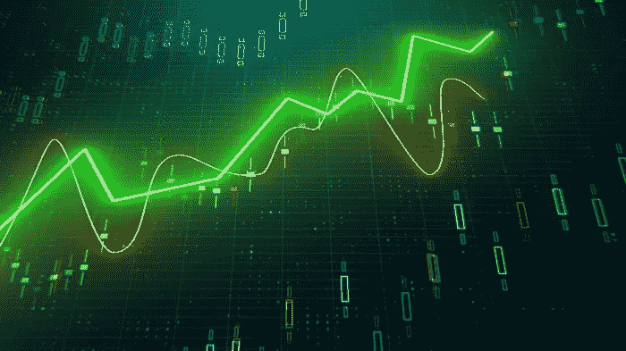

# 理解 Python 中的 Aroon 振荡器

> 原文：<https://medium.com/geekculture/understanding-the-aroon-oscillator-in-python-f0a7576fbbcf?source=collection_archive---------13----------------------->

## 如何编码和交易阿隆振荡器

趋势跟踪也值得彻底研究，因为许多已知的指标在跟踪趋势方面做得很好。众所周知，由于对新趋势的确认，趋势跟踪策略存在一定的结构性滞后。它们更多的是关于市场中的时间，而不是把握市场时机。在这个…