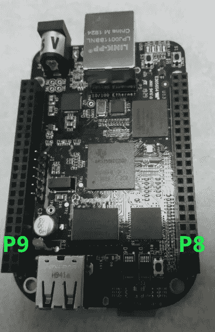

# 了解 BeagleBone Black 通用输入/输出的基础知识

> 原文：<https://medium.com/geekculture/understanding-the-basics-of-general-purpose-input-outputs-on-the-beaglebone-black-1568aacd67c9?source=collection_archive---------1----------------------->

# 扩展集管的布局

简单地说，有两个扩展标题:左手边在 BeagleBone 黑色文献中被称为“P9”，而右手边被称为“P8”。

扩展接头的每个引脚都有一定的意义。