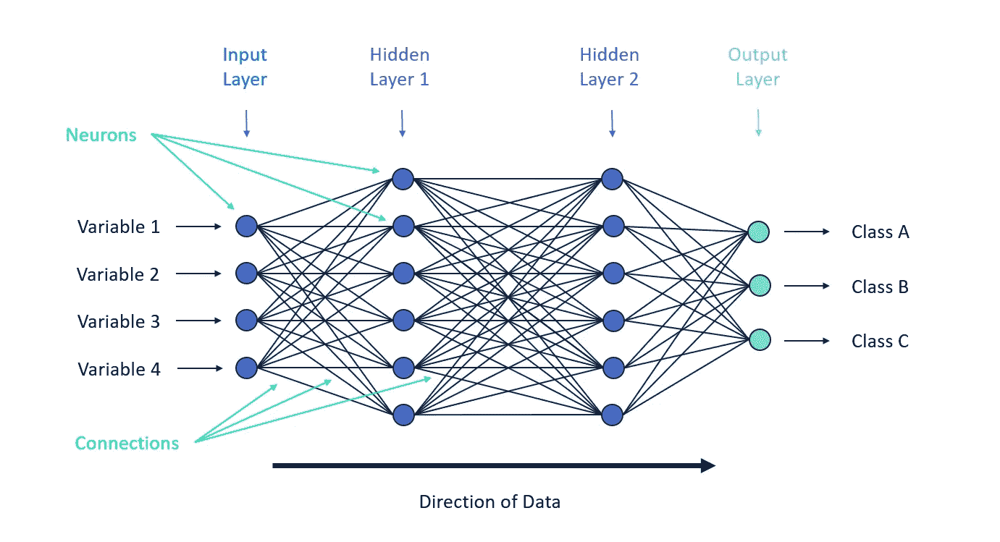
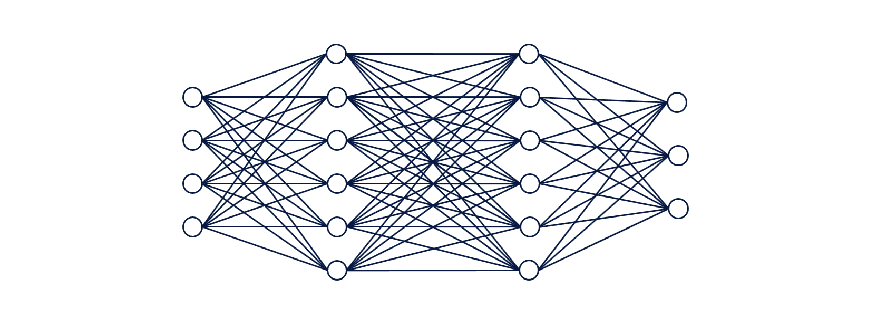

# 理解神经网络的基础(适用于初学者)

> 原文：<https://medium.com/geekculture/understanding-the-basics-of-neural-networks-for-beginners-9c26630d08?source=collection_archive---------12----------------------->

## 让我们来了解一下神经网络背后的魔力:隐藏层、激活函数、前馈和反向传播！

任何在人工智能驱动的数据分析领域工作的人都应该知道神经网络，因为它是令人兴奋的深度学习领域的基石。虽然人工神经网络(ANN)的想法自 20 世纪 40 年代就已经存在(*沃伦麦卡洛克和沃尔特皮茨创建了第一个神经网络计算模型* ) **，**)，但最近数据可用性和计算能力的激增使神经网络及其变体重新成为人们关注的焦点**。**

有许多与神经网络相关的[成功故事](https://www.healthcareitnews.com/news/top-10-ai-and-machine-learning-stories-2020)，这些模型观察到的高精度对于有抱负的数据科学家来说是令人兴奋的消息。*但我也看到许多人在使用最新最复杂的深度学习模型的竞赛中陷入困境，而不知道它们是如何工作的*。这种方法的问题是，他们不能理解或解释模型的输出，这限制了他们在默认版本失败时有效调整模型的能力。

这促使我写了一系列关于神经网络如何工作、关键参数是什么以及如何有效训练它们的博客。我将在另一个博客系列中添加详细的 python 代码(使用 Keras 和 Pytorch 库)来帮助读者实现这些方法。

我们将从理解神经网络如何工作开始。最好的开始方式是用动物大脑中的生物神经网络进行类比。这就是为什么神经网络中的每个单独的组件被称为神经元，它们之间的链接被称为连接(*见下面的*图 1)。这些模型通过考虑输入变量和[目标变量](https://www.datarobot.com/wiki/target/)之间的关系来“学习”执行任务(如[回归](https://en.wikipedia.org/wiki/Regression_analysis)或[分类](https://en.wikipedia.org/wiki/Statistical_classification)，而不指定任何预定义的规则。神经网络的工作涉及三个关键概念:

1.  *图层(输入、隐藏和输出)*
2.  *前馈*
3.  *反向传播*

## 层(输入、隐藏和输出)

Image 1: Neural Network Structure

神经网络中有三种类型的层:

1.  **输入层**:接收神经网络的输入数据。它不对输入值进行任何计算，而只是将值传递给下一层。在图 1 的网络中，我们有 4 个输入值:x1、x2、x3 和 x4。
2.  **隐藏层**:这些是输入层和输出层之间的中间层，所有的魔法都在这里发生！这一步我们需要知道几个技术术语:
    **a .权重:** *每个神经元都与一个权重相关联，这个权重代表了单元之间连接的强度。接近零的权重意味着改变神经元的输入不会改变输出，而负权重意味着增加输入会减少输出。* **b .激活函数:** *隐层和输出层中的每个神经元都将前一层的输出作为输入，对权重和输入的和积应用函数。这种功能称为激活功能。我们在选择这些激活函数时需要非常小心(关于如何做的更多细节可以在这个* [*博客*](https://indraneeldb1993ds.medium.com/activation-functions-and-loss-functions-for-neural-networks-how-to-pick-the-right-one-542e1dd523e0)*)* **c .深度网络:** *如果神经网络至少有两个隐藏层，那么它被称为深度神经网络* **d .密集层:** *这些层中的每个神经元接收来自其前一层的所有神经元的输入*

让我们试着更好地理解这些层，因为大部分计算都发生在这里。在图 1 的网络中，我们有 2 个深度为 6 的隐藏层(即每层有 6 个神经元)。关注第一个隐藏层，我们可以观察到它的所有神经元都将获得输入层中所有 4 个神经元的输入。我们如何检查这个？只需检查从输入层的每个神经元到第一个隐藏层的每个神经元的连接数。
然后，我们可以得出结论，在第一个隐藏层中，将有 4 个与每个神经元相关联的权重(如果存在偏差项，那么它将是 5)。假设第一隐藏层中的第一个神经元的权重是 w1、w2、w3 和 w4，与该神经元相关联的激活函数将看起来像:

***F((w1 * x1)+(w2 * x2)+(w3 * x3)+(w4 * x4))=输出***

类似于第一个隐藏层中的第一个神经元，该层中的其他神经元将具有自己的权重和激活函数。第一层的输出成为第二隐藏层中神经元的输入。我们可以观察到所有的隐藏层都很密集*。*因此*，*第二隐层中的每个神经元将有 6 个权重。最后，第二层的输出成为输出层的输入。

**3。输出层**:使用最终隐藏层的输出作为输入，生成最终输出。在图 1 的网络中，最后的隐藏层从它的 6 个神经元产生 6 个输出。因此，将有 6 个权重与输出层中的每个神经元相关联。重要的是要记住，我们必须根据任务(回归与分类)在输出层中选择适当数量的神经元和适当的激活函数。在我们的例子中，我们用三个类进行多类分类。因此，我们可以使用 3 个神经元和一个 softmax 激活函数。

如果熟悉矩阵运算，所有这些数学都可以用矩阵符号[简洁地表示出来。为神经网络选择正确的架构可以使其性能完全不同，我们将在这篇](https://ml-cheatsheet.readthedocs.io/en/latest/forwardpropagation.html)[博客](https://indraneeldb1993ds.medium.com/activation-functions-and-loss-functions-for-neural-networks-how-to-pick-the-right-one-542e1dd523e0)中对此进行详细讨论。

## 正向输送

**Image 2: Feed Forward Neural Network for Classification** (*Courtesy:* [*Alteryx.com*](https://community.alteryx.com/t5/Data-Science/It-s-a-No-Brainer-An-Introduction-to-Neural-Networks/ba-p/300479)*)*

前向传播是基于给定输入获得神经网络输出的过程。它实际上是指上一节中定义的过程，输出称为预测值。给定来自输入层的输入，第一个隐藏层中的每个神经元计算变换 *z = W*x + b* (W 是权重矩阵，x 是输入矩阵，b 是偏置向量)，然后对变换应用激活函数。如图 2 所示，该过程对后续图层重复进行，最终输出图层生成预测。然后，可以将预测值与实际目标变量进行比较，以了解预测的好坏。实际值和预测值之间的差异称为误差，然后我们可以定义一个损失函数来计算这个误差。基于手头的任务，有各种各样的损失函数，我们将在下一篇[博客](https://indraneeldb1993ds.medium.com/activation-functions-and-loss-functions-for-neural-networks-how-to-pick-the-right-one-542e1dd523e0)中讨论不同场景下的最优损失函数。然后，神经网络试图通过使用反向传播(我们接下来讨论)最小化损失函数来找到最佳权重。

## 反向传播

Image 3: Finding the minimum of loss function

如前所述，我们通过前馈得到一个输出值，即*预测值*。我们通过使用计算预测值和实际值之差的损失函数来计算预测值的好坏。然后，我们尝试使用优化器(如梯度下降)来确定与所有神经元相关的权重值，使损失函数最小化(见图 3)。这个过程被称为反向传播。有多种优化器可以用来执行回溯，我们将在我未来的博客中讨论流行的优化器的优缺点。模型构建器可以决定运行多少次训练迭代(称为历元),在每次迭代中，反向传播过程会根据选择的优化器不断更新权重。

因此，反向传播算法允许信息从输出层反向通过网络，以便计算权重的最佳变化。它具有以下步骤:

1.  使用前馈机制计算预测值
2.  使用损失函数计算误差
3.  根据选择的优化器，确定权重更新的方向和幅度，以最小化损失函数(通常这一步包括计算导数)
4.  将优化器的输出乘以一个分数(称为学习率),因为我们不希望权重快速变化，这可能会阻止我们找到损失函数的最小值
5.  通过将步骤 4 的输出添加到原始权重来调整权重
6.  对于模型开发人员提到的时期数，重复步骤 1–5

# 结论

这个博客的目的是帮助开始探索深度学习的读者理解神经网络是如何工作的。我们了解到以下情况:

1.  神经网络中有哪些不同的层，它们是如何工作的？
2.  什么是激活函数、权重、密集层和深度网络？
3.  什么是前馈，它是如何工作的？
4.  反向传播包括哪些步骤？我们为什么需要它？

下一步是了解开发人员在选择激活和损失函数等关键组件时有哪些选项，以及如何选择正确的选项。请关注这个[博客](https://indraneeldb1993ds.medium.com/activation-functions-and-loss-functions-for-neural-networks-how-to-pick-the-right-one-542e1dd523e0)，在接下来的部分中了解更多！

你对这个博客有什么问题或建议吗？请随时留言。

# 感谢您的阅读！

如果你和我一样，对人工智能、数据科学或经济学充满热情，请随时添加/关注我的 [LinkedIn](http://www.linkedin.com/in/indraneel-dutta-baruah-ds) 、 [Github](https://github.com/IDB-FOR-DATASCIENCE) 和 [Medium](/@indraneeldb1993ds) 。

# 参考

1.  A.K. Jain、毛建昌和 K. M. Mohiuddin，“人工神经网络:教程”，载于*计算机*，第 29 卷，第 3 期，第 31-44 页，1996 年 3 月，doi: 10.1109/2.485891。
2.  神经网络的基础。美国:不扩散条约，1994 年。网络。