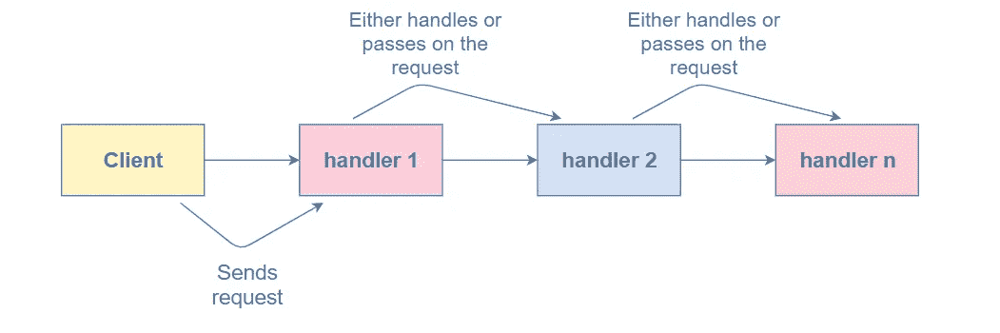
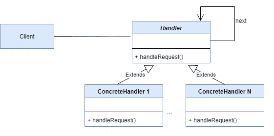

# 理解责任链模式

> 原文：<https://medium.com/geekculture/understanding-the-chain-of-responsibility-pattern-d729ef84621c?source=collection_archive---------1----------------------->


Photo by [Jon Tyson](https://unsplash.com/@jontyson?utm_source=medium&utm_medium=referral) on [Unsplash](https://unsplash.com?utm_source=medium&utm_medium=referral)

责任链模式是一种行为设计模式，我们用它来实现软件设计中的松散耦合，其中来自客户的请求被传递给一系列对象来处理它们。请求将通过处理程序接收，链中的对象将自己决定谁将处理该请求。这些对象中的每一个都包含某种类型的命令来处理请求。如果一个特定的对象不能处理该请求，它将把该请求传递给该链中的下一个对象。



Image: Chain of responsibility pattern concept (educative.io)

因此，这种模式的主要目的是避免耦合。例如，当向接收者发送消息时，发送者不知道接收者是谁，接收者也不知道发送者是谁。因此，接收者可以在不知道谁发送消息的情况下执行其任务，发送者也是如此。这意味着我们可以通过这种设计模式**解耦** **发送者和接收者**。

## 责任链模式的结构



Image: UML Representation (programmergirl.com)

正如您在 UML 图上看到的，它有 3 种类型的组件，分别命名为客户端、处理程序和具体处理程序。

**处理程序:**它定义了一个处理请求的接口。此外，这可以是一个抽象类，它主要接收请求并将请求转发给处理程序链。

具体的处理程序:这些处理程序负责处理它们收到的请求。如果一个特定的处理程序不能处理这个请求，它就把这个请求发送给它的后继者。

**客户端:**向链中可能处理命令的第一个对象发送请求。

> 注意:请求可以发送给链中的任何处理程序，但不一定是第一个。

# 责任链模式的用例

在这一章中，我将通过一个使用 Java 的真实例子来解释如何应用责任链模式。假设有一家公司为员工提供了一个基于几个事实请假系统。因此，公司在批准他们的休假前会考虑这些事实。例如，这些可能是**天数**、**员工级别**和**休假原因**。基于这些事实，休假请求将被转发给一个特定的人(休假处理者)，他可以处理这些请求。这个人可能是**团队领导、项目领导、人力资源或经理。**如果员工要求休假 7 天或更短时间，团队领导将处理该请求。但在批准休假请求之前，团队领导会检查员工的级别。如果员工级别在可接受的范围内，那么团队领导将批准休假请求。

如果员工请求休假 14 天或更少，团队领导不能处理该请求，因为他只有权批准最多 7 天的休假。在这种情况下，请求将被传递给有权处理该请求的项目负责人。然后，他将开始审批流程，与上一个流程相同。

然而，在上面的场景中，他们不会检查请假的原因。但是到了 HR 和经理层面，他们会去查请假的理由。如果员工要求最多 21 天，人力资源部会处理，如果超过 21 天，经理会处理。在处理请求时，他们会检查原因是**常规、关键、**还是**特殊**原因。然后，他们将根据这些事实批准或拒绝请求。

现在让我们看看这个例子的实现。

## 步骤 01

作为第一步，我已经实现了**【请假】**类。在“Leave”类中，我定义了类似于**、“天数”、“清空”和“原因”的字段。这些是公司在批准休假申请前将要考虑的事实。**

## 步骤 02

第二步，我们必须创建处理程序类。根据这个场景，我创建了一个名为**“leave handler”的抽象类。然后我在类中创建了“LeaveHandler”对象，因为处理程序应该知道它的后继者。**

此外，我还创建了一个接受“Leave”类对象的抽象方法。因此，每个要扩展“LeaveHandler”类的类都必须在它们的类中实现这个方法。

## 步骤 03

现在，我们必须为该公司的每个请求批准者(具体的处理者)实现一个单独的类。因此，我为团队领导、项目领导、人力资源和经理创建了一个单独的类。所有这些类都扩展了“LeaveHandler”类，并在其中实现了**“apply leave”**方法。

此外，我还创建了一个枚举来保存原因类型。

如您所见，“applyLeave”方法包含了这些类的核心逻辑。因此，无论何时处理者收到休假请求，它都会传递给团队领导。如果团队领导有权对该请求采取行动，他将处理并给出结果(批准/拒绝)。如果他没有权限，他将把它传递给链中的下一个人(项目领导)。如果没有人有权对请求采取行动(*如果员工请求超过 21 天，且原因是“特殊”*)，则该请求将被传递给经理(链的末端)，他将对该请求做出回应。

## 步骤 04

最后，我们可以运行应用程序了

输出:

```
Your leave days has been APPROVED by TeamLeader
Your employee Tier level is too low for request 5 days
Your leave days has been APPROVED by Project Leader
Your leave days has been APPROVED by HR
Your leave request has been DENIED by HR
Your leave days has been APPROVED by Manager
```

如果您感兴趣，可以使用下面的 GitHub 链接来查看我的责任链模式的完整实现。

[](https://github.com/nisal-kumara/krish-lp-training/tree/master/Design%20Patterns/ChainOfResponsibility) [## 尼萨尔-库马拉/克里希-LP-培训

### 在 GitHub 上创建一个帐户，为 nisal-kumara/krish-lp-training 的发展做出贡献。

github.com](https://github.com/nisal-kumara/krish-lp-training/tree/master/Design%20Patterns/ChainOfResponsibility) 

所以，这是我的文章的结尾，我希望你喜欢它。快乐编码👨‍💻。

# 参考

[](https://www.geeksforgeeks.org/chain-responsibility-design-pattern/) [## 责任链设计模式

### 责任链模式用于实现软件设计中的松散耦合，在这种情况下，来自客户的请求是…

www.geeksforgeeks.org](https://www.geeksforgeeks.org/chain-responsibility-design-pattern/)