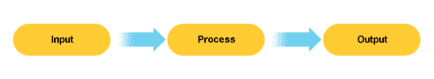

# 理解 JavaScript 闭包的核心概念。

> 原文：<https://medium.com/geekculture/understanding-the-core-concept-of-javascript-closure-49e3517e49a5?source=collection_archive---------14----------------------->

Photo by [Kaleidico](https://unsplash.com/@kaleidico?utm_source=medium&utm_medium=referral) on [Unsplash](https://unsplash.com?utm_source=medium&utm_medium=referral)

闭包的概念是 JavaScript 最吸引人的特性之一。在数据从调用栈中弹出后，函数怎么可能在它的执行上下文中记忆和保存数据呢？太神奇了！等等，这真的可以让我们用 JavaScript 做很多很酷的事情，不是吗？

在我们深入了解闭包是如何工作的之前，让我们看看 JavaScript 函数，它们是闭包真正发生的媒介。

# JavaScript 函数

JavaScript 函数是[对象数据类型](https://262.ecma-international.org/9.0/#sec-ecmascript-data-types-and-values)的一种变体，它接受被称为参数的数据，处理数据，并在被称为**执行上下文**的过程框架内返回值。

Stages in executing a function

## 执行上下文

创建函数的执行上下文是为了运行函数的代码。在上下文中，有两个部分:

1.  执行线程
2.  记忆

## 执行线程

这是执行上下文的一部分，它按照代码出现的顺序执行函数中的代码。这解释了 JavaScript 编程语言的单线程特性。

## 记忆

内存是执行上下文的一部分，用于存储处理执行上下文中的数据所需的数据。函数参数的值在函数中称为自变量。

参数以值的形式存储在内存中。有效值为**数据类型**和**函数。**函数调用，如 **add(3)** 不存储在内存中，而是进行评估，其结果/返回值存储在内存中。

## 调用栈

调用堆栈是 JavaScript 跟踪执行上下文或当前正在运行的函数的传统方式。

堆栈的首要原则是专注于堆栈顶部的内容，这意味着堆栈使用 **LIFO** (后进先出)策略。

> 一旦执行线程执行 return 语句或到达右花括号(})，执行上下文将自动销毁，数据将被垃圾收集。这时，在调用栈中作为栈帧的函数也被弹出栈。

注意上面的陈述，因为它将有助于理解本文后面的闭包是如何工作的。

# 高阶函数

JavaScript 中的高阶函数基本上是接受函数作为参数或在执行结束时返回函数的函数。

这是一种编写函数的优雅方式，它通过创建一个通用代码并接受一个指令函数来鼓励可重用性，该指令函数在运行时用特定于其逻辑的代码编辑函数。

> 函数是幕后的对象，作为属性存储在对象中的函数称为方法。参数不会让函数运行，圆括号 **()** 会让函数运行。

高阶函数是 JavaScript 闭包的基石，在这里您可以完整地看到闭包。我们去看看。

## 返回一个函数(闭包)

考虑下面的代码:

让我们按照 JavaScript 编译器的执行顺序来看一下这段代码。

1.  在第 1 行，我们看到一个函数声明。标签“higherOrderFunction”作为一个函数的值存储在全局内存中。
2.  编译器移到第 10 行。标签“squareRootOfSum”是在全局内存中创建的，但其值将是从函数“higherOrderFunction”的执行中返回的值。
3.  仍然在第 10 行，“higherOrderFunction”被添加到调用堆栈中，并且创建了一个新的执行上下文来运行带有参数 5 和 4 的“higherOrderFunction”。
4.  现在在“higherOrderFunction”执行上下文中开始执行线程，标签 a 和 b 分别以值 5 和 4 存储在**本地存储器**中。在第 2 行，标签 sum 存储在本地内存中，其值为 a 和 b 的和，应该等于 9。在第 3 行，一个标签“squareRoot”在本地内存中被创建，并被赋予一个**匿名函数表达式**。最后，在第 7 行，返回标签“squareRoot”。
5.  记住，在一个 return 语句或右花括号( **}** )之后，函数被弹出调用堆栈，**执行上下文与上下文**内本地内存中的数据一起被删除，最后返回值被分配为全局内存中的“squareRootOfSum”的值。
6.  太好了！现在回到第 10 行的全局执行线程，标签“squareRootOfSum”现在有一个值，它是一个由标签“squareRoot”标识的函数。
7.  编译器移到第 11 行。我们看到一条语句来记录执行“squareRootOfSum”的结果。因此，JavaScript 启动另一个执行上下文，因为标签名旁边有括号。但是什么函数将被添加到调用堆栈中呢？嗯……请记住，我们正在尝试运行“squareRootOfSum”的值，它是一个名为“squareRoot”的返回标签的标识符，该标签指向我们想要运行的实际函数。因此，我们的匿名函数表达式被添加到调用堆栈中。
8.  回到第 4 行，我们看到一个返回标签“sum”的平方根的语句。但是请记住，我们又回到了全局执行上下文中，在删除执行上下文时,“higherOrderFunction”中的“sum”值早已被删除，因此我们不再引用它。如果我们在全局内存中找不到任何标签“sum ”,这段代码不是应该用来破解我们的代码吗？是的，绝对应该。除了引擎盖下发生了一些精彩的事情😎

每当调用全局标签时，它与高阶函数没有任何关系，而是直接在自己的作用域中运行从高阶函数返回的函数，因此我们实际上无法访问高阶函数中的数据。

> 现在，返回的函数会带走返回函数代码中引用的本地内存中的变量，这样全局标签的值(返回的函数)就可以对高阶函数的本地变量进行受限的访问。这些变量存储在返回函数原型中一个名为“**[[范围]]”的属性中。变量被限制为仅在函数单独执行期间被访问。**

从上面的语句中，我们可以推断出，在第 7 行，当“squareRoot”函数被返回时，JavaScript 在函数的原型中自动创建了一个“[[scope]]”属性，并添加了值为 9 的标签“sum”，然后将其作为值返回给全局标签“squareRootOfSum”。因此，当我们在全局范围内运行“squareRoot”时，我们仍然可以访问标签“sum ”,并在算术平方根运算后返回值 3。然后 3 作为输出被注销。太神奇了！

## **这里是闭包的一些实际应用**

1.  **保存数据的辅助函数**。如果你想让一个函数只运行一次。当用户赢得游戏时只运行一次的功能。避免多次执行高数据计算。
2.  **迭代和生成器**。每次调用函数时，使用 closure 返回数组中的下一项。您可以通过在代码停止执行的地方保持不变来停止和继续执行带有闭包的线程。
3.  **模块模式**。通过用闭包存储状态并通过执行的函数访问状态，在应用程序的生命周期内保留全局状态，而不会污染全局名称空间。
4.  **异步编程**。如果我们想在完成一个异步任务后用它的初始数据运行一个函数，闭包在异步编程中非常有用。由于数据可以用闭包存储，这使得执行成为可能。

> 我希望这能给你一个更简单、更好理解的闭包概念，以及它是如何工作的。如果你喜欢这篇文章，你可以提问，分享你对结束的其他想法，并鼓掌。敬请关注更多关于 JavaScript 的精彩话题。干杯！