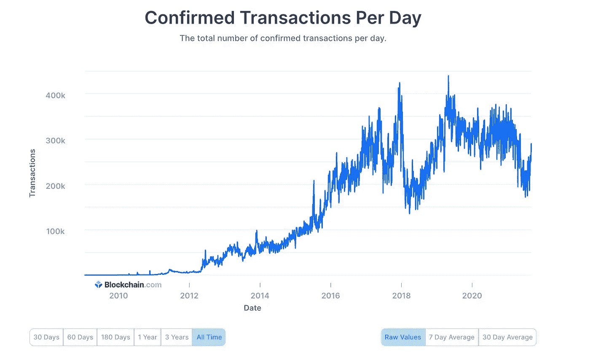
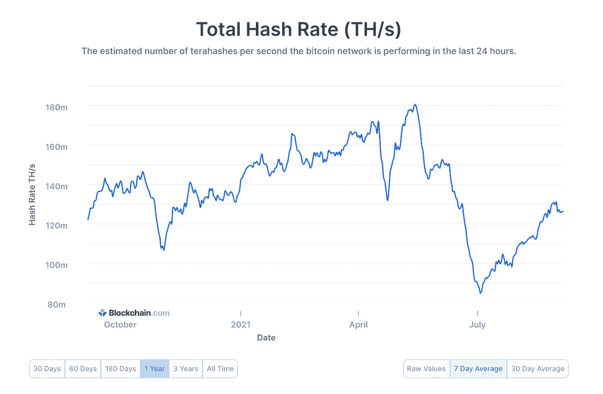
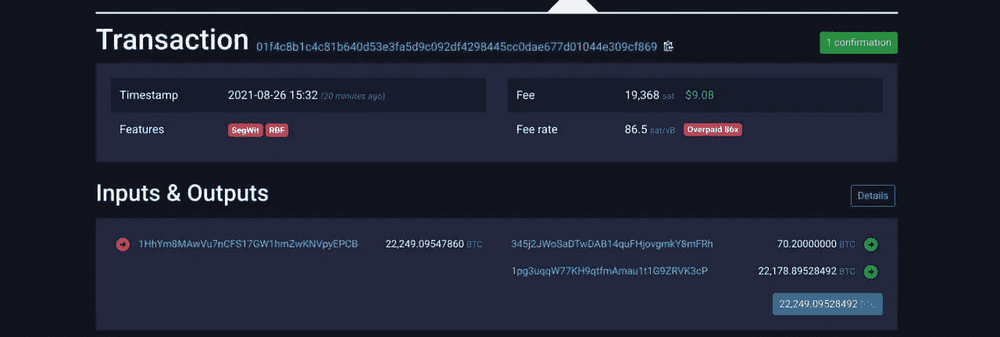

# 透过神秘的冬天了解去中心化的世界

> 原文：<https://medium.com/geekculture/understanding-the-decentralized-world-through-the-crypto-winters-edff53378d1a?source=collection_archive---------18----------------------->

> 我们害怕我们不了解的东西。我们害怕的东西，我们认为是邪恶的。我们认为邪恶的东西，我们试图去控制。我们无法控制的…我们攻击
> 
> —未知

# 寻找比特币

我不记得我到底是如何发现比特币的。但我清楚地记得是什么引起了我的注意。我曾在印度一家快速发展的初创公司担任产品经理。我们最近搬到了一个新的海湾。附近坐着一群刚从大学毕业的年轻工程师。偶尔在深夜，我会发现他们在进行生动的对话，看着屏幕上的图表兴奋不已。我会无意中听到一些不熟悉的词，如波纹和以太坊。经过讨论，我了解到这些人拥有加密货币。

好奇心战胜了我，我开始阅读加密货币。我的第一反应是怀疑。比特币的发明者中本聪曾在他们名为 [**比特币:点对点电子现金系统**](https://bitcoin.org/bitcoin.pdf) **的白皮书中介绍过比特币。在那个时间点上，我不确定一种已经变异成具有令人不安的波动性的投机交易工具的东西，是如何成为一种全球分散货币的。**

YCombinator 前总裁 Sam Altman 在他 2013 年的[帖子](https://blog.samaltman.com/thoughts-on-bitcoin)中发表了类似的观点。他分享了一个跟踪比特币应用的指标，即合法交易数量的增长。自从他写了这篇文章后，这个指标似乎一直在快速增长。

[Source](https://www.blockchain.com/charts/n-transactions) *Note — A single transaction can have multiple payments.*

没关系，当有聪明的年轻人对新事物如此热情，有坚定信念支持技术的利基社区时，你需要注意。我在谷歌上出现的第一个加密交易所创建了一个账户，看起来合法，并开始每月投入少量资金购买比特币。见鬼，我甚至还买了一点比特币现金，这是比特币的一个分支，旨在让交易更便宜、更快捷。

# **经历第一个冬天**

一个晴朗的日子，我的信用卡在交易所停止了工作。2018 年 4 月 6 日 RBI，印度央行曾发布通知，禁止实体与虚拟货币交易。

> 鉴于相关风险，现已决定，受储备银行监管的实体不得从事风险资本交易，也不得提供服务为任何个人或实体从事风险资本交易或结算提供便利。此类服务包括维护账户、注册、交易、结算、清算、根据虚拟代币发放贷款、接受虚拟代币作为抵押品、在与虚拟代币交易的交易所开立账户以及转移/接收与购买/出售虚拟代币相关的账户中的资金。— [打点](https://rbidocs.rbi.org.in/rdocs/notification/PDFs/NOTI15465B741A10B0E45E896C62A9C83AB938F.PDF)

比特币从 2017 年 12 月 19K 美元的高点跌至 2018 年 3 月的 7K 美元。三个月内下降了 63%。人们将加密冬天的到来与比特币价格暴跌联系在一起。在印度，它正在失去进入密码交易所的机会。我不再公开表示怀疑。但那时我也不会称自己为信徒。我个人对比特币的看法是谨慎的乐观主义者。

# 重新发现加密

几年过去了。我已经停止积极跟踪这个领域的发展。但事情在 2020 年的某个时候开始发生变化。印度最高法院撤销了印度储备银行引入的限制。比特币开始了又一轮牛市，出于某种原因，似乎更多的人注意到了这一点，我 60 多岁的妈妈问我是否拥有比特币😲。这一次我决定深入研究。我所学到的，让我看到了一个新的世界。

## 比特币的弹性

加密交易所的禁令和 2018 年的崩溃标志着我对加密冬天的第一次体验。然而，比特币在其存在的 10 年中经历了更糟糕的情况。

2010 年，比特币验证过程中的一个漏洞被利用，产生了 1840 亿个比特币，并被转移到两个地址。比特币社区发现了异常，并部署了补丁，网络在 5 小时内恢复到正确的版本。这是迄今为止 12 年多来比特币中发现的唯一漏洞。

早在早期，Mt. Gox 处理了超过 70%的比特币交易。2011 年，Mt. Gox 遭到黑客攻击，黑客能够将价格暴跌至 1 美分。它设法恢复了。但两年后，Mt Gox 再次申请破产，因为它发现其客户因多次黑客攻击而损失了价值超过 5 亿美元的比特币。比特币在最大的加密交易所消亡后依然存在。

比特币躲过了政府的多重禁令。值得注意的是，中国自 2013 年以来一直在打击比特币，今年他们将比特币挖矿定为非法活动。当时，65%的比特币 hashrate 位于中国境外。“Hashrate”指的是在一个[工作证明](https://www.coindesk.com/learn/bitcoin-101/how-bitcoin-mining-works)区块链(如比特币)上挖掘和处理交易的总计算能力。hashrates 崩溃了，但随后从 2021 年 7 月开始再次回升。

[Source](https://www.blockchain.com/charts/hash-rate)

保罗·克鲁格曼(Paul Krugman)等诺贝尔奖得主以及沃伦·巴菲特(Warren Buffet)和乔治·索罗斯(George Soros)等投资者都将比特币称为泡沫。包括埃隆·马斯克在内的知名人士质疑比特币的能源使用，并取消了用比特币购买特斯拉汽车的选项。比特币已经被[注销](https://dealbook.nytimes.com/2013/11/27/a-prediction-bitcoin-is-doomed-to-fail/)多次。然而，比特币拒绝死亡，继续突突前进。

## 采用率呈指数级增长

就在我过日子的时候，全世界加密货币用户的数量已经超过了 [2 亿](https://crypto.com/images/202107_DataReport_OnChain_Market_Sizing.pdf)人。更令人震惊的是，从 2021 年 3 月到 6 月，这个数字增长了 2 倍。

当我写这篇文章时，在过去的 24 小时内，超过 200 亿美元的交易在比特币和以太坊上完成。客观地看，Visa 每天处理约 400 亿美元的交易。

特斯拉、Square 等多家公司开始持有比特币。大型跨国公司正在探索将加密货币作为跨境交易的一种选择，特别是在银行基础设施不发达的地区。拥有 600 万人口的拉美国家萨尔瓦多通过法律，宣布比特币为法定货币。多年来，比特币和加密货币在现实世界中的好处只是说说而已。我们正处于一个转折点，并开始看到它们变得生动起来。

## 底层技术

比特币和其他加密货币表现出的弹性很大一部分可以归因于去中心化的风气。

没有单一的中央实体来控制网络。这有助于建立更加稳健的金融基础设施。将 2021 年中国对地下采矿的禁令与 2009 年次贷危机时的禁令进行对比。后者导致大银行倒闭，数百万人失业，并标志着大萧条的开始。前者是比特币网络中的一个亮点，几周后就恢复了。

无信任设计允许经济价值的交换，而不需要参与的参与者相互信任或信任第三方以使系统运行。人类是会犯错的。我们会犯错。编码正确的机器每次都以同样的方式执行。它更快更便宜。几天前，比特币网络上完成了两笔交易，每笔价值 10 亿美元，收费约 10 美元。相比之下，我上一次做国际电汇(*当然要少得多*)，我支付了 20 美元的费用，外加银行收取的巨额汇率费用。此外，十亿美元的交易可能在几分钟内完成，而我的交易需要几天。

[Source](https://www.reddit.com/r/CryptoCurrency/comments/ph281c/two_1_billion_dollar_bitcoin_transactions_were/)

无权限方面使每个人都可以参与。你需要的只是一部电话和互联网。管理一个机构的人和团体都有既得利益。要获得银行服务，你需要申请并让别人批准你开设银行账户的申请。这可能需要几个小时到几天的时间。加密消除了这些偏见和低效率。你的宗教、国籍、种族或经济状况都不重要。在 crypto 中，你只需要生成一个公钥-私钥对和一个散列值就可以被存入银行。你可以在几分钟内完成这一切，并开始接受或转移资金到你的钱包。让我们再举一个例子。你是一个企业家，正在从世界各地的人那里募集一轮天使投资。你很有可能会陷入下面这条推文中所描述的情况。

相比之下，前 Mozilla 首席执行官[布伦丹·艾希通过 ICO 在 30 秒内建立了一个新的浏览器，筹集了 3500 万美元。来自 70 多个国家的人参加了会议。](https://techcrunch.com/2017/06/01/brave-ico-35-million-30-seconds-brendan-eich/)

比特币是一种自下而上的现象，它夺走了中央实体的大量控制权，并将其传递给人们。它比当前的金融基础设施高效 10 倍。

# 前方的路

尽管今天的加密生态系统可能令人兴奋，但这些仍处于早期阶段。如今，加密货币给两类人带来了好处；巴拉吉共享的超级用户和边缘用户。

> **电力用户是金融家或开发商**。例如，如果您有一个用例，您需要向 100 个不同国家的数千名用户发送 10 美元，或者在接下来的 5 分钟内向另一个国家的某人发送 200 万美元，现有的方法对此不够好。
> 
> 被边缘化的人要么没有银行账户，要么没有银行账户。例如，这些人不容易获得银行账户。有了 crypto，他们不需要任何人的许可就能得到一个

我们还没有看到主流观众的主要实际利益。要做到这一点，有三个关键因素需要结合起来；一个满足人们资本需求的基础设施，一个理解现实世界资产所有权的框架，一个连接链上和链下世界的桥梁。

我们正处于紧要关头。在过去的三十年里，我们见证了两次关键的技术革命。第一个是互联网，第二个是智能手机。我相信区块链是第三个，它会让世界变得更好。

# 感谢

*   [麦蒂·贝克](https://unsplash.com/@maddybakes)为了美丽的形象
*   [巴拉吉的](https://twitter.com/balajis)塑造了我的许多想法和对未来的理解
*   [Pritesh](https://www.linkedin.com/in/pritesh123iit/) 和 [Mehul](https://www.linkedin.com/in/mehulmarakana/) 分享对草案的反馈
*   发明比特币的中本聪