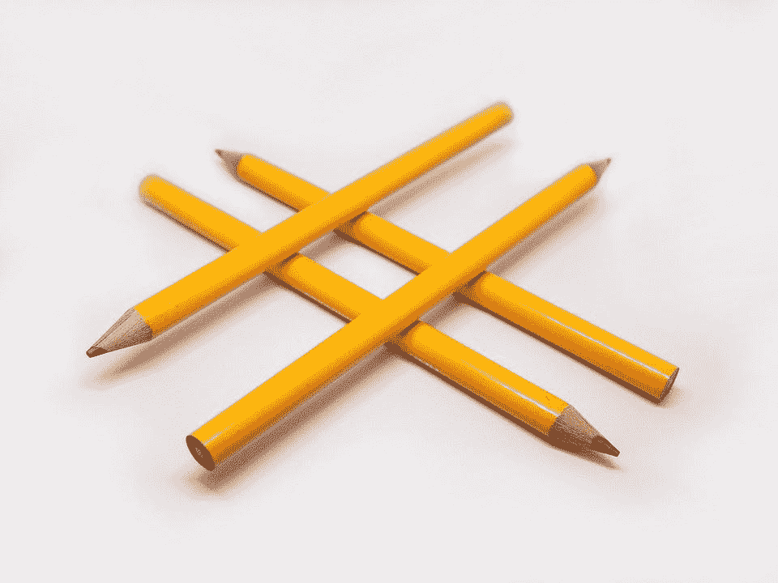

# 了解 sklearn 的哈希矢量器和 FeatureHasher 之间的区别

> 原文：<https://medium.com/geekculture/understanding-the-difference-between-sklearns-hashingvectorizer-and-featurehasher-73779b015c2c?source=collection_archive---------33----------------------->

看起来这可能是我最近一段时间关于自然语言处理(NLP)的最后一篇文章，因为我已经几乎用尽了 sklearn 关于机器学习的函数和类的列表。然而，我发现了另一个涵盖 NLP 的库，所以在某个时候我也会写关于那个库的文章。在这个…