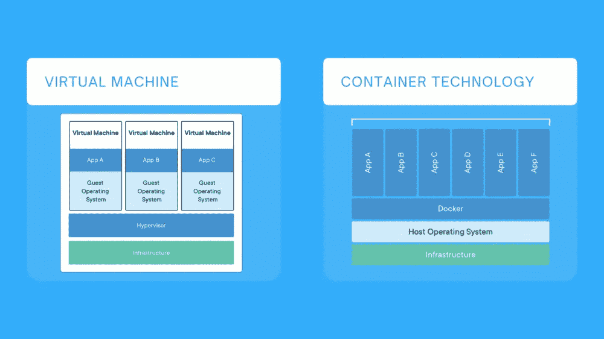
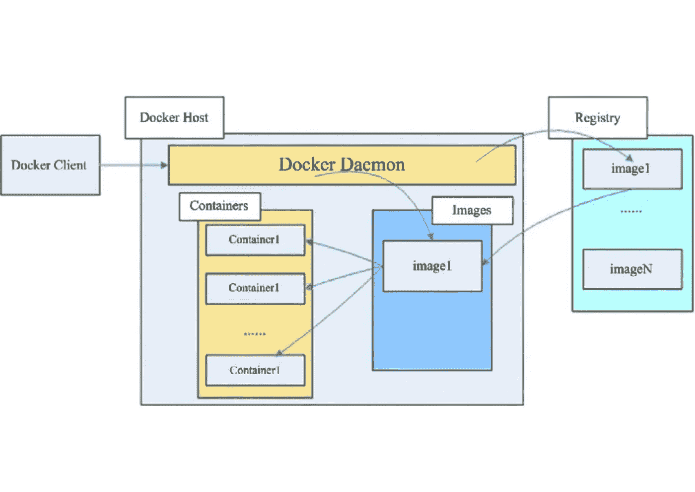
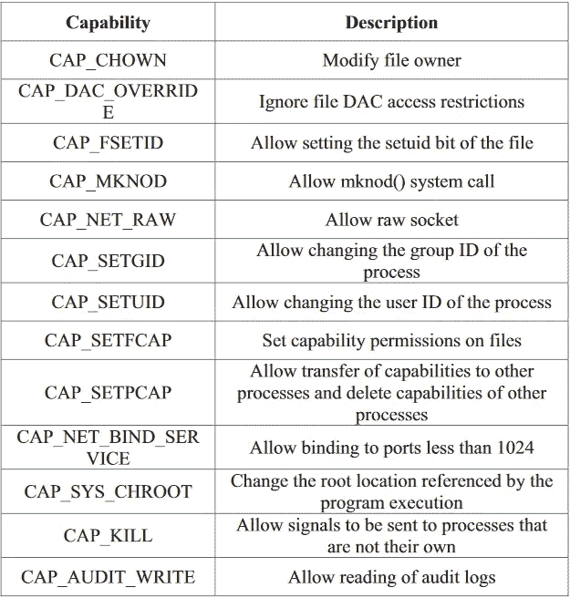

# 了解 Docker 容器

> 原文：<https://medium.com/geekculture/understanding-the-docker-containers-d5ee422bfd9d?source=collection_archive---------24----------------------->

## 深入了解 Docker 容器的框架和工作方式。

# 目录:

1.  什么是容器？
2.  码头集装箱。
3.  Docker 容器的框架。
4.  Docker 中的安全机制。

# 什么是容器？

容器基本上是一个标准的软件单元，它包含了代码并承载了应用程序独立于部署容器的系统运行所需的所有依赖关系。

## 让我为你简化它

共享程序或让相同的程序在不同的系统上运行有时会很乏味。在 Linux 环境下开发的程序可能无法在其他操作系统(如 windows 或 mac)上运行，所使用的编程语言可能是不同的版本，如果为了使程序运行而更改了版本，则其他一些程序会停止运行😕依赖关系的版本也可能冲突，等等。

这个问题的解决方案是拿一个空盒子，在考虑开发环境的同时，将所有代码及其依赖项添加到其中，现在关闭这个盒子。这个盒子是你的容器，它包含了程序运行所需的一切，并且可以独立于你的系统配置工作。容器已经准备好被部署*(只要把盒子放在你想放的任何地方，你想放多少次都可以)。*

这个过程称为容器化，容器在操作系统级别实现虚拟化，而虚拟机在硬件级别实现虚拟化。

## 在使用容器之前，让我们先了解一下虚拟机

虚拟机自 20 世纪 60 年代就已经存在，被认为是云计算的基础。如果需要可扩展性或优化服务器容量，那么虚拟机就是首选解决方案。虚拟机虚拟化或模拟完整的硬件，然后在其上安装操作系统*(考虑在那个空盒子中连同程序和依赖项一起添加底层操作系统)*。虚拟机需要时间来启动，大小在 GB 范围内，特别是由于每次都要安装庞大的操作系统。

容器技术可以看做是一个'*轻量级 VM'* 。多个容器可以在主机上运行，同时共享相同的硬件和 OS 内核，并且彼此完全隔离。多棒啊🔥

# 码头集装箱

Docker 容器是最先进的虚拟化技术，可以实现比传统虚拟机更高的效率。Docker 容器的尺寸很小，只有几兆字节，你可以在 [**Docker Hub**](https://hub.docker.com) 上找到并下载你需要的任何 Docker 容器，这是 Docker 提供的一个容器库，用于找到并与他人分享图像。Docker 容器可以快速部署到本地，或者本地开发的映像可以轻松上传到 Docker Hub 供他人使用。

这就是促使每个人转向 Docker 容器的原因，其创建和部署的简单性，其对硬件资源的最小使用，一个可以找到和共享成千上万个图像的适当组织的存储库，所有这些都有效地缩短了软件开发生命周期。

> 部署时的 Docker 映像称为 Docker 容器。

# Docker 容器的框架

Docker 遵循一个客户/服务框架，Docker 的各个模块既相互独立又相互协作。它由 3 个模块组成

1.  码头客户
2.  Docker 守护进程
3.  Docker 注册表

## 码头客户

它为用户提供与 Docker 容器通信的接口，可以是 [docker-cli](https://docs.docker.com/engine/reference/commandline/cli/) 或 [docker-desktop](https://www.docker.com/products/docker-desktop) 。当用户在客户端运行命令时，客户端将这些命令发送给`dockerd`，由它执行。

## Docker 守护进程( `dockerd` )

它是 Docker 服务启动时系统自动创建的后台进程。Docker 守护进程(`dockerd`)监听 Docker API 请求并管理 Docker 对象，如图像、容器、网络和卷。一个守护进程也可以与其他守护进程通信来管理 Docker 服务。

## Docker 注册表

Docker 注册表的职责是存储和组织 Docker 镜像，例如 [**Docker Hub**](https://hub.docker.com/) **。**

# 现有安全机制

由于容器是在操作系统级实现的，多个 Docker 容器可能同时运行在同一主机上，共享相同的操作系统内核、硬件和软件资源，因此有必要在硬件和软件资源访问方面隔离这些容器。因此，为了隔离容器，Docker 利用了 Linux 的名称空间和 Cgroups 机制。

## 资源隔离:

Docker 通过利用 Linux 中的名称空间来实现容器隔离。

**名称空间**是用于定义访问范围的基本名称标签。将名称空间视为树的节点，每个节点可以完全访问其子节点，但不能访问祖先节点。根节点可以访问系统中所有可用的资源，但是第 3 层的节点可以访问它的所有子节点，但不能访问它的祖先节点。通过名称空间，每个容器实例都可以拥有自己完整的网络、文件系统和 IPC，这些都与其他容器相隔离。

有 8 种不同的命名空间:

1.  增加
2.  进程 ID (PID)
3.  进程间通信
4.  网络
5.  UNIX 分时系统(UTS)
6.  用户
7.  时间
8.  cgroups

主机系统将容器视为系统上运行的另一个进程，因此可以使用 PID 名称空间隔离两个进程(容器)。

 [## Linux 名称空间-维基百科

### 名称空间是 Linux 内核的一个特性，它对内核资源进行分区，这样一组进程就可以看到一个…

en.wikipedia.org](https://en.wikipedia.org/wiki/Linux_namespaces) 

## 资源控制:

Docker 利用 Linux 中的控制组，cgroups 是一个 Linux 内核特性，它限制、说明和隔离进程的资源使用。它确保资源对所有运行的容器都是公平可用的，并且没有容器滥用其资源，包括 CPU、内存、块 I/O、带宽等。正确配置 cgroups 可以有效控制 Dos 攻击。

## 内核功能的限制:

Linux 中通常有两种类型的用户——根用户和非根用户。Docker 和 host 在共享的内核模型中运行，因此主机上的 root 用户可以访问或运行容器上的任何活动。但是非根用户不能访问他没有权限的任何东西。由于许多不同的容器可以在一台主机上运行，因此使用 root 访问权限运行它们并不是一个好主意，相反，我们为每个容器创建一个新用户，并为该用户提供最低要求的权限，这将增强系统的安全性。白名单机制用于以默认方式赋予内核能力，用户可以根据实际需要赋予额外的内核能力。

WHITELIST OF KERNEL CAPABILITIES ADOPTED BY DOCKER BY DEFAULT

# 结论

Docker 被广泛接受，并再次彻底改变了云、可伸缩性和服务器的弹性，这些都是由迁移到微服务架构的公司改进的，采用 Docker 容器使这变得很容易。超过 25%的公司已经采用了 Docker。到 2024 年，Docker 的市场规模预计将增长 9.93 亿美元，Docker 甚至通过 GPU 支持简化了 AI/ML 工具的采用，并确保了本地和远程部署之间的一致性。

## 留下掌声👏，关注更多🔥，并不断学习🤓

 [## 码头集装箱的安全性分析

### Docker 安全挑战和最佳实践。

mayankpatel99.medium.com](https://mayankpatel99.medium.com/security-analysis-of-docker-containers-a686cebf6405)