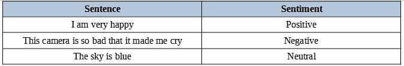
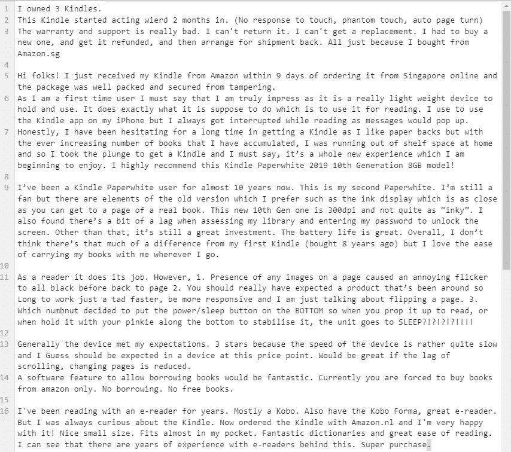
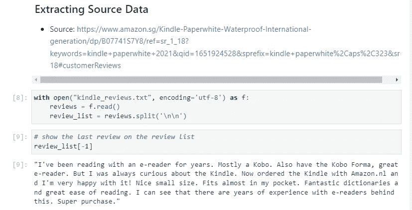
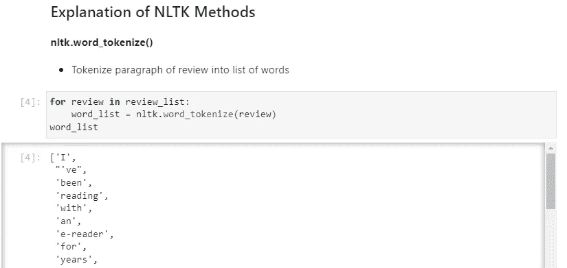
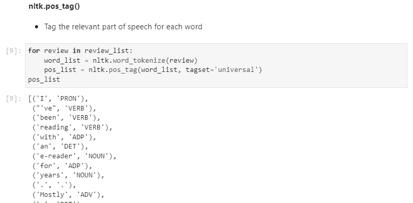
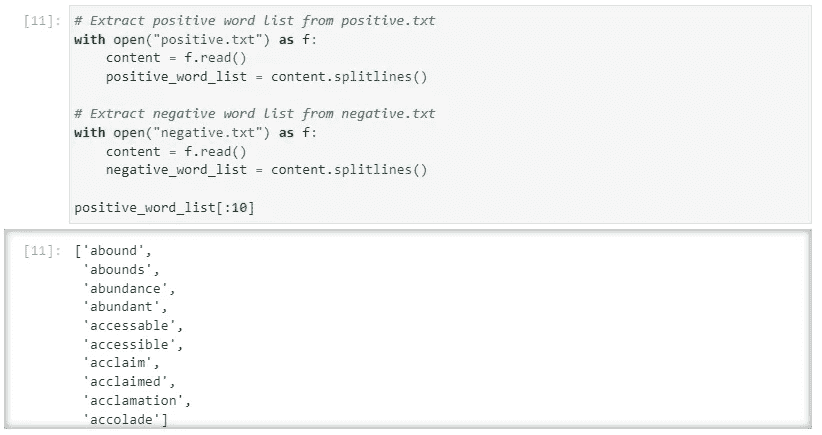
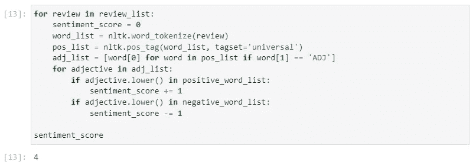
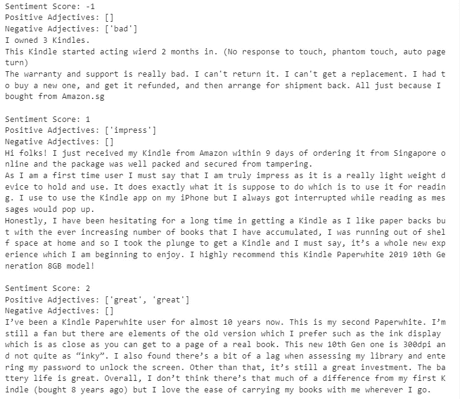

# 理解人类语言背后的情感

> 原文：<https://medium.com/geekculture/understanding-the-emotions-behind-the-human-language-34938a1fb5c7?source=collection_archive---------17----------------------->

## Python 中使用 NLTK 的评论情感分析


[根据加州大学圣地亚哥分校 ***的研究人员 Roger Bohn 和 James Short 的研究***](https://ijoc.org/index.php/ijoc/article/viewFile/1566/743)，美国人平均每天消耗约 34g 数据(截至 2012 年)。

那是…大量的数据。在撰写本文时，个人消耗的数据量可能会大得多。

> 如果一个人每天可以消耗如此大量的数据，您认为组织会收集多少数据？

## 最突出的一种数据类型是文本数据


在网络上的海量数据中，有一种类型的数据非常突出，那就是文本数据——一些消息来源估计网络上的信息 80%是文本数据。

事实上，不管网络上的文本数据占多大比例，我们都不能否认这些文本数据的重要性。

通过称为**文本挖掘**的过程，即从文本信息中提取洞察力，公司能够**做出数据驱动的业务决策，以发展和扩大其组织。**

在本文中，我将分享一个简单的**情感分析算法**来**使用 Python 中的`NLTK`库导出文本**的情感。

**什么是情感分析？什么是 NLTK？请继续阅读，寻找答案！**

# 什么是 NLTK？


**NLTK 代表自然语言工具包**，这是一个用 **Python** 编写的 NLP(自然语言处理)库，它允许我们**分析文本数据并得出有价值的见解。**

`NLTK`提供的一些功能包括

*   **标记化**(即将句子拆分成单词列表，或将段落拆分成句子列表)
*   **词干化**(即将一个单词还原成它的词根形式。关心、细心、粗心属于“care”的词根)
*   **词性标注**(即将每个单词标注为名词、代词、形容词、动词等。)
*   …以及更多！

这个强大的库允许我们**分析我们的文本数据，并得出文本的情感。**

# 什么是情感分析？


有时被称为**观点挖掘**，情感分析是指**识别文本中表达的情感。**

**示例**



***“我很幸福”*** 是肯定句，因而被认定为有积极的情绪。
***“这个相机太差了，把我弄哭了”*** 是否定句，因而被认定为有负面情绪。

# 我们的工作空间——Jupyter 实验室


为了演示`NLTK`库中某些方法的例子，我将使用 [JupyterLab](https://jupyterlab.readthedocs.io/en/stable/) 作为我的主要工作空间。

**JupyterLab** 是一个 **web 应用，它允许我们查看基于我们的 python 代码**的交互式输出。也经常被**数据科学家和机器学习工程师使用。**

# 我们的文本数据源——亚马逊 Kindle 设备评论


在这个项目中，我们的目标是识别不同文本的情感。

在这里，我将使用亚马逊商店上一款[流行阅读设备 Kindle 设备](https://www.amazon.sg/Kindle-Paperwhite-Waterproof-International-generation/dp/B07741S7Y8/ref=sr_1_18?keywords=kindle+paperwhite+2021&qid=1651924528&sprefix=kindle+paperwhite%2Caps%2C323&sr=8-18#customerReviews)的评论作为数据源来执行情感分析。为了帮助我们完成这个过程，我已经完成了数据收集阶段，并提取了几篇包含正面和负面观点的评论。

**kindle_reviews.txt**



作为人类，我们可以非常清楚地识别第一次审查是负面的，第二次审查是正面的。

第一次审查— `The warranty and support is really bad`:明显否定
第二次审查— `I highly recommend this...`:明显肯定。

让我们看看如何创建一个情感分析算法来做同样的事情。

# 我们的情感分析算法


对于我们的情感分析算法，我们将创建以下工作流:

1.  阅读文件源并提取单个评论
2.  对于每个评论，我们将使用`nltk.word_tokenize()`将**段落标记为**单词标记
3.  对于复习中的每个单词，我们会识别出**词性**(即名词、动词、形容词等。)与它相关联使用`ntlk.pos_tag()`
4.  在获得单词列表以及它们各自的词性之后，我们将把所有的形容词提取到一个形容词单词列表中。
5.  接下来，我们将遍历形容词单词列表中的每个形容词，并根据包含肯定和否定单词列表的`positive.txt`和`negative.txt`文件来识别该形容词是肯定的还是否定的。如果形容词是积极的，我们将在评论的情感得分上加 1。
    如果形容词是负面的，我们会从评论的情绪得分中减去 1。
6.  如果最终得分是肯定的，我们可以有把握地认为评论是肯定的。还有，分数越高越积极。否则，审查将被视为中立(如果分数为 0)或负面(如果分数为负)。

迷茫？别担心，我会解释创建这个算法的每一个代码块，所以继续吧！

***注**** — ***这个项目的源代码也可以在 GitHub 上找到:***[***https://GitHub . com/cyber jj 999/kindle _ reviews _ 情操 _ 分析***](https://github.com/cyberjj999/kindle_reviews_sentiment_analysis)

事不宜迟，让我们直接开始编码吧！

## 第一步。阅读文件源并提取单个评论

第一步是从 **kindle_reviews.txt** 中提取我们的个人评论，这是一个包含我事先准备好的评论的文件。



为了对每个评论执行编程逻辑，我们需要首先将所有评论提取到一个列表中。

在这里，我们打开包含评论的文件，并通过使用分隔符`\n\n`将每个评论分割成一个列表项

使用`review_list[-1]`访问列表的最后一个元素向我们展示了最后一次检查。

***注* —由于在本项目中数据是预先准备好的，因此不需要数据争论程序。然而，如果您使用 python 库(如 bs4)从网上搜集评论，您将需要执行数据清理，以便源数据可以准确地用于进一步的分析。***

## 第二步。对于每个评论，我们将使用 `**nltk.word_tokenize()**`将段落标记为单词标记



在这里，我们使用`nltk.word_tokenize()`方法将每个评论(即文本段落)标记为一个单词列表。

有了单词列表，我们就可以进行词性识别了。

***注意*—***`***nltk***`***中的*** `***word_tokenize()***` ***方法并不像 Python 中的*** `***string.split()***` ***方法那么简单。通过分析该方法的源代码，我们可以看到在标记化过程中实现了各种正则表达式算法。***

## 第三步。对于评论中的每个单词，我们将使用 ntlk.pos_tag()来识别与之相关的词性



为了识别词类，我们可以将单词列表作为参数传递给`nltk.pos_tag()`方法，并指定`tagset='universal'`的参数

`tagset='universal'`的目的是**将词性标注简化为动词、名词、形容词等一般类别**。如果不使用通用标记集，将会有非常具体的标记和动词、名词、形容词等的多种变体。

输出是一个`tuple`的列表，第一个元素存储单词，第二个元素存储词性值——即`('reading', 'VERB')`

## 第四步。在获得单词列表及其词性之后，我们将把所有形容词提取到一个形容词单词列表中。

这一步需要一些使用`list`和`tuple`的基本 python 知识。


我们可以做一个简单的列表理解来过滤`pos_list`，只提取形容词——即那些标记为`"ADJ"`的形容词。

```
adj_list = [word[0] for word in pos_list if word[1] == 'ADJ']
```

这段代码遍历`pos_list`，如果第二个元素(词性值)等于`ADJ`(形容词)，则提取第一个元素(原单词)。

太好了！我们现在有一个形容词列表。下一步很简单。

## 第五步。我们将遍历形容词单词列表中的每个形容词，并基于包含肯定和否定单词列表的 positive.txt 和 negative.txt 文件来识别该形容词是肯定的还是否定的。



我们可以首先从文本文件中提取所有正面和负面的单词，并将它们存储在列表中。

在这里，你可能会注意到有些单词拼错了，比如“accessable”。这不是一个错误，因为互联网评论经常充满了错别字/拼写错误。该列表将考虑常见的拼写错误的单词，从而使我们的分析更加准确。

接下来，我们将通过将形容词列表与正面和负面单词列表进行比较来计算我们的情感得分。

**如果形容词是正面的，我们会给评论的情绪评分加 1。
如果形容词是负面的，我们会从评论的情绪得分中减去 1。**



我们首先指定一个`sentiment_score`变量来跟踪我们的情感得分。然后，我们检查每个形容词是否在正面或负面单词列表中，并相应地增加/减少情感得分。

值得注意的是，我们还通过使用`lower()`方法将我们的评论形容词转换成小写来规范化它们。这使我们能够更准确地将每个形容词与只包含小写单词的肯定和否定单词列表相匹配。

在这里，你可以看到计算出的最终情绪得分是 4。

## 第六步。如果最终得分是肯定的，我们可以有把握地认为评论是肯定的。还有，分数越高越积极。

使用这个逻辑，我们可以看到我们的评论的情绪是积极的——理想的分数是 4 分！

让我们再看一遍评论。

```
"I've been reading with an e-reader for years. Mostly a Kobo. Also have the Kobo Forma, great e-reader. But I was always curious about the Kindle. Now ordered the Kindle with Amazon.nl and I'm very happy with it! Nice small size. Fits almost in my pocket. Fantastic dictionaries and great ease of reading. I can see that there are years of experience with e-readers behind this. Super purchase."
```

`great`、`happy`、`Fantastic`、`super`——看起来我们有很多积极的词汇！

准确吗？看起来肯定是这样的！

# 整理代码后的输出



正如我们所见，该算法工作得相当好！我们能够识别不同的积极和消极形容词，并决定它们对情绪得分的贡献是积极的还是消极的。

***当然也有一些明显肯定/否定的词因为没有被*** `***nltk***`认定为形容词而被遗漏。如果我们简单地统计所有肯定/否定的单词，而不考虑它们的词性，就会发生相反的情况。我们最终会捕捉所有积极/消极的单词，而不管它们的上下文。

这表明，好的情感分析不仅仅是计算正面和负面形容词的数量那么简单。以及在很多情况下，这种算法的表现不尽如人意。

## 对算法的改进

我们可以探索许多算法来进一步完善我们当前的情感分析算法。


一个改进是利用`bigrams`或`trigrams`(即连续的相邻单词)来更准确地计算情感得分。

考虑以下情况

```
“This device is not good at all. I heard from my friend that it was great, but it is really not very impressive.”
```

在这里，我们大概可以找到三个积极的词——“好”、“棒极了”和“令人印象深刻”。但是，很明显，评论是负面的。

为了改进我们的算法，我们可以考虑肯定/否定词之前的词。`"**NOT** good" = <negative> * <positive> = <negative>`因而它应该被确定为否定的。`"**NOT** bad" = <negative> * <negative> = <positive>`因此这应被确定为阳性。

使用`bigrams`和`trigrams`，我们可能会使算法更加健壮。

# 结束语


然后…就这样结束了！感谢您阅读我用 Python 中的 `**NLTK**` **进行**情绪分析的文章！我希望你学到了一些有价值的东西，学到了一些新东西。****

人类的语言非常复杂，但也非常重要。有些人认为语言是我们作为一个物种能够真正繁荣昌盛的主要原因之一，我绝对同意这一点！

理解语言既是一门科学，也是一门艺术我对未来几年 NLP(自然语言处理)的进步充满希望！

只是温柔的提醒一下——你可以在这里访问这个项目的**完整源代码:**[https://github . com/cyber jj 999/kindle _ reviews _ 情操 _ 分析](https://github.com/cyberjj999/kindle_reviews_sentiment_analysis)

继续摇摆，享受学习！下次见！