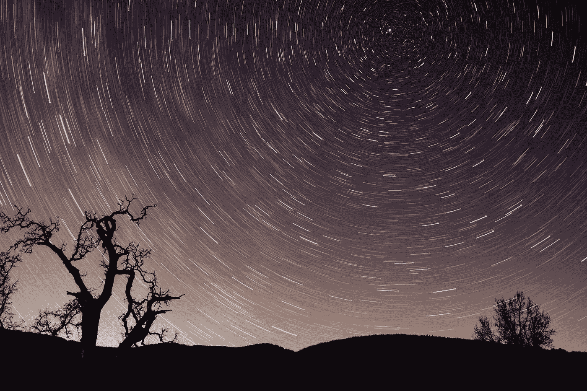

# 通过儒略历和公历了解日期和年份的历史

> 原文：<https://medium.com/geekculture/understanding-the-history-of-dates-and-years-through-the-julian-and-gregorian-calendars-b2837f2ecaa4?source=collection_archive---------7----------------------->

Photo by [Caleb Woods](https://unsplash.com/@caleb_woods?utm_source=medium&utm_medium=referral) on [Unsplash](https://unsplash.com?utm_source=medium&utm_medium=referral)

自然界只给了我们两个由宇宙决定的时间单位，那就是年和日。月、小时、分钟和秒都是人类的发明，在自然界中没有依据。然而日子和岁月却不是这样。一天，当然，是地球的一个完整的旋转，一年是一个围绕…