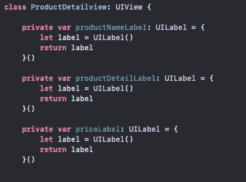
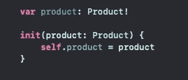
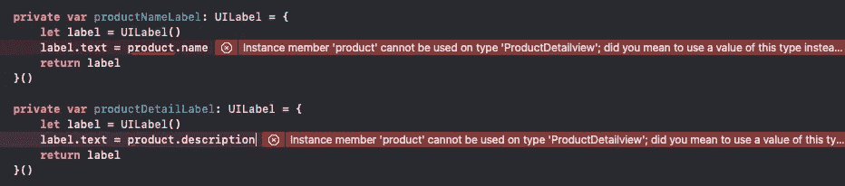
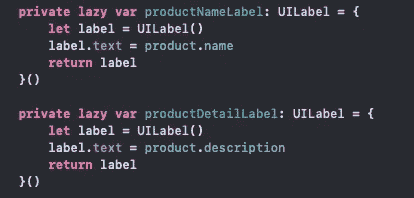
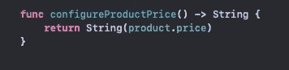
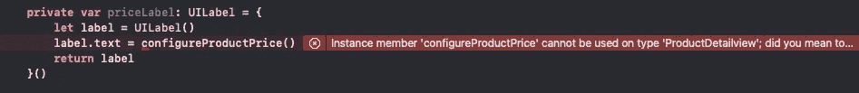
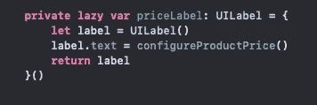

# 理解 Swift 中的 Lazy 关键字

> 原文：<https://medium.com/geekculture/understanding-the-lazy-keyword-in-swift-65f1d14fa477?source=collection_archive---------17----------------------->

Photo by [Christopher Gower](https://unsplash.com/@cgower?utm_source=unsplash&utm_medium=referral&utm_content=creditCopyText) on [Unsplash](https://unsplash.com/s/photos/coding?utm_source=unsplash&utm_medium=referral&utm_content=creditCopyText)

当谈到在 Swift 中进行编程时，闭包让我们的工作变得更容易，因为它允许我们在花括号体中设置对象或视图。当正在讨论的类被加载到内存中时，我们的对象被配置了闭包设置的所有属性。

假设我们正在构建一个购物应用程序，我们的数据模型由一个名为 **Product** 的简单结构组成，该结构有三个属性:名称、描述和价格。数据将通过自定义视图显示给用户，该视图显示特定产品的详细信息。我们的视图将有三个 UILabels 来保存我们的产品信息，由一个闭包初始化。

该视图有一个定制的 init 方法来接收产品，用正确的数据填充标签的文本。因为我们在这个例子中使用了闭包，所以我们将在每个闭包中设置每个标签，以保持我们的 init 方法干净，没有多余的代码。

现在我们有了我们的产品，我们可以通过调用我们存储的产品属性来用正确的信息设置我们的标签。

但是，哦不！当我们试图分配标签的文本属性时，Xcode 抛出一个错误，指出:**实例成员“产品”不能用于类型“产品详细视图”；您是否打算改用这种类型的值？**

这是什么意思？嗯，就像我们的标签一样，我们的产品存储属性是一个实例成员， ***意味着不可能确定何时将每个项目加载到内存中*** 来分配我们标签的文本。那么我们能做什么呢，我们的视图依赖于初始化时传入的产品，这发生在我们的标签初始化的同时。在获取产品并将其分配给存储的属性后，我们可以简单地在 init 方法中配置每个标签，但是我们希望将代码分组到它所属的位置。即产品标签的所有属性都应该一起设置和包含。

这就是**懒惰关键词**发挥作用的地方。用这个关键字标记你的属性告诉编译器这个属性将在某个时候被加载到内存中，但是我们**首先需要**来自传入产品的信息。

添加这个关键字满足了编者的要求，认识到设置标签的文本属性将在标签完全准备好使用之前发生。设置了名称和描述属性后，我们现在可以设置价格标签的文本。数据模型存储为 Int，为了实现将价格转换为字符串，我们将使用一个简单的助手函数。

为了遵循我们相同的编码风格，我们将在价格标签的闭包中使用我们的函数。

当设置我们的产品属性时，在我们的闭包内调用一个函数会抛出同样的错误。这是怎么回事？swift 中的功能被视为**一等公民**；这意味着它们被视为任何其他属性或给定类中的实例成员。就像以前一样，我们的价格标签必须用我们的懒惰关键字标记，因为 ***不可能确定我们的 configureProductPrice()函数何时可以使用。*** 分配惰性告诉 Swift，一旦我们的助手功能加载并可供使用，我们的价格标签将被完全配置。

lazy 关键字可以帮助你在编程时清理代码块，特别是当属性依赖于你的类中的一个实例成员时，或者当一个函数必须在一个特定的属性上被调用，或者调用闭包中的任何一个类方法时。