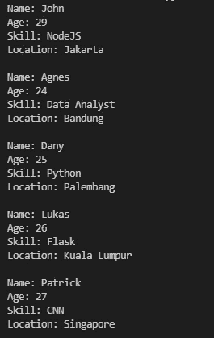
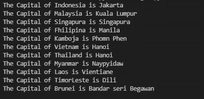

# 理解*args 和**kwargs Python 的含义

> 原文：<https://medium.com/geekculture/understanding-the-meaning-of-args-and-kwargs-python-82de28c28500?source=collection_archive---------25----------------------->


Photo by [Keith Misner](https://unsplash.com/@keithmisner?utm_source=unsplash&utm_medium=referral&utm_content=creditCopyText) on [Unsplash](https://unsplash.com/s/photos/repeated?utm_source=unsplash&utm_medium=referral&utm_content=creditCopyText)

作为一个 Pythoneer 或 Pythonista，有时我们会遇到这两个奇怪的论点`*args`和`**kwargs`。那是什么？你知道吗，这两样东西真的可以帮助你解决问题。在这篇文章中，我将试着用简单的方式解释它。我希望这将是你需要知道的关于`*args`和`**kwargs`的唯一一个帖子。

> **关于这两个你应该记住的一件事，就是星号(*)**

# 理论

在程序员的日常生活中，函数会让我们更容易完成任何工作。因为不用重复同样的过程，我们可以构建可以重复使用的小代码，在短时间内完成。

作为一个例子，我们正在制作一个函数来计算平均值。在更简单的情况下，当参数输入是已知的(3 个输入)时，我们可以很容易地使用这段代码来实现

你能回答吗？是的，答案是 6，这很简单，但是当输入的参数数量是随机的。你不能再使用这个功能了。嗯，这就是为什么，`*args`出来了。

## *参数

这个函数的正式定义被用作非关键字参数。这意味着，我们可以传递任何输入，而不知道输入参数的长度。所以，如果你想创建一个函数来保存名字到列表中，但是不知道你需要输入多少个名字，你可以使用这个语法。

如你所见，你可以添加任意多的名字，而不会出现任何错误。对于求平均值的问题，计算起来会容易得多。下面是语法。

嗯，通过添加几行代码，这个函数可以处理你传递给它的任何参数输入。

**记住，** `***args**` 是关于只用一个星号(*)。它可以用于非字典变量。

## * *克瓦查

嗯，如果你了解数据和结构，你就会明白变量可以是列表、元组、字典等。对于非关键字参数，比如 list 或 tuple，我们可以使用`*args`来处理。但是对于字典这样的关键字参数，变量保存在`key : values`对中。因此，获取价值观`**kwargs`来帮助我们处理它。

对于这种情况，假设您是一名开发人员，负责处理员工数据。大概你的数据会是这样的。

你的工作就是把数据显示成这样

```
Name: John
Age: 29
Skill: JS
Location: Jakarta
```

你可以像这样使用概念`key : value`手动完成

对于更简洁的代码，你可以使用 For 循环来完成，就像这样

for 循环是完成这项工作的绝佳概念。问题是每当字典名称改变时，我们也需要改变它。所以来帮你完成这项工作。假设我们有很多这样的字典数据。

通过使用 for 循环一个接一个地显示它需要时间，对吗？所以为了更简单，你可以像这样使用这个`**kwargs`

输出将是这样的



越多越好，对吗？但是等等，你看到我使用双`**kwargs`了吗？第一个在函数中使用，第二个在调用函数时使用。你知道我为什么用它吗？

我在调用函数时使用双星号的原因是因为字典有`keys : values`所以，它将一个接一个地迭代，然后在函数内部它将再次迭代，输出将被显示。

嗯，我想我的解释太难理解了。好，让我们来看第二个例子。在这里，我想保存东盟的国家和首都到列表中，然后显示它。想想看，今天东盟有 11 个成员，而以前只有 10 个成员。所以，如果你不使用`**kwargs`，你需要重写你的函数。因为我们在使用它，我们可以使用这个语法

使用上面的代码，您将得到如下输出



**记住，** `****kwargs**` 讲的是使用双星号(**)。它可以用于遍历字典变量。

# 结论

以下是我们之前所学内容的回顾

*   `*args`和`**kwargs`是一种奇怪的语法，可以用来将参数输入更改为我们想要的任何内容，而无需声明它
*   `*args`为非字典变量
*   `**kwargs`是字典变量
*   要点在单星(*)或双星(**)内，不在名称 args 或 kwargs 内

好吧，谢谢你一直读到这个结尾

最后，
祝✌代码愉快