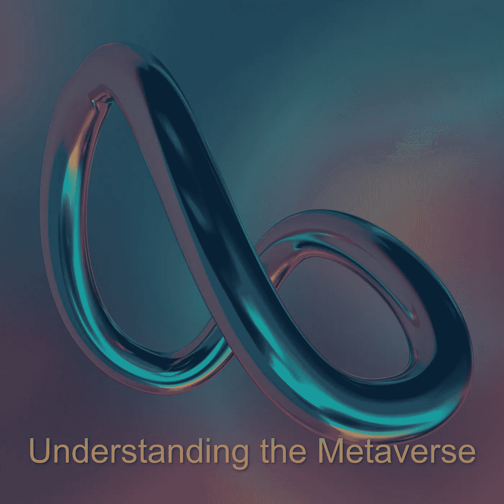

# 了解元宇宙

> 原文：<https://medium.com/geekculture/understanding-the-metaverse-35b22b28ffe?source=collection_archive---------6----------------------->

***Image From:***[*Unsplash*](https://unsplash.com/photos/2UjheC7FBWQ)*, by* [*Steve Johnson*](https://unsplash.com/@steve_j)

元宇宙……多好的术语啊！

意思是“超越”或“宇宙之后”，“超越”。

还不清楚元宇宙会是什么样子，因为我们还没有准备好。

我们仍然会发现在线 MMO 游戏、在不同环境下并不成功的在线平台(第二人生)、具有游戏化特征的社交媒体网站，以及…