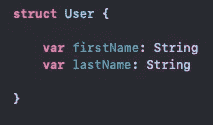
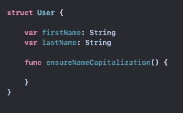
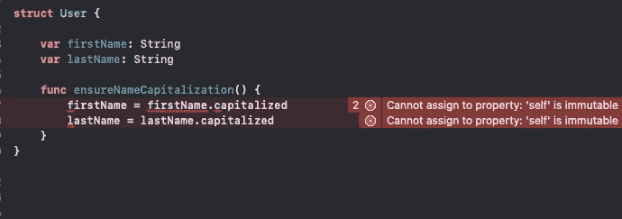
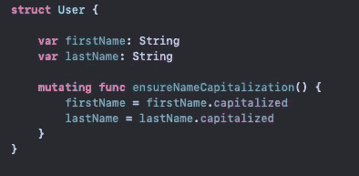
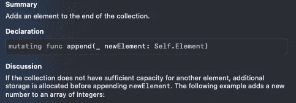

# 理解 Swift 中的变异关键字

> 原文：<https://medium.com/geekculture/understanding-the-mutating-keyword-in-swift-71163418e2f6?source=collection_archive---------8----------------------->

Photo by [Joshua Reddekopp](https://unsplash.com/@joshuaryanphoto?utm_source=unsplash&utm_medium=referral&utm_content=creditCopyText) on [Unsplash](https://unsplash.com/s/photos/coding?utm_source=unsplash&utm_medium=referral&utm_content=creditCopyText)

当谈到在 Swift 中管理对象时，苹果的建议是使用一个**结构**而不是一个**类**，这样不仅对开发者来说更容易管理内存，对应用程序的健康也是如此。结构是**值类型**，这意味着它们被分配给设备的堆，在内存中没有引用指针，并且针对速度进行了优化。

假设我们正在开发一个捕捉用户信息的应用程序。我们的数据模型是一个名为 User 的简单结构，它在初始化时接受名字和姓氏。

我们的应用程序逻辑要求我们确保每个用户都有一个大写的名字和姓氏。因为我们希望数据模型管理自己的属性，所以我们将编写一个方法来确保输入的信息配置正确。

现在就像调用我们的属性一样简单。大写的属性使我们的用户对象随时可用！

当我们试图操作我们的属性时，我们得到一个错误。这是怎么回事？错误消息如下: ***不能赋值给属性:“self”是不可变的*** 。从结构本身来看，结构的属性是**不可变的**，换句话说，Swift 无法推断该结构在创建时将被声明为变量还是常量，因此为了安全起见，Swift 不允许从其方法中对结构的属性进行任何更改。

幸运的是，Swift 为我们提供了一个关键字，允许我们处理这些不可变的属性。 **Mutating** 关键字标志着我们的函数能够将我们的属性作为变量使用，允许我们将字符串大写。

知道我们的结构的属性仍然是**不可变的**很重要，那么为什么**可变的**关键字允许我们操纵我们的属性呢？在幕后，Swift 为我们的结构制作了一个新的副本，并将我们的新值赋给它的属性。然后，我们定义的**原始结构**被我们的**复制结构**替换。由于结构是**值类型**，当它们被赋给新的变量或常量时，它们总是被**复制**，并且不包含对内存中特定点的引用。

你可以在整个 Swift 中看到 mutating 关键字。常见的地方是在本机数组类型中。一旦一个数组被声明， ***就没有办法简单的给它分配更多的空间来存放更多的条目*** 。操纵数组内容的数组方法都是**变异**函数。

虽然我们不能向这个数据集合添加更多的空间，但是 append()方法可以向数组中添加新元素，然后将其所有内容复制到一个新数组中。

现在我知道您在想什么，“为什么不在 init 方法中简单地大写用户的属性，或者为什么不直接使用点符号来操作它的属性？”虽然这是一个过于简化的例子，但现实世界中的数据可能需要在以后进行更改，而不是在初始化时。 **Mutating** 关键字允许结构的方法管理其自身属性的状态，从而使管理结构变得更加容易，并允许在整个代码中使用点符号来减少混乱。