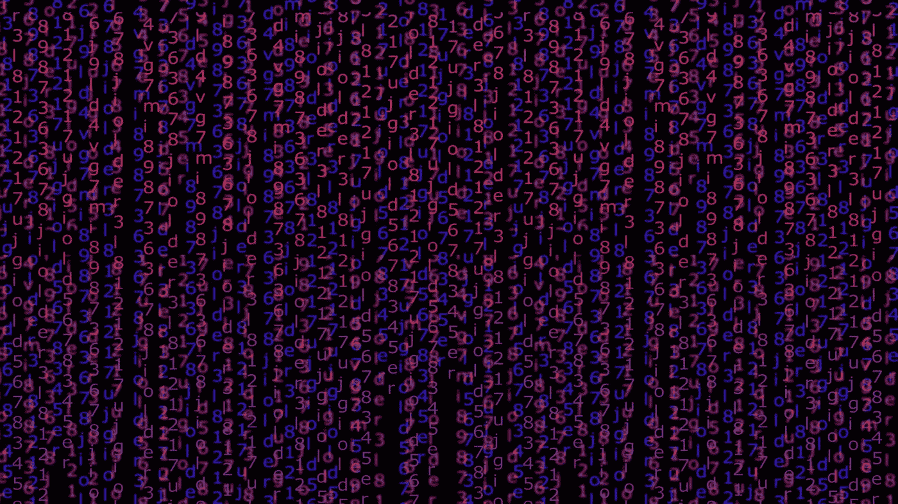

# 理解 sklearn 字典矢量器的神秘之处

> 原文：<https://medium.com/geekculture/understanding-the-mystique-of-sklearns-dictvectorizer-4e8ce93bbf6d?source=collection_archive---------9----------------------->

在过去的几篇文章中，我一直专注于 sklearn 中处理自然语言处理(NLP)的主要函数，包括 CountVectorizer、TfidfTransformer、TfidfVectorizer 和 HashingVectorizer。我最近写的关于矢量器的文章可以在这个链接找到…