# 用 RNNs 理解纸张生成序列(Alex Graves)

> 原文：<https://medium.com/geekculture/understanding-the-paper-generating-sequences-with-rnns-by-alex-graves-18635cdd32be?source=collection_archive---------20----------------------->

在这篇文章中，我写下了我对这篇论文的理解，这将有助于你对它有一个概念，之后你自己阅读这篇论文将会理清思路。最后，分享了我使用该论文合成网络生成的手写文本样本。

本文共分五个部分，具体如下:

*   介绍
*   预测网络
*   文本预测
*   手写预测
*   手写合成

## **简介**

递归神经网络(RNNs)是一种神经网络，其中来自前一步骤的输出作为输入被馈送到当前步骤。然而，在传统的神经网络中，所有的输入和输出都是相互独立的。

为什么我们需要 rnn 来生成序列？

在这里，序列意味着任何语言语句、歌曲、诗歌等。每当你读一首押韵的诗，你会发现最后一个词听起来和上一行的最后一个词很相似。

> 他们将输掉比赛
> 没有人会受到责备

你可以看到上面的两行，最后一个单词听起来很相似。所以重点是当你写第二行时，你需要记住前一行，那是我们传统网络失败的地方。同样，在任何序列中，我们都需要记住过去。并且我们的传统神经网络独立于先前的输出。

即使标准的 rnn 也不能长时间存储过去的信息，这种“健忘症”使它们易于产生不稳定的序列。

长短期记忆(LSTMs)是一种特殊的 RNN 结构，它被设计成比标准的 rnn 更好地存储和访问来自过去的信息。

这篇论文的主要目的是证明 LSTM 可以利用它的记忆产生复杂的、真实的包含长程结构的序列。

## 预测网络

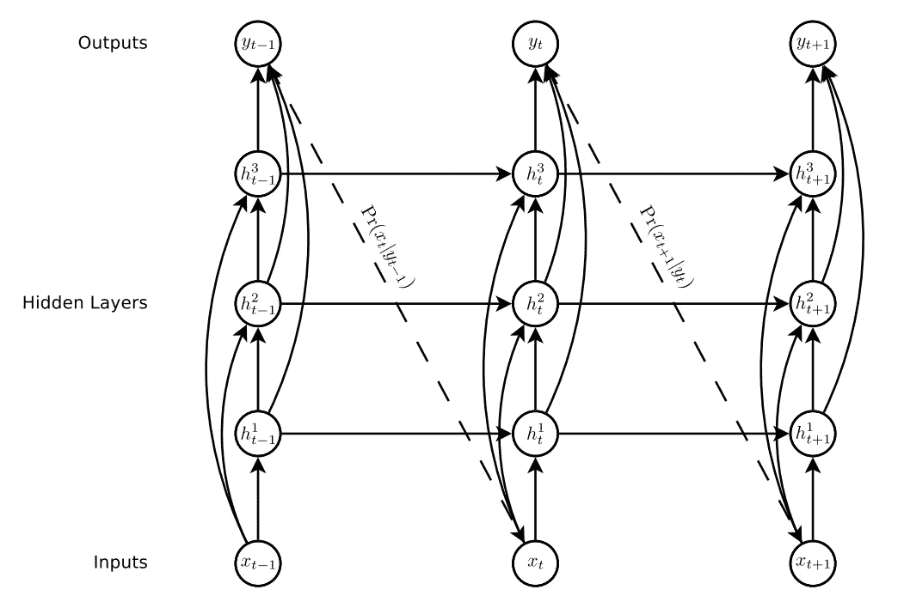

**Deep recurrent neural network prediction architecture.** The circle represents the cells of the network layer, solid lines represents weighted connections (each lines have some weight W) and the dashed lines represent the predictions

上面我们可以看到 RNNs 架构，其中 x (x1，x2，…xT)输入单元格也直接传递到第二和第三隐藏层。正如我们所知，RNN 将之前的输出作为下一个单元格的输入，这可以在上图(虚线)中以概率的形式看到(给定之前的输出，下一个输入的概率)。

让我们看看其中一个隐藏层单元格的方程
这是第一个隐藏层的第二个单元格的方程，从上图可以验证。我们可以看到，指向单元格的箭头数量是 2，这就是为什么它有两个加权项。

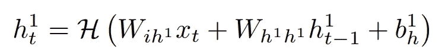

2nd cell of 1st hidden layer

其中 H 表示隐藏层激活函数，W 表示连接(线)的权重(例如 W(i，h1):将输入连接到第一隐藏层的线的权重矩阵)，X_t 是输入向量的第 t 项，b 表示偏置向量。

类似地，其他方程都可以写成。通常

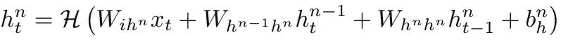

General equation for hidden layer cells

输出向量 Y 用于确定下一个输入的预测分布(Pr(X_t|Y_t-1))。

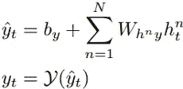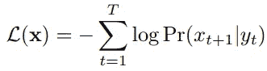

上面我们可以看到损耗(L(x))和输出向量(Y_t)等式，其中，γ是输出层函数。在下一节中，我们将看到预测分布的方程(Pr(X_t|Y_t-1))。

在这一节中，作者还简要介绍了 LSTM 单元的体系结构，它更善于发现和利用数据中的长程相关性(序列中的前几个词)。

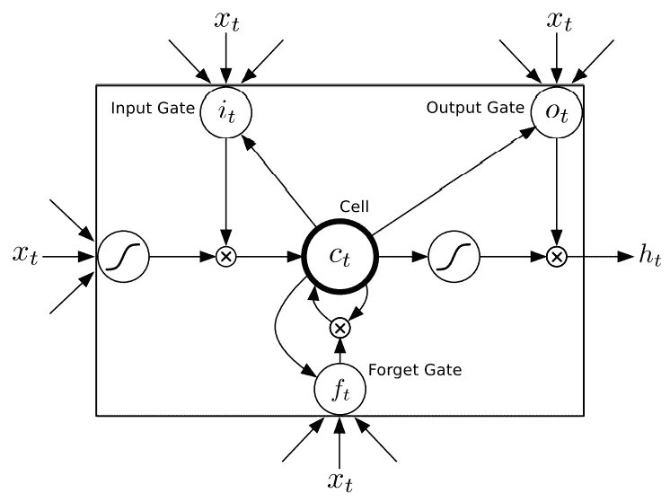

Long Short-Term Memory Cell Architecture

这是 LSTM 蜂窝的架构，而 LSTM 网络是这些蜂窝的集合。这些方程式可以在建筑中看到

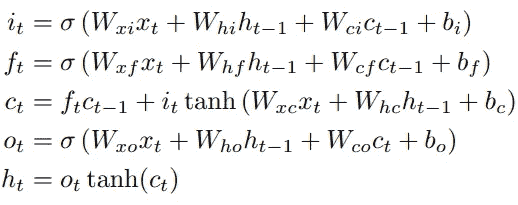

Equations for the above LSTM cell

其中，σ是 sigmoid 函数，I、f、o 和 c 分别是输入门、遗忘门、输出门和单元输入激活向量。

## 文本预测

文本数据是离散的，并且通常在使用“一键编码”方法之后呈现给神经网络。Pr(X_t+1 | Y_t)为

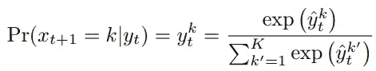

Predictive Probability

其中 k =用于独热编码的 K 向量文本类的元素。

因此，对于文本预测，我们需要在字符级建模(K:字符的表征)或单词级建模(K:单词的表征)之间选择建模技术的类型。作者选择了字符级模型，尽管它的性能比等价的单词级模型稍差。
在真实世界的数据中，不同单词的数量经常超过 100，000，单词级模型可能会有问题。我们还需要增加网络的参数，这使得训练计算变得困难，我们还需要能够覆盖 k 个类别的总数的训练数据

总的来说，本文中的实验旨在预测数据中发现的最佳质量，以便最大化网络的生成灵活性。

作者进行了两个实验`Penn Treebank Experiment`和`Wikipedia Experiment`。
Penn Treebank 是第一个文本预测实验，Penn Treebank 数据被广泛用作语言建模基准。主要目的是估计网络的预测能力，而不是生成序列。此外，实验比较了单词和字符级别的 LSTM 预测器在 Penn 语料库上的性能。在这两种情况下，网络架构是一个具有 1000 个 LSTM 单元的单一隐藏层。

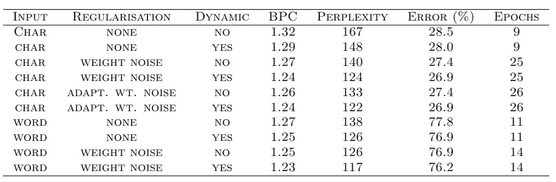

**Penn Treebank Test Set Results.** **‘BPC’** is bits-per-character. ‘Error’ is next-step classification error rate, for either characters or words.

他们发现，使用迭代增加的正则化进行再训练比使用正则化从随机权重进行训练更快。发现自适应权重噪声正则化对于字级网络非常慢，因此它仅用固定方差权重噪声正则化。表中显示，单词级 RNN 比字符级网络表现得更好(复杂度越低，模型越好)，但是当使用正则化时，差距似乎缩小了。

从序列生成的角度来看，Wikipedia 数据很有趣，因为它不仅包含大量的字典单词，还包含许多不会包含在 Penn Treebank 文本数据中的字符序列。例如外语、元数据的 XML 标签、网站地址和用于格式化页面的标记语言。由于大量的数据，使用了比 Penn data 更大的网络，具有 700 个 LSTM 单元的 7 个隐藏层。并且维基百科中几乎有四页的样本是从论文中可以看到的模型生成的(第 5-8 页)。样本显示，网络已经从数据中学习了很多结构。然而，模型生成的所有文本都没有意义(没有意义)。

## 手写预测

本节演示了如何通过使用混合密度输出层将预测网络应用于真实世界的数据，并提供了在 [IAM 在线手写](https://fki.tic.heia-fr.ch/databases/iam-on-line-handwriting-database)数据库上的实验结果。

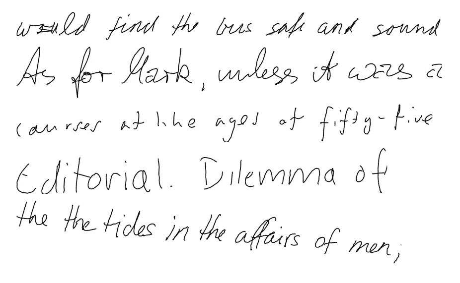

**Training samples from the IAM online handwriting database.** Notice the wide range of writing styles, the variation in line angle and character sizes, and the writing errors, such as the scribbled out letters in the first line and the repeated word in the final line.

在线手写输入数据包含每个字符的 x、y 笔坐标以及当笔离开白板时序列中的点(如果字符已完成，则为 1，否则为 0)。我们的模型将一次预测一个点的笔轨迹，这给了网络最大的灵活性来发明新的笔迹，这需要大量的内存，其中平均一个字母占用超过 25 个时间步，平均一行占用大约 700 个时间步。

根据作者，将预测网络应用于在线手写数据的主要挑战是确定适合于实值输入的预测分布。
为了确定这里的预测分布，作者使用了[混合密度网络](https://towardsdatascience.com/a-hitchhikers-guide-to-mixture-density-networks-76b435826cca)。网络输出的子集用于定义混合权重(与每个混合成分相关的概率)，而剩余的输出用于确定单独的混合成分(单独的输出分布)。

本文将有助于进一步了解混合密度网络

[混合密度网络搭便车指南 Oliver Borchers 博士|走向数据科学](https://towardsdatascience.com/a-hitchhikers-guide-to-mixture-density-networks-76b435826cca)

对于本文中的手写实验，基本的 RNN 体系结构和更新方程与第 2 部分(预测网络)保持不变。每个输入向量 X_t 由一个实数值对 x1、x2 和一个二进制值 x3 组成，其中 x1、x2 定义笔相对于前一个输入的偏移量，如果向量结束一个笔画(即，如果笔在下一个向量被记录之前被从板上提起)，x3 的值为 1，否则为 0。

下面你可以看到预测概率和序列丢失的等式

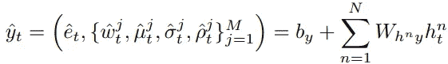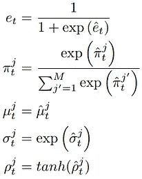

因此，每个输出向量 Y_t 由冲程结束概率 e、一组均值 j、标准偏差σ j、相关性ρ j 和 M 个混合成分的混合权重π j(输出的单独分布)组成。

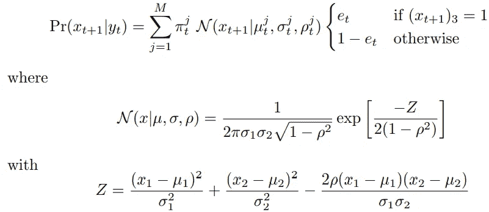

Probability density for the next input layer

给定输出向量 Y t，下一个输入 X t+1 的概率密度 Pr(X t+1 | Y t)。

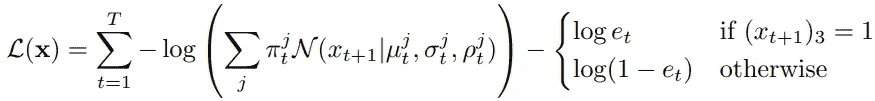

Sequence loss

*实验:* 数据序列中的每个点都由三个数字组成:相对于前一个点的 x 和 y 偏移，以及二进制笔画结束特征。对于隐藏层，比较了两种网络架构:一种具有三个隐藏层，每个包含 400 个 LSTM 单元，另一种具有 900 个 LSTM 单元的单个隐藏层。两个网络的权重都在 340 万左右。用自适应加权噪声重新训练三层网络，所有标准偏差初始化为 0.075。使用固定方差权重噪声进行训练被证明是无效的，这可能是因为它阻止了混合密度层使用精确指定的权重。

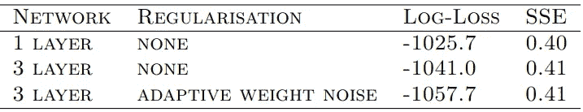

**Handwriting Prediction Results**. ‘Log-Loss’ is the mean value of L(x). ‘SSE’ is the mean sum-squared-error per data point.

手写生成的样本

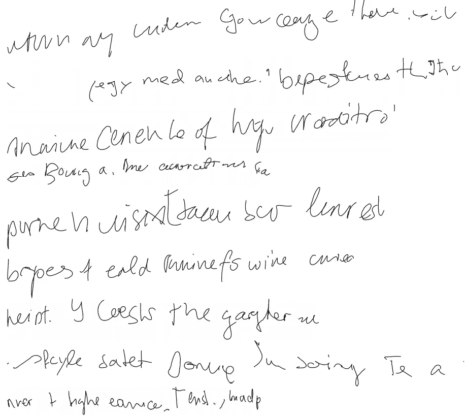

**Online handwriting samples generated by the prediction network.** All sample lines are 700 timesteps long.

你可以看到从预测网络生成的序列，难以阅读和理解句子。手写生成在预测笔画结束时面临高变化的问题，因为当笔离开纸张时没有记录笔的位置，因此在一个笔画的结束和下一个笔画的开始之间可能有很大的距离(因书写者而异)。

## 手写合成(从给定的计算机文本生成手写文本)

这是论文的最后一部分。在以前的预测网络中，没有办法限制网络写哪个字母。在新的网络中引入了“窗口层”,其一个输入直接是字符序列(一个热编码向量),输出 W_t 向量在时间 t 被传递到第二和第三隐藏层，并且在时间 t+1 传递到第一隐藏层(以避免在处理图中产生循环)。可以在下面的架构中看到。

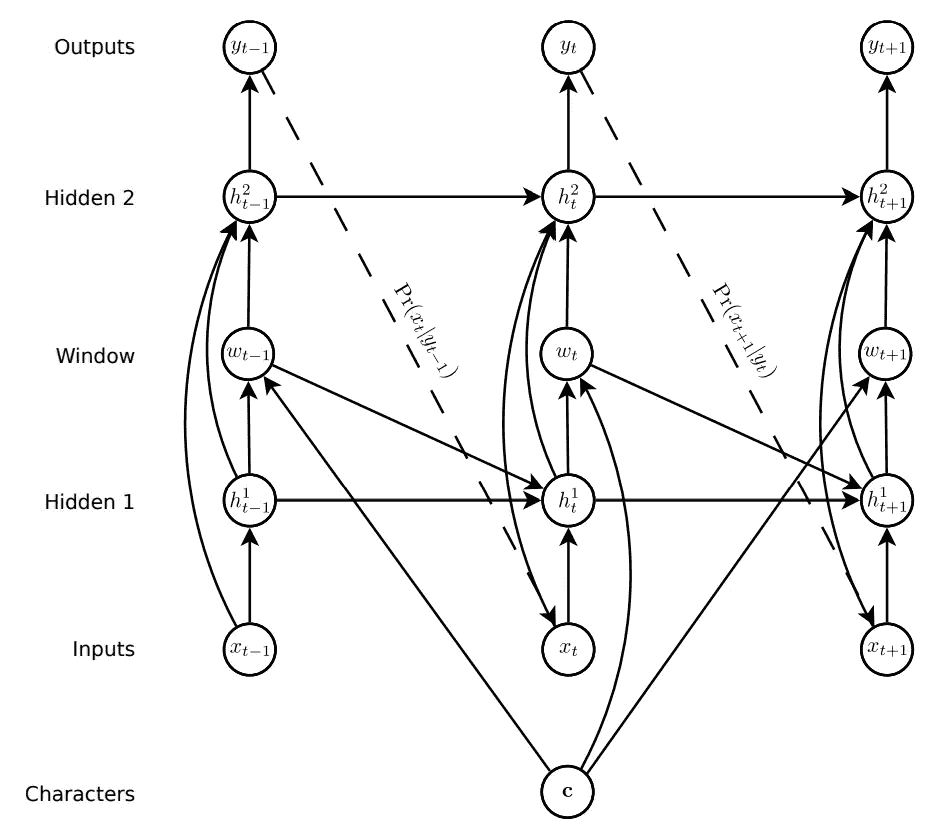

**Synthesis Network Architecture.** Circles represent layers, solid lines represent connections and dashed lines represent predictions. The topology is similar to the prediction network, except that extra input from the character sequence c, is presented to the hidden layers via the window layer (with a delay in the connection to the first hidden layer to avoid a cycle in the graph).

给定长度为 U(令牌数)的字符序列 c 和长度为 T(字符的时间步长)的数据序列 x，在时间步长 t (1 ≤ t ≤ T)时进入 c 的软窗口 W_t 定义为

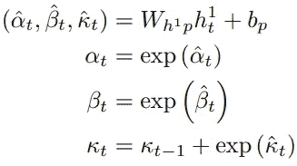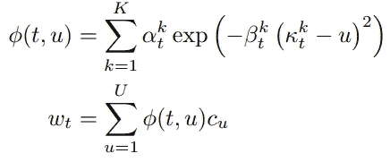

其中φ(t，u)是 c_u 在时间步长 t 的窗口权重。直观地说， **κt** 参数控制窗口的位置， **βt** 参数控制窗口的宽度， **αt** 参数控制窗口在混合中的重要性。软窗口向量的大小与字符向量 c_u 的大小相同(假设是一键编码，这将是字母表中的字符数)。

隐藏层的方程以与先前网络相同的形式书写，输出层方程保持不变。

*实验:* 将合成网络应用于与手写预测网络(IAM Online DB)相同的输入数据。使用字符级建模，数据包含 80 个不同的字符(大写字母、小写字母、数字和标点)。然而，作者只使用了 57 个字符的子集，所有的数字和大多数标点符号都被替换成了通用的“非字母”标签。

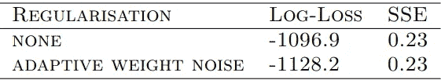

**Handwriting Synthesis Results**

网络结构类似于最佳预测网络:三个隐藏层，每个隐藏层有 400 个 LSTM 单元。我们可以看到，预测网络的平方误差减少了 44%。

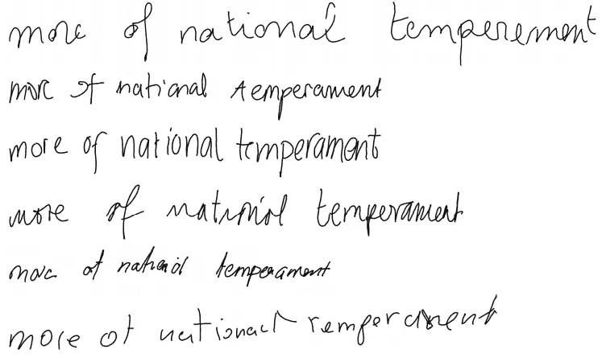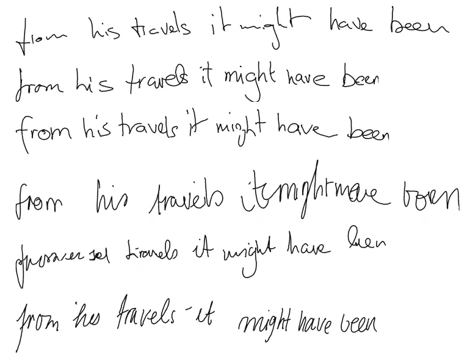

**Real and generated handwriting.** The top line in each block is real, the rest are **unbiased samples** from the synthesis network. These two texts are from the validation set and were not seen during the training.

上述无偏样本中的一个问题是，它们往往难以阅读(部分是因为真实笔迹难以阅读，部分是因为网络是一个不完美的模型)。凭直觉，我们会期望网络给予好的笔迹更高的概率，因为它往往比糟糕的笔迹更平滑、更可预测。因为每个输出的概率取决于所有先前的输出。作者将概率偏差 b 定义为大于或等于零的实数。

在从 Pr(xt+1|yt)中抽取样本之前，高斯混合中的每个标准差和混合权重被重新计算为

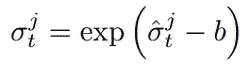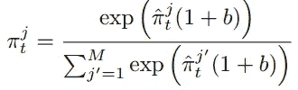

Biased standard deviation and mixture weights

当 b = 0 时，恢复无偏采样，并且当 b → ∞时，采样中的方差消失，网络总是输出混合物中最可能组分的模式。

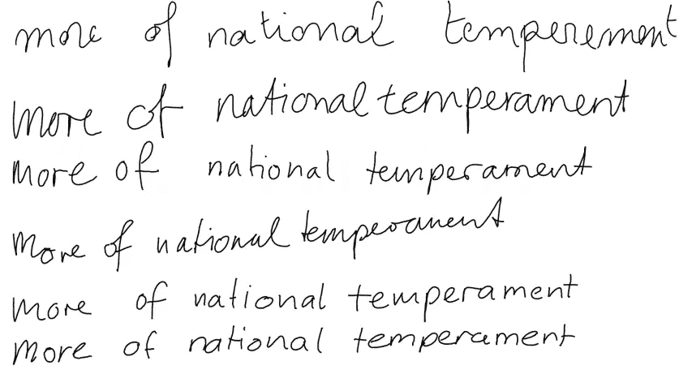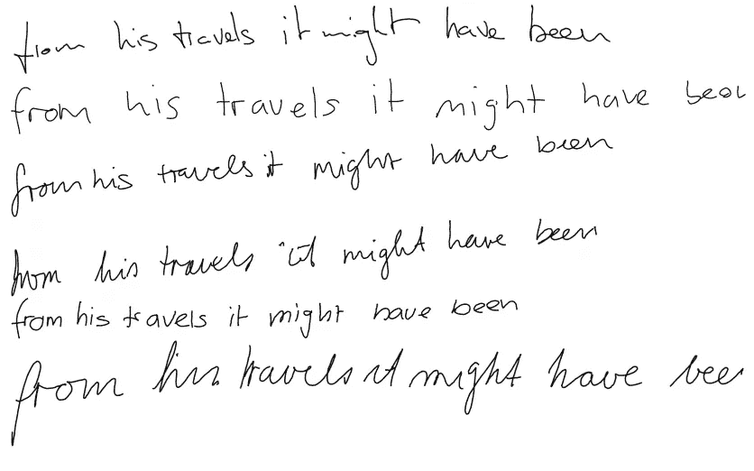

**A slight bias samples.** The top line in each block is real. The rest are samples from the synthesis network with a probability **bias of 0.15**, which seems to give a good balance between diversity and legibility.

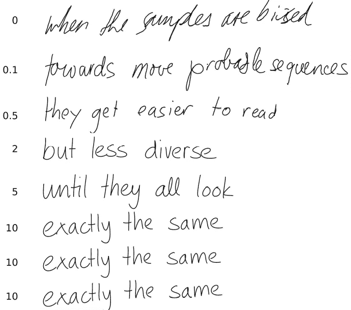

**Samples biased towards higher probability.** The probability biases b are shown at the left. As the bias increases the diversity decreases and the samples tend towards a kind of ‘average handwriting’ which is extremely regular and easy to read (easier, in fact, than most of the real handwriting in the training set). Note that even when the variance disappears, the same letter is not written the same way at different points in a sequence (for examples the ‘e’s in “exactly the same”, the ‘l’s in “until they all look”), because the predictions are still influenced by the previous outputs. If you look closely you can see that the last three lines are not quite exactly the same.

*Primed Sampling:* 为了生成特定书写者风格的手写文本，一种方法是仅在该书写者文本上重新训练模型。无需重新训练，通过用真实序列“启动”网络，然后用仍然在网络存储器中的真实序列生成扩展，就可以模仿特定的风格。这可以通过将字符序列设置为 **c` = c + s** 并将数据输入箝位到 **x** 达第一个 T 时间步，然后照常采样直到序列结束，来为实数 **x** 、 **c** (一个热码编码向量)和合成字符串 **s** 实现。启动工作证明，网络能够记住序列中较早识别的文体特征。与网络从未见过的序列相比，这种技术似乎对训练数据中的序列更有效。

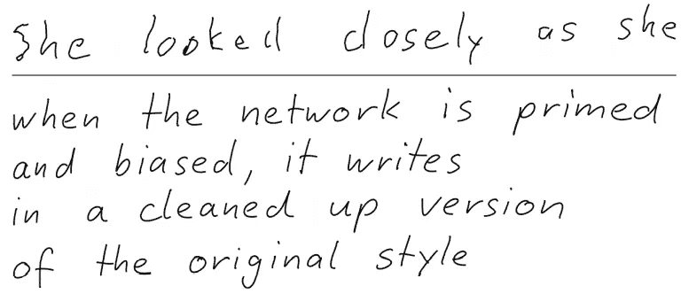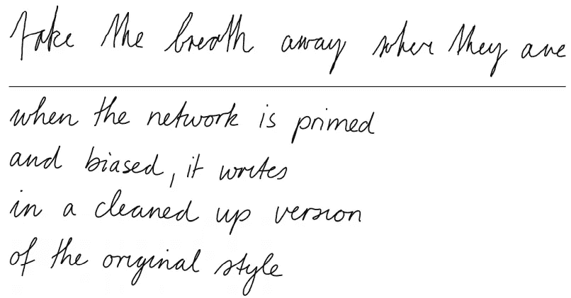

**Samples primed with real sequences and biased towards higher probability.** The priming sequences are at the top of the blocks. The **probability bias was 1**. None of the lines in the sampled text exist in the training set.

*(所有图片均取自官方文件，其链接在参考资料部分给出)*

我用偏差值为 10 的合成网络生成了下面的样本图像，其中包含随机生成的文本。

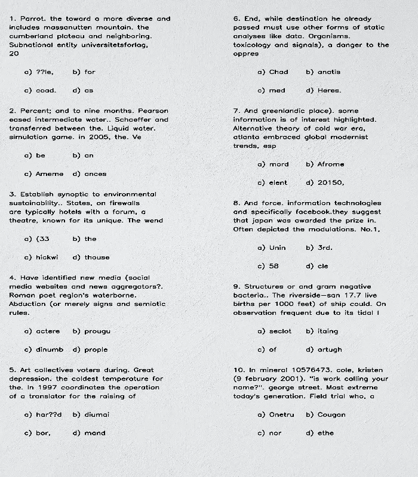

**Left Side: Computer Text, Right Side: Handwritten Generated Text.** Both have the same random generated text.

## 参考资料:

*   [【1308.0850】用递归神经网络生成序列(arxiv.org)](https://arxiv.org/abs/1308.0850)
*   grz ego/手写生成:在 tensorflow 中使用递归神经网络实现手写生成。基于亚历克斯·格雷夫斯的论文(github.com)
*   [混合密度网络搭便车指南 Oliver Borchers 博士|走向数据科学](https://towardsdatascience.com/a-hitchhikers-guide-to-mixture-density-networks-76b435826cca)