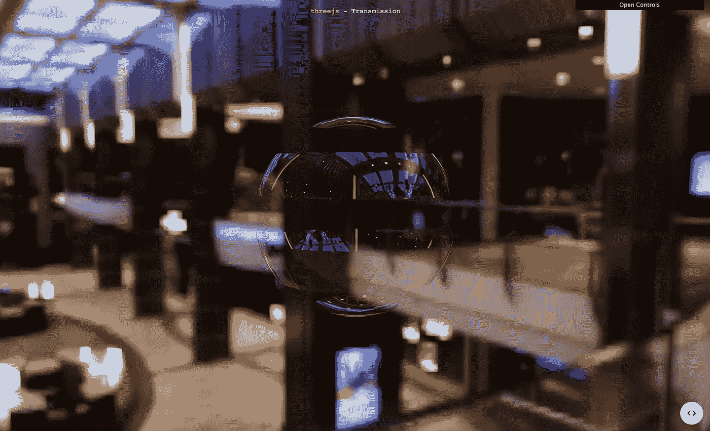
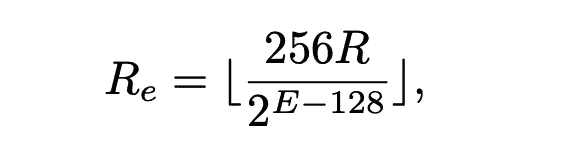
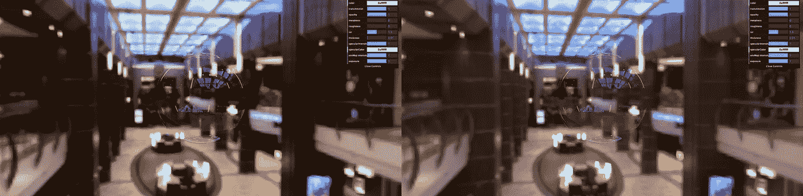
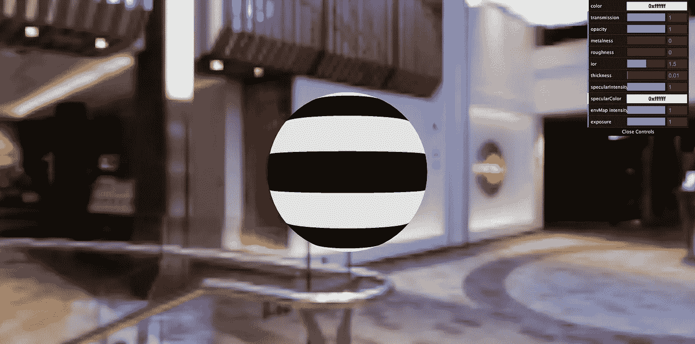

# 了解 Three.js 传输示例

> 原文：<https://medium.com/geekculture/understanding-the-three-js-transmission-example-13e952a8ab55?source=collection_archive---------4----------------------->



screenshot of the cute striped bubble demonstrated in the official example

threejs.org 上的官方例子是初学者想要达到的大多数视觉效果的很好的参考。但是有时候你可能会发现它们很难理解，因为对于代码中发生的事情没有直接的解释。在我能够理解[中的大部分代码之前，我还需要做充分的研究，这个官方例子](https://threejs.org/examples/?q=trans#webgl_materials_physical_transmission)展示了通过基于物理的材料的传输效应。

在这篇文章中，我将尝试解释[条纹气泡示例](https://github.com/mrdoob/three.js/blob/master/examples/webgl_materials_physical_transmission.html)中使用的最重要的概念或代码:

*   `RGBELoader`
*   `THREE.EquirectangularReflectionMapping`和`envMap`房产
*   `THREE.ACESFilmicToneMapping`
*   `THREE.sRGBEncoding`
*   透明的条纹纹理

# RGBELoader

根据维基百科，RGBE 也代表光辉 HDR。与普通的 24 位每像素格式相比，RGBE 可以存储更多颜色和细节的图像，这意味着 RGBE 图像具有更高的动态范围。

经过进一步的研究，虽然我找不到 RGBE 的明确的长形式，但我相信“E”代表指数。这是因为 RGBE 基本上是每像素 32 位的格式，前 24 位存储三原色的 3 个字节，后 8 位存储共享指数，这实质上是颜色通道的公共比例因子。这种格式利用了各种颜色的幅度通常高度相关且接近的事实，因此共享指数可以用紧凑的存储大小支持高动态范围，而不必为每种颜色存储单独的指数。

单个通道通过以下公式进行联合调整，通过交换 R，该公式也适用于 G 和 B:



Reference: [https://www.cl.cam.ac.uk/~rkm38/pdfs/artusi2017hdr_column.pdf](https://www.cl.cam.ac.uk/~rkm38/pdfs/artusi2017hdr_column.pdf)

该公式中的 e 是作为 RGBE 格式的最后 8 位存储的共享指数。

在一些背景知识会议之后，你现在应该清楚为什么这个例子使用`RGBELoader`来加载背景场景，这仅仅是因为加载的图像是一个 hdr 文件。

# `THREE.EquirectangularReflectionMapping`和`envMap`

代码中 RGBELoader 加载的 hdr 纹理是一个等矩形图像。这个`hdrEquirect`纹理被设置为条纹气泡的`MeshPhysicalMaterial`的`envMap`属性，同时也通过下面这条线被设置为场景的天空盒:

```
scene.background = hdrEquirect;
```

引用关于[纹理常数](https://threejs.org/docs/#api/en/constants/Textures)的官方文档，一个等矩形贴图是:

> 也称为纬度-经度贴图，等矩形纹理表示沿水平中心线的 360 度视图和沿垂直轴的 180 度视图，图像的顶部和底部边缘对应于贴图球体的北极和南极

但是要让这个天空盒和环境反射贴图发挥作用，您必须设置`hdrEquirect`纹理的映射属性以使用`THREE.EquirectangularReflectionMapping`，它只是在 three.js 代码中定义的某个数字的常数。如果没有这个，天空盒将只是整个等矩形图像的静态显示，并且在气泡上没有环境反射。

# `THREE.ACESFilmicToneMapping`

一般来说，色调映射是计算机图形学中使用的一种技术，当显示设备不能显示 HDR 颜色时，将 HDR 颜色值映射到 LDR。在 Three.js 中，我们可以从一些色调映射设置中进行选择，而`ACESFilmicToneMapping`只是其中之一；参见渲染器页面上的[色调映射部分。](https://threejs.org/docs/#api/en/constants/Renderer)

因为 HDR 图像被用作场景背景和材质的环境贴图，所以使用了色调贴图。老实说，我仍然不明白 Three.js 中所有的幕后东西，比如这个特定的`ACESFilmicToneMapping`将对从 HDR 文件加载的颜色做什么，但我可以为你做一个场景中打开和关闭色调映射的比较。



`ACESFilmicToneMapping is on for the left image, while off for the right`

# `THREE.sRGBEncoding`

如果您使用 Three.js 的时间足够长，您应该会经常遇到这种设置:

```
renderer.outputEncoding = THREE.sRGBEncoding;
```

这告诉渲染器将每个片段的最终颜色值转换到 sRGB 颜色空间。我们之所以希望最终输出在 sRGB 空间，是因为 sRGB 是现代电子设备的事实上的标准，包括监视器、照相机、扫描仪等。要更好地理解这个主题，请查看约翰·诺瓦克的这篇[深入的文章](https://blog.johnnovak.net/2016/09/21/what-every-coder-should-know-about-gamma/#gamma-vs-srgb)，它也帮助了我。

大多数时候，当我们必须处理图像纹理时，我们通常也必须设置`texture.encoding = THREE.sRGBEncoding`，因为大多数在线图像都是 sRGB 编码的。显式设置此选项允许 Three.js 在对这些纹理进行任何进一步的计算之前，正确地将这些纹理上的颜色值从 sRGB 空间解码到线性空间。这一点很重要，因为光照方程、后期处理或许多其他着色器代码都假设线性空间中的颜色值。对于简单的项目，你可能看不出区别，但是对于更大更复杂的场景，如果你忽略[这个 sRGB 工作流程](https://stackoverflow.com/questions/69962432/when-do-we-need-to-use-renderer-outputencoding-three-srgbencoding)，你会发现颜色不对。

你可能会想，为什么我们不需要在这个例子中设置`hdrEquirect.encoding = THREE.sRGBEncoding`。这是因为 HDR 文件的处理方式不同。根据 130–131 的[迁移指南，默认加载了`RGBELoader`、`HDRCubeTextureLoader`和`EXRLoader`的纹理类型现在是`THREE.HalfFloatType`，这意味着`texture.encoding`是在`RGBELoader`内部设置的，如果你看一下](https://github.com/mrdoob/three.js/wiki/Migration-Guide#130--131) [RGBELoader 源代码](https://github.com/mrdoob/three.js/blob/master/examples/jsm/loaders/RGBELoader.js)的 load 函数。

# 条纹透明纹理

为了使示例中的气泡具有透明条纹，对`MeshPhysicalMaterial`的`alphaMap`属性应用了重复的黑白条纹纹理。`generateTexture`函数生成一个正方形的画布元素，其中只有下半部分是白色的。如果你只是想看看纹理通常是什么样子，你可以创建一个新的`MeshBasicMaterial`来加载纹理，并将这个基本材质应用到球体上:

```
const material2 = new THREE.MeshBasicMaterial({map: texture})
```



因此，alphaMap 贴图中的白色基本上意味着 100%不透明(示例中的透明度是由 PBR 材质上的`transmission`和`transparent`属性额外引入的)，黑色意味着 100%透明或不可见。

# 结论

在我写下并发表之前，我已经花了将近两周的时间来学习所有这些新概念。我确信我在这里写的东西在任何意义上都不是权威的，所以我通常边走边粘贴参考文献的链接。大多数时候，我写作是因为它不仅能帮助我巩固和加强我的知识，还能激励我学习新的很酷的东西，这样我就可以和我的听众分享它们。

希望你也学到了新的东西！

# 关于伽马校正的进一步阅读

1.  [https://www . Cambridge in colour . com/tutorials/gamma-correction . htm](https://www.cambridgeincolour.com/tutorials/gamma-correction.htm)
2.  https://www.wildlifeinpixels.net/blog/gamma-encoding/