# 理解 JavaScript 中的“this”

> 原文：<https://medium.com/geekculture/understanding-this-in-javascript-22c068616f5a?source=collection_archive---------14----------------------->

对于许多 JavaScript 开发人员来说，这个问题一直是一个棘手的问题，但是现在是时候说“我得到了这个问题”

Photo by [Nick Sokolov](https://unsplash.com/@nsokolov114?utm_source=unsplash&utm_medium=referral&utm_content=creditCopyText) on [Unsplash](https://unsplash.com/t/textures-patterns?utm_source=unsplash&utm_medium=referral&utm_content=creditCopyText)

之前我在 JavaScript
中写过[理解范围和上下文，在阅读**这篇**文章之前，我会推荐你应该先阅读](https://suhas010.medium.com/understanding-scope-and-context-in-javascript-suhas-more-8f765e3867ba)[那篇](https://suhas010.medium.com/understanding-scope-and-context-in-javascript-suhas-more-8f765e3867ba)文章，但是如果你认为你已经很好地掌握了范围和上下文，让我们继续。

# 那么 JavaScript 中的‘this’是什么呢？

正如我们在[这篇](https://suhas010.medium.com/understanding-scope-and-context-in-javascript-suhas-more-8f765e3867ba)文章中详细讨论的，在全局上下文中`this`关键字的值指的是一个全局对象，在浏览器的情况下是`Window`。

所以 JavaScript 中的`this`的答案是
`this`包含一个值，这个值大部分时间是一个`object`，这个值是在那个特定时间执行的`context`。

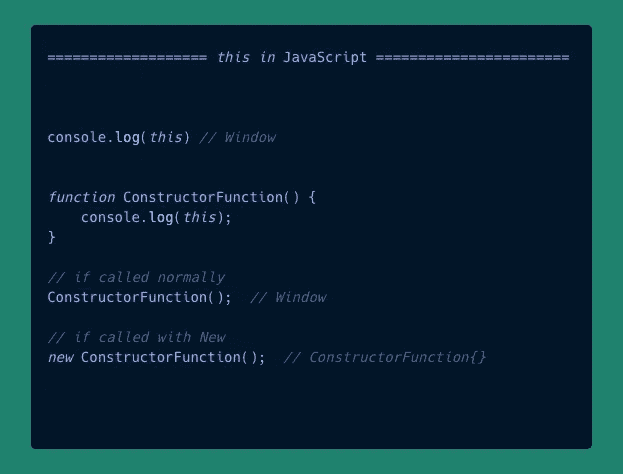

Value of this in different cases

正如你在上面的例子中看到的，
默认情况下，`this`将包含一个`object`值，该值引用 web 浏览器中的`Window`全局执行上下文。

`this`的值由调用函数的方式决定。

如果用关键字`new`调用一个函数，JavaScript 将为它创建一个单独的执行上下文。

*注意:如果在* ***严格模式下运行，* `*this*` *的值会发生变化。***

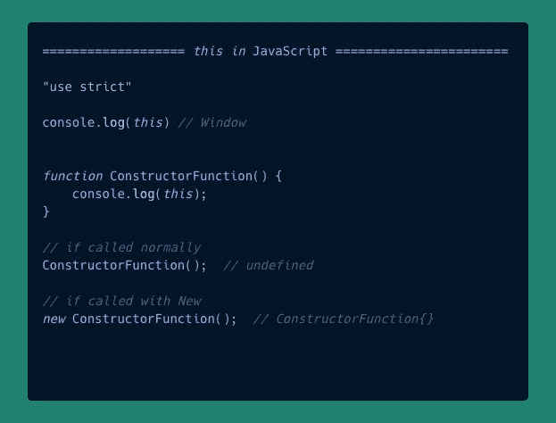

in strict mode

正如你在上面的例子中看到的，
如果`constructorFunction`被正常调用，它现在将包含`undefined`值，因为它运行在严格模式下。

JavaScript 引入了一个名为`globalThis`的新属性，它指向全局`this`值。

*注意:全局* `*this*` *的值在 NodeJS (* `*Object*` *)中不同，在 WebWorker 中可能是* `[*DedicatedWorkerGlobalScope*](https://developer.mozilla.org/en-US/docs/Web/API/DedicatedWorkerGlobalScope)` *或* `[*SharedWorkerGlobalScope*](https://developer.mozilla.org/en-US/docs/Web/API/SharedWorkerGlobalScope)` *但在 web 浏览器中会是* `*Window*` *。*

所以总而言之，`this`只不过是运行特定代码行的执行上下文，这是在`runtime bindings`中定义的

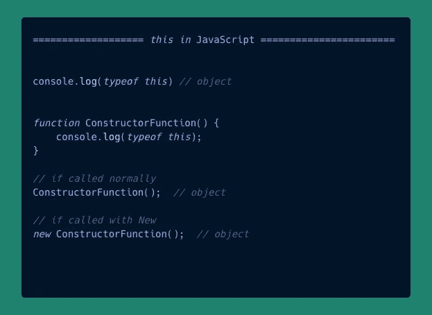

typeof this

正如你所看到的，几乎在所有场景中`this`只不过是一个`object`，
我们有时称之为`context`或`execution context`

## 如何确定'`this'`的值

我们已经了解了什么是`this`及其包含的内容，现在是时候学习一些规则来确定`this`在任何给定时间点的值。

对许多人来说，确定`this`的值是**最难的**部分，这使得`this`在 JavaScript 中备受争议。

我们将列出`this`值发生变化的所有可能情况。

## 缺省值

这是最简单的部分，打开 devtools 和 log `this`，在 chrome 中会是这个样子

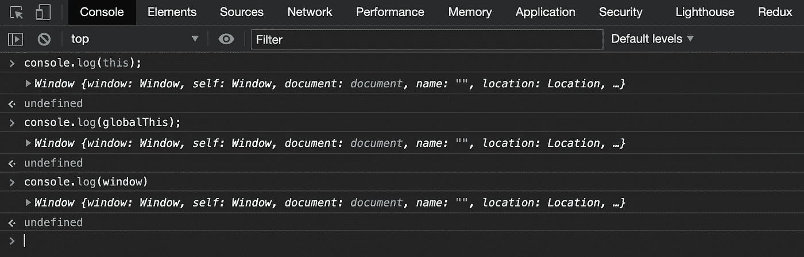

this, globalThis and Window are same

如您所见，所有都记录了同一个值，即一个`Window`对象。

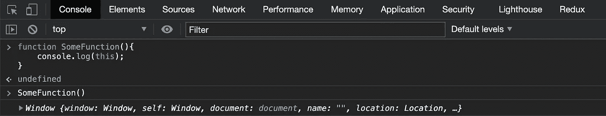

default execution context

这是 JavaScript 中的默认执行上下文，默认情况下，每个函数都在默认上下文中执行。

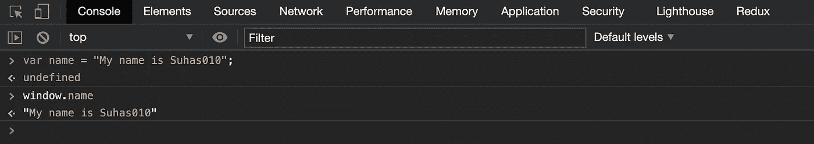

variable declaration

在全局`scope` ( *使用* `*var*`)中声明的变量被添加到`Window`对象中，我们可以使用`window.varName`来访问它们

## 改变这个的值

如果`this`总是指向`Window`对象，我们就无法实现代码**复用**，代码**抽象**并且会污染`global`上下文。
这就是为什么有一种方法可以让我们创建自定义上下文，并更改已经在其他上下文中定义的某个函数的执行上下文。

## **呼叫**，**申请，**和**捆绑**解救我们。

这些是在`Function`原型上可用的方法，所有三种方法的目的是相同的，只是在实现上有所不同。

我们不打算详细研究这些方法，而是用一些例子简单地解释一下。

让我们想象一下，您编写了一个名为`printName`的函数，它接受`message`作为输入，并打印一个名为 name 的变量，以便从它运行的上下文中进行控制。

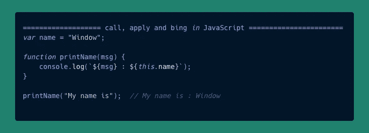

好了，对了，
在上面的例子中，我们创建了一个名为`name`的变量，它将被添加到`window`对象上，因为`printName`函数默认运行在`global`上下文中，变量`name`在`this`上可用。

现在成像，需求有了变化，现在你有了另一个名为`user`的对象，它也包含一个名为`name`的属性，你想在控制台上打印它。

既然你是一个优秀的程序员，并且你练习了**干**，你想要重用上面的函数来完成这项工作。

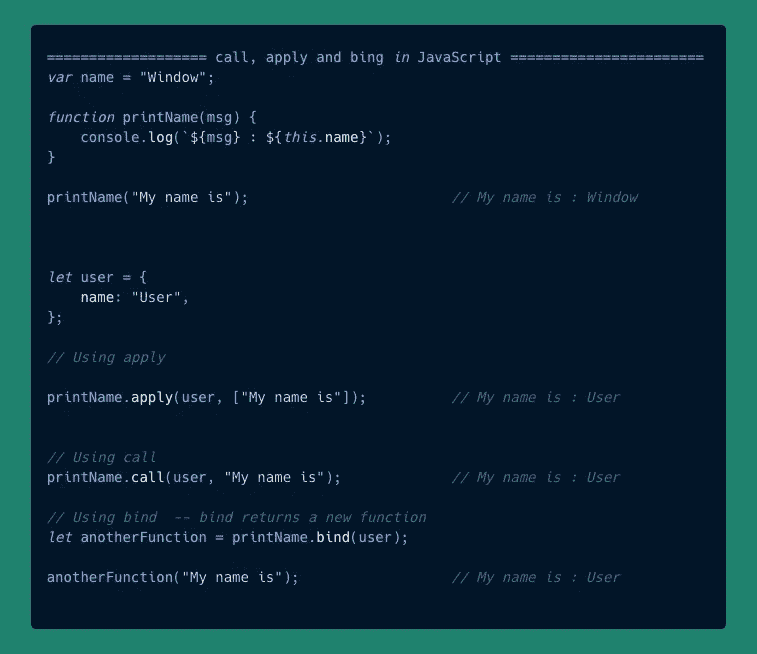

call, apply and bind example

正如你在上面看到的，
我们现在能够打印名为`name`的属性，它在`user`对象中可用，而在`Window`对象中不可用。

基本上，我们改变了默认运行在`global`上下文中的原始`printName`函数的上下文。

与`call`、`apply`、`bind`法说、
、`printName`请磨合`user`语境，

仔细看看下面的例子，
现在我们也在`printName`函数中记录`this`

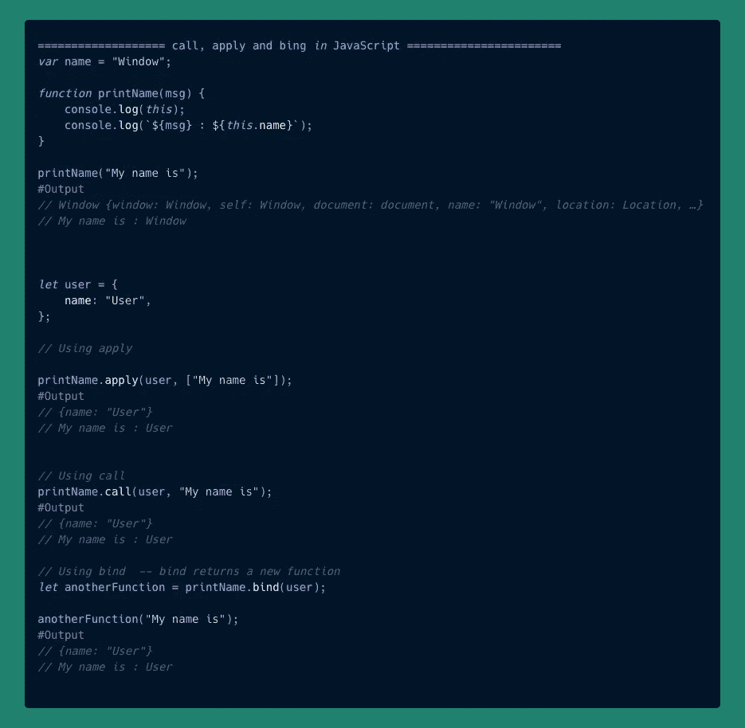

We are also logging **this**

如你所见，当我们调用`printName`时，通常`this`指向`Window`
，而当我们使用`call`、`apply`和`bind` `this`调用时，指向的是`User`对象

## 正常功能与箭头(胖)功能

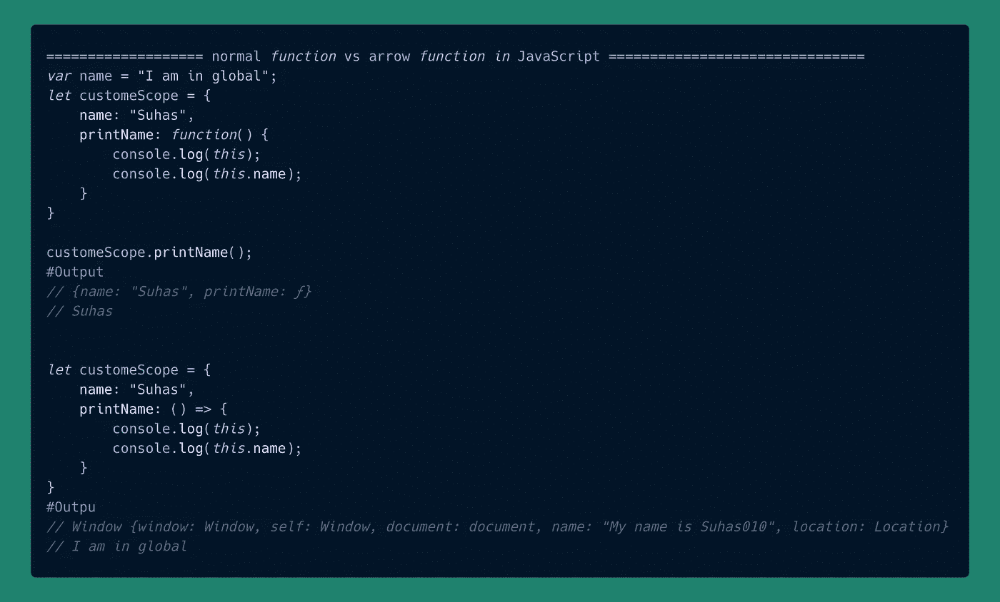

Normal function vs arrow (=>) functions

正如你在上面的例子中看到的，
我们已经创建了一个名为`customeScope`的对象，并定义了一个匿名函数，将它分配给一个名为`printName`的属性，该属性打印了`this`和`name`属性。第二个例子和第一个一样，唯一的区别是我们使用了箭头函数。

但是这一点小小的差异却导致了一个大的变化。

说明:
箭头(= >)功能默认没有`this`设置为`window`。其功能正常。相反，箭头函数在它们被创建的范围内执行。

在上面的代码片段中，第一个示例中的
,`this`指向创建它们的上下文，即`customeScope`

在第二个例子中，由于 arrow 函数没有自己的`this`，它将使用封闭范围的`this`值，即`Window`(封闭范围是`customeScope`，其`this` 为`window`

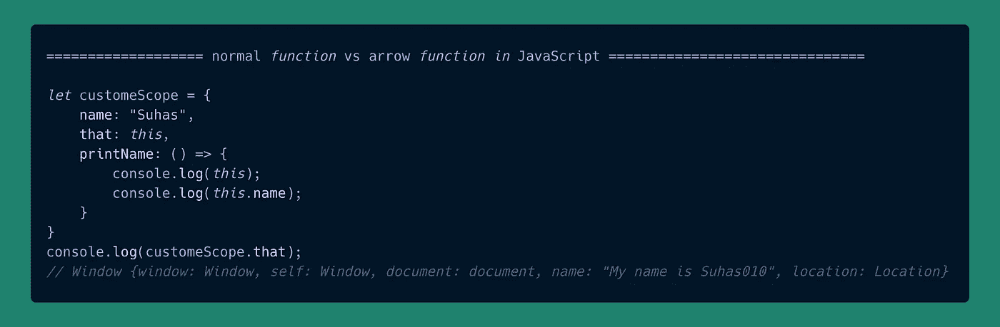

Arrow function example

。
。今天就到这里吧，我已经尽力解释了什么是`this`以及它在各种情况下是如何变化的。

希望你今天学到了一些新东西…

如需进一步了解，请考虑以下来源
1。[https://developer . Mozilla . org/en-US/docs/Web/JavaScript/Guide](https://developer.mozilla.org/en-US/docs/Web/JavaScript/Guide)
2。[https://javascript.info/](https://javascript.info/)

欢迎反馈和建议。

在推特上联系我。

在那之前…