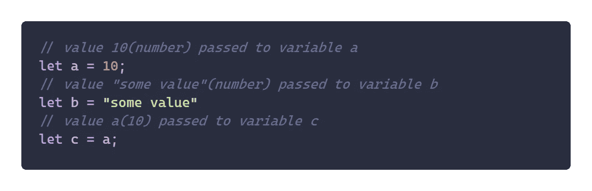
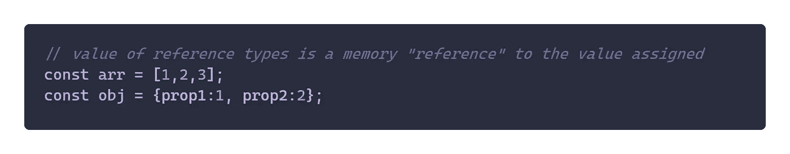
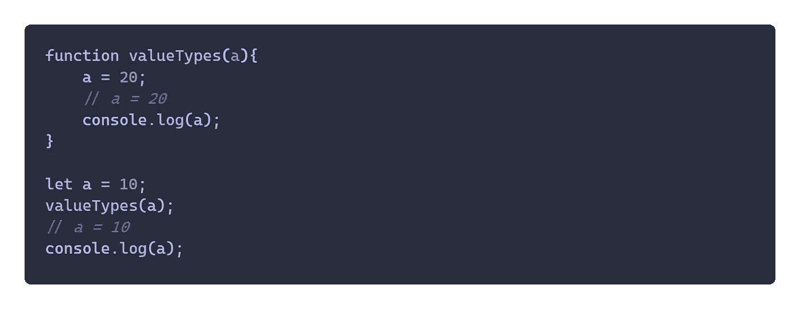
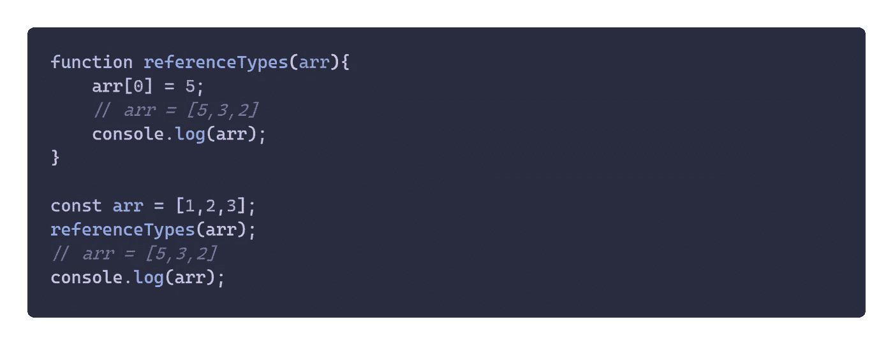
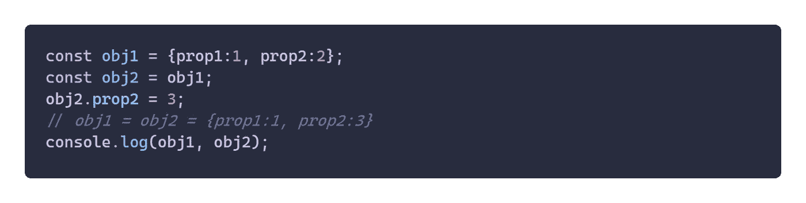
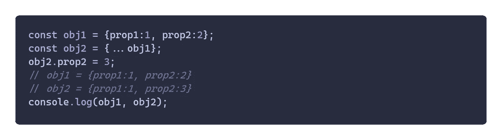

# Javascript 中的值与引用类型

> 原文：<https://medium.com/geekculture/understanding-value-and-reference-types-with-javascript-4833f48b74c?source=collection_archive---------33----------------------->

Photo by [Juanjo Jaramillo](https://unsplash.com/@juanjodev02) on [Unsplash](https://unsplash.com/)

**简介**

在这篇文章中，我们将讨论编程中最重要的话题之一，即值类型和引用类型。特别是，在本文中，我将尝试使用 Javascript 来解释它。这些是我们将要讨论部分:

*   什么是值类型和引用类型？
*   它们之间有什么区别？
*   为什么知道它们很重要？

## 什么是值类型和引用类型？

如果您已经编写了一段时间的代码，您可能会熟悉其中的一些数据类型，如字符串、数字或布尔值。这些数据类型被称为原始数据类型。原始数据类型在赋值时使用*方法。所以我们也可以称这些类型为值类型。在 Javascript 中，这些类型是字符串、数字、布尔、空和未定义。让我们看看下面的一些例子:*

**

**value types example in javascript**

*在上面的例子中，你可以看到，在 Javascript 或大多数编程语言中，这些“按值传递”术语是通过简单地将等号运算符右边的值赋给变量左边的值，并将其存储在内存中完成的。这意味着变量总是保持我们给它们的实际值。这些可能很简单，所以让我们转到引用类型来看看区别。顾名思义，引用类型在我们给它们赋值时使用了*方法。在 Javascript 中，这包括数组和对象。让我们看一些例子:**

****

***reference types example in javascript***

**那么这里的***【reference】***到底是什么意思呢，意思是说这些数组和对象只是把内存引用作为它的值保存，而不是像以前的值类型那样马上保存实际的值。这个引用指向我们赋予它们的值。好了，现在你已经知道这两种类型的定义了。但是，为了更好地理解和了解这些类型，我们来看下一部分。**

## **它们之间有什么区别？**

**因为我们使用的是 Javascript，所以我将尝试使用函数，来展示这部分中这些类型之间的区别。**

****

**value types example with function**

**正如你在上面的例子中看到的，我有一个带参数的值类型函数。然后，调用该函数并将变量传递给它。如果你试着运行上面的代码，你会看到函数中的变量 **"a"** 将输出 **20，**，但是在函数**、**之外执行变量 **"a"** 之后，仍然会输出 **10。**为什么会出现这种情况？如果我们遵循*规则，当我们调用函数时，我们将**【a】**的值赋给函数参数中的变量**【a】**，其中这两个变量有不同的内存位置，但现在有相同的值。然后，当我在函数内部重新赋值**“a”**的值时，新值被传递给目标赋值，也就是我们的变量**“a”**。由于这两个变量是不同的，这就是为什么函数外的变量**在把它的值传递给函数内的变量后，仍然有它的初始值。现在，让我们看一下下面的引用类型示例，让它更清楚。*****

**********

*****reference types example with function*****

*****值类型的例子也是如此，但现在我创建了一个数组，它是 Javascript 中的引用类型之一，并将该数组传递给我的函数。现在，当我们调用该函数时，数组的值被传递给参数中的一个新的变量数组，但是根据 ***【按引用传递】*** 的定义，这个数组的值实际上只是对一个保存所分配数字的内存位置的引用。所以现在，尽管这两个变量互不相关，但都有相同的参考值。当我试图改变函数内部的值时，数组会引用它在内存中的引用值来改变它。因为，函数外的数组持有相同的引用，当我们记录值时，它将再次引用该引用，但现在我们得到更新的引用，因为在函数中我们已经改变了它。*****

## ****为什么知道它们很重要？****

****所以在最后一部分，首先我会试着总结一下我们到目前为止学到的东西。 ***值类型是保存我们赋予它们的值的数据类型*** 。此外，**引用类型是保存分配值所在的内存引用的数据类型**。所以，理解这些类型基本上会让你更清楚变量的当前值，特别是在使用引用类型的时候。正因为如此，我要添加最后一个关于引用类型的例子，在这里我们很可能会有一个很难调试的地方，为什么值和我们期望的不一样。****

********

****reference types example using objects****

****首先，你可能会注意到，在我所有的引用类型示例中，我使用了 **const** 关键字来防止变量值被重新赋值。这也是使用引用类型时的一些好的最佳实践，因为在大多数情况下，我们不想改变引用，而只想改变引用内部的值。继续我上面的例子，我用来自 **obj1** 的参考值给 **obj2** 赋值。因此，当我们改变 **obj2** 的属性值时，同样的属性也会在 **obj1** 中改变。因此，为了防止 obj1 出现意外值，如果您打算将 **obj1** 的值复制到 **obj2** 中，一个解决方案是您可以使用新的 Javascript 语法 **spread 运算符**将所有 **obj1** 的内容复制到 **obj2** 中，并使 **obj2** 拥有自己的**引用值**。****

********

****spread operator in action****

****这是我关于引用和值类型的帖子，我知道我不能涵盖与这些主题相关的所有不同情况，所以我希望通过阅读这篇帖子帮助你学习一些基础知识，并让你想自己试错来真正理解它。****

****谢谢你。****

****法比安·维埃里。****