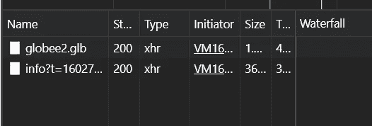
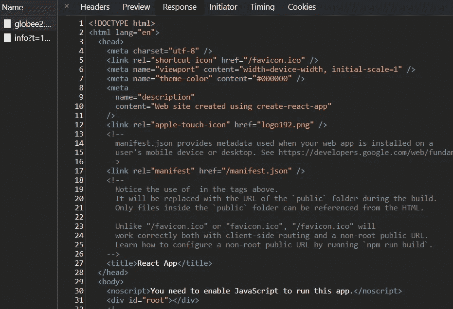
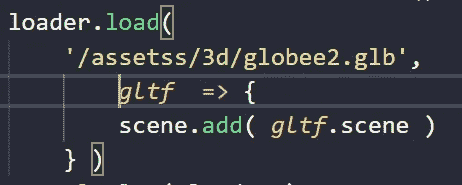
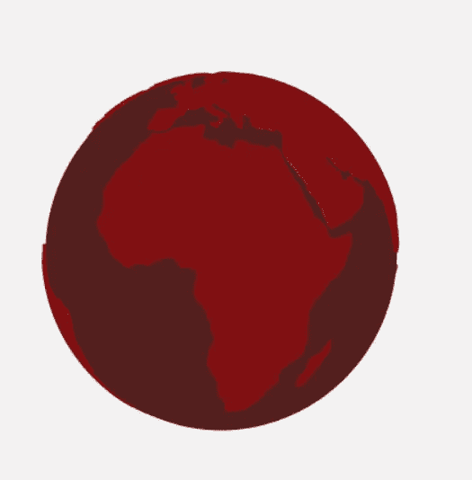

# 意外标记< in JSON at position 0 Three.js

> 原文：<https://medium.com/geekculture/unexpected-token-in-json-at-position-0-three-js-20e9c4e1aabc?source=collection_archive---------0----------------------->

# Error

SyntaxError: Unexpected token < in JSON at position 0 Three.js

# Fix it

When you want to load a GLTF or OBJ or GLB or another object to your Three.js Project the error occurs in the HTTP request and return pure HTML

Example XHR globe figure glb

In this case returns react index.html

# Solution

The solution is in the loader, if you see I added another s on assets and the loader can’t find the figure in other cases is the root of the file or could be the name or on the root of the figure.

Example where the error start

We have the 3D Figure

# Conclusion

This will help you to know where is the exact problem and how to fix it.

# Sources

[https://discourse . three js . org/t/syntax error-unexpected-token-in-JSON-at-position-0/13810/5](https://discourse.threejs.org/t/syntaxerror-unexpected-token-in-json-at-position-0/13810/5)