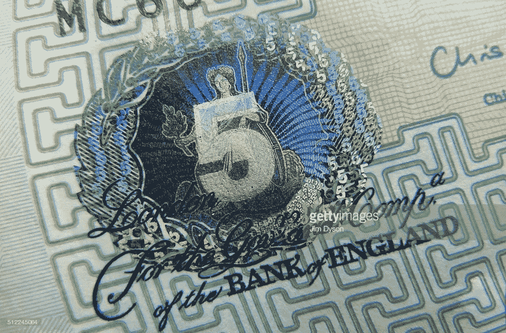
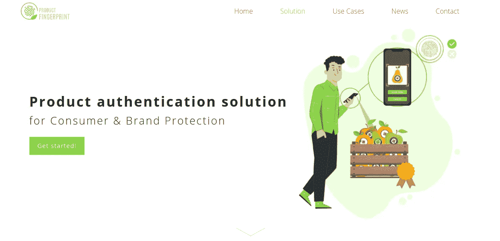

# 供应链的独特认证方法

> 原文：<https://medium.com/geekculture/unique-authentication-methods-for-supply-chains-bf298446bb38?source=collection_archive---------20----------------------->

Photo by [Martin Adams](https://unsplash.com/@martinadams?utm_source=medium&utm_medium=referral) on [Unsplash](https://unsplash.com?utm_source=medium&utm_medium=referral)

在我们这个快节奏的世界中，技术进步提供了许多新的解决方案，尤其是在产品验证和认证领域。跟踪、追溯和产品认证是确保供应链中质量控制、防盗和可追溯性的关键措施。

近年来，技术的进步导致了几种产品认证方法的发展。每种方法都有其独特之处，本文将介绍其中的一些方法。

随着人工智能技术及其子领域的发展，我们现在有可能用新技术解决这个问题。

Photo by [sydney Rae](https://unsplash.com/@srz?utm_source=medium&utm_medium=referral) on [Unsplash](https://unsplash.com?utm_source=medium&utm_medium=referral)

# 什么是认证？

身份验证是验证产品和请求访问系统、流程、管理任务或设备的人员的身份的过程。如今，有各种各样的用户认证方法来防止未授权人员访问敏感信息和产品认证方法。

同样，产品认证将验证在来源到最终用户的运输过程中是否遵循了适当的流程。认证还可以识别和防止不符合质量标准的掺假或假冒产品被添加到特定货物或产品批次中。

# 现有身份验证方法

Photo by [Markus Winkler](https://unsplash.com/@markuswinkler?utm_source=medium&utm_medium=referral) on [Unsplash](https://unsplash.com?utm_source=medium&utm_medium=referral)

## **公开方法**

公开认证方法涉及序列号中的印刷 2D 码、QR 码或数据矩阵码以及产品代码的其他机器可读表示。虽然公开方法仍在使用，但它的流行是因为易于使用和对技术的熟悉。这种方法的缺点是产品伪造者可以很容易地复制这些代码。因为没有可靠的方法来区分原始 QR 码和复制的 QR 码；因此，二维码作为产品认证方式并不完全是优质的。

[Getty](https://www.gettyimages.co.uk/detail/news-photo/detail-of-the-holographic-foiling-on-a-5-banknote-news-photo/512245064#/detail-of-the-holographic-foiling-on-a-5-banknote-featuring-a-of-picture-id512245064?esource=social_PI_gallery)

## **基于全息图的认证**

尽管基于全息图的认证很少，但它作为产品的安全特征而存在，如信用卡或钞票。全息图具有难以复制的复杂特征，但它主要仍然是安全的装饰功能，而不是验证。早期的全息图制作仅限于特定的制造商，但在技术时代，可以定制具有不同特性的全息图，并且无法检测出伪造的全息图。

## **RFID**

RFID 标签通常用于使用 RFID 设备对物体进行简单的跟踪和非接触式识别。RFID 的使用在物流行业非常普遍，物流行业是供应链的关键因素之一。低成本 RFID 标签易于被篡改或复制。因此，它们不适合用于身份验证。相反，价格较高的 RFID 标签被认为是防克隆的。使用 RFID 标签作为产品认证的主要来源的障碍是成本因素和对标签转换或克隆的关注。

# 为什么产品认证很重要？

产品假冒是一个严重的全球性问题，这个问题正在迅速增加，尤其是在最近几年。假冒行为正在吸引盗窃、犯罪和供应链中的一些掺假行为。复杂的供应链结构和庞大的分销渠道使得监控和跟踪产品变得非常困难。

产品认证解决方案确保参与供应链的个人可以轻松认证产品。假冒行为在电子商务、制药、机械、电子等没有任何耐用性或质量保证的行业普遍存在。

同样，农业部门遭受盗窃或添加不符合标准的低质量食品，并迅速侵蚀。此外，食品的产品标签被伪造，非有机食品以更高的价格出售。因此，市场对产品认证方法的需求不断增长，以应对这些挑战。

目前，产品认证解决方案采用 QR 码或序列号的形式，并使用全息图。然而，这种解决方案不能提供可靠的认证解决方案，并且它们不能保护供应链和保持完整性。一些现有的解决方案由于简单易用但不安全而失败，而另一些解决方案是安全的选项，但需要专业和专用的硬件，还有一些解决方案不经济。此外，所有现有的解决方案都需要某种人工监督，这使得效率较低。

近年来，人工智能一直是构建自动化和更完善的认证方法的首选技术，这种方法可以在从制造商到消费者的分销网络中提供端到端保护。

# **产品认证的最新创新**

两个显著的例子包括:

[Authentic Vision](https://www.authenticvision.com/)

## 真实的视觉

该公司提供了一种安全标签解决方案，这是一种安全、用户友好且经济高效的产品认证流程。

客户可以选择安全标签的类型并确定标签的简单性，包括用于产品认证的标签系统所需的特殊设备或培训的因素。安全标签由机器可读代码、独特的人类可读代码和防复制的随机 3D 结构组成，即使公司也无法复制生成的代码。该安全标签也与移动设备兼容，并且具有对每个产品的位置的实时跟踪和地理定位。

## 产品指纹

Deeplai 的产品指纹为产品认证提供了独特的解决方案和新颖的方法。这种方法是一种人工智能支持的视觉可追溯性和认证方法，可以使用各种视觉产品线索创建唯一的产品指纹。

[ProductFingerprint](https://productfingerprint.com/)

带有*视觉指纹*的产品让制造商和经销商在整个供应链中跟踪他们的产品。例如，苹果生产是大规模的。因此，人工检查如此大量的标签和质量检查几乎是不可能的。

[Deeplai 的](https://deeplai.com/)人工智能驱动的多维图像分析考虑了颜色和形状，还可以根据输入系统的图像对产品进行损坏评估。系统生成分配给每个产品的唯一产品指纹。详细信息存储在云平台中，用于安全和防篡改的记录保存。

# 结论

身份认证技术正在快速发展，市场上有许多新的选择。通过集成产品认证方法，可以实现安全的供应链网络，从而减少伪造、盗窃和其他与安全相关的因素，避免产品的任何滥用。

人工智能技术为业界期待已久的自动化产品认证方法提供了一种新方法。