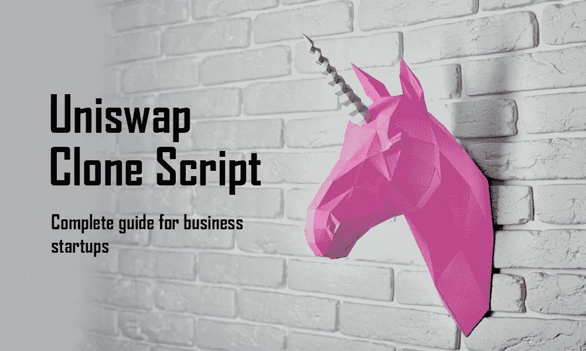

# Uniswap 克隆脚本—创业指南

> 原文：<https://medium.com/geekculture/uniswap-clone-script-complete-guide-for-business-startups-66946d8830d?source=collection_archive---------8----------------------->

Uniswap Clone Script — Complete guide for business startups

今天的话题是加密领域，推出 DEX 平台是一个利润丰厚的业务模块。许多企业家对区块链行业有着敏锐的洞察力，他们的 Defi 平台，如 UniSwap，渴望推出自己的基于 Defi 的类似于 UniSwap 的交流平台。

因此，我想解释清楚 UniSwap 克隆脚本以及如何以一种简单的方式开发它。让我们将这篇文章移到下一步，深入探讨 UniSwap 克隆脚本。

# 什么是 UniSwap 克隆脚本:

uni WAP 克隆脚本可用于构建一个类似于 uni WAP 的功能丰富、安全且分散的交易平台，用户可以在该平台上交易具有流动性特征的不同代币。在加密领域，许多解决方案提供商提供 100%准确的 Uniswap 源代码，以及额外的交易和支付优势。您可以使用 Uniswap 克隆脚本完全自定义您的 Defi Exchange，以满足您的特定需求。高技能开发人员使用敏捷方法开发 Uniswap 克隆脚本。

# UniSwap 概述:

UniSwap 是一个完全开放源代码和完全分散的交换平台。它使用一种相对新型的交易协议，称为自动流动性协议。它建在区块链以太坊的顶部。这是 Marketcap 的世界第二大 Defi 项目，该项目通过在 Metamask 和 MyEtherWallet 等钱包上使用 ERC20 令牌进行交易。这是一个完全分散的交易所，用户可以控制他们的资金，不用担心中间人。

# 如何像 UniSwap 一样搭建 DEX 交易所？

如果你是一个初学加密的人，你可能需要分散的 exchange 开发公司的帮助来建立一个像 Uniswap 这样的令人惊奇的 DEX。像 Uniswap 这样功能丰富的 DEX 可以通过两种方式之一启动。第一种方法需要从头开始创建一个分散的交易所。这种技术非常复杂，使用起来要花很多钱。此外，如果你是加密货币世界的新手，你无疑需要一家知名的加密交易所开发公司的帮助。其次，通过使用完美的 Uniswap 克隆脚本，您可以创建与 Uniswap 相当的 DEX。您可以使用 Uniswap 克隆脚本快速启动理想的 DEX。

# 创建一个像 UniSwap 这样的 Defi exchange 需要多少成本？

创建一个基于 Defi 的交换平台的成本是企业家考虑的最重要的事情，成本是根据开发过程的方法和你给定的特性来决定的。包含所有特定功能的 UniSwap clone 脚本的成本大约为 5000 美元，根据您的定制功能和业务需求，成本可能会有所不同。与其他方法相比，这种 UniSwap 克隆脚本完全经济高效。

# 为什么要建立像 Uniswap 克隆软件这样的 DEX？

*   建立在以太坊最可靠的区块链网络上。
*   昂贵的 Uniswap 克隆软件中有数不清的可调功能。
*   为您的用户实现快速、安全的 ERC20 令牌交换。
*   高端安全模块和增强的 DeFi 交换协议功能用于构建 Uniswap DEX 克隆脚本。
*   您可以利用这个白色标签的 Uniswap exchange 克隆软件快速构建一个 DeFi exchange。
*   短期内成功的可能性很大。
*   以最少的努力获得出色的投资回报。
*   它减少了您在创建 Uniswap exchange 克隆方面的投资，因为它是一种经济高效的解决方案。
*   Uniswap 克隆已经过全面测试，没有任何错误。
*   包括对许多加密钱包连接的支持。

# UniSwap 克隆软件的高级功能:

**自动做市商(AMM):**

Uniswap clone script 包括一个流动性提供工具，使用户能够使用流动性池自动进行交易，不再需要传统的订单簿系统。

**即时兑换:**

该解决方案提供商开发了顶级的外部钱包，包括信托钱包、币安钱包、比特币基地钱包和 Metamask 钱包等。交易者可以快速交换建立在以太坊网络上的代币。智能合约为软件提供支持高速自动化交易的能量。

**交易速度:**

这个克隆脚本允许每秒进行数千笔交易，使许多用户能够同时使用 exchange 而没有任何延迟。

**安全性:**

它们提供无轨的多层安全机制，这是区块链技术的官方商标。由于多项安全协议，泄露个人信息或金融交易几乎是不可能的。

**神谕:**

他们开发了一个高度安全的交易所，允许用户查看固定的价格数据，并将数据保存在外部。

# UniSwap 克隆应用程序:

使用 UniSwap clone 应用程序使手机上的加密交易变得更加简单快捷。这个克隆应用程序支持 android 和 iOS，并且可靠、安全、易于操作。您可以使用手机上的 UniSwap Clone 应用不间断地交易您的密码。DEX clone 应用程序具有原始 UniSwap 的所有功能和优势。如果您需要根据自己的业务想法插入任何附加功能，您可以根据自己的业务需求对它们进行定制。

# 像 UniSwap 这样有效的 Defi exchange 是如何工作的？

让我们一步步地了解 UniSwap 克隆的工作过程。

第一步

用户帐户创建。

第二步

连接 Web3 wallet 的用户。

第三步

选择要交换的令牌。

第四步

钱包收到的令牌。

第五步

交换完成。

第六步

固定滑动公差。

第七步

管理掉期交易。

第八步

选择一对来增加流动性。

第九步

从流动性中赚取交易费用。

# UniSwap 克隆的优势:

*   投资较少
*   巨大的投资回报率
*   完全可定制
*   LP 奖励
*   抵制审查
*   流动性优势
*   上市时间短
*   没有中介
*   极好的兼容性
*   非凡的隐私
*   飙升的交易量
*   经过全面测试的源代码
*   即时令牌交换
*   高度安全。
*   内置加密钱包
*   可行交易费

# 在哪里建立像 UniSwap 这样利润丰厚的基于 Defi 的 DEX 平台？

希望你对 UniSwap 克隆脚本 及其特性有所了解。如果你想推出一个基于 Defi 的平台，如 UniSwap，并寻找加密领域最好的 Defi 解决方案提供商。别担心，我会帮你完成我的研究，我会被推荐给顶尖的 Defi 开发公司“WeAlwin Technologies”。作为一家成功且有前途的区块链发展公司，他们的名字传遍了全世界。他们根据自己的业务需求，以可承受的价格为满意的客户完成了 200 多个项目。