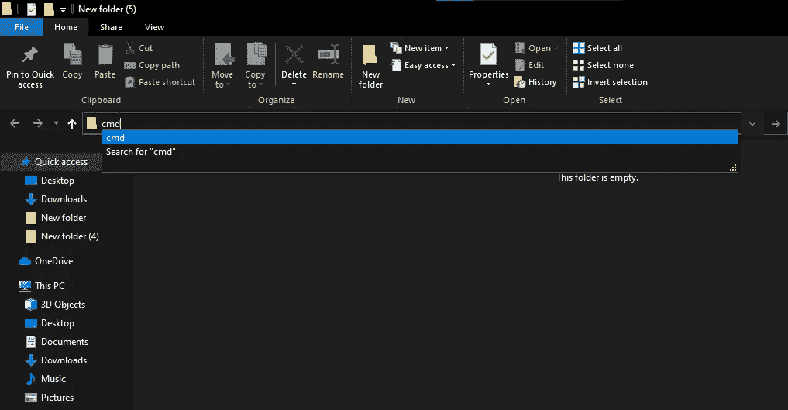
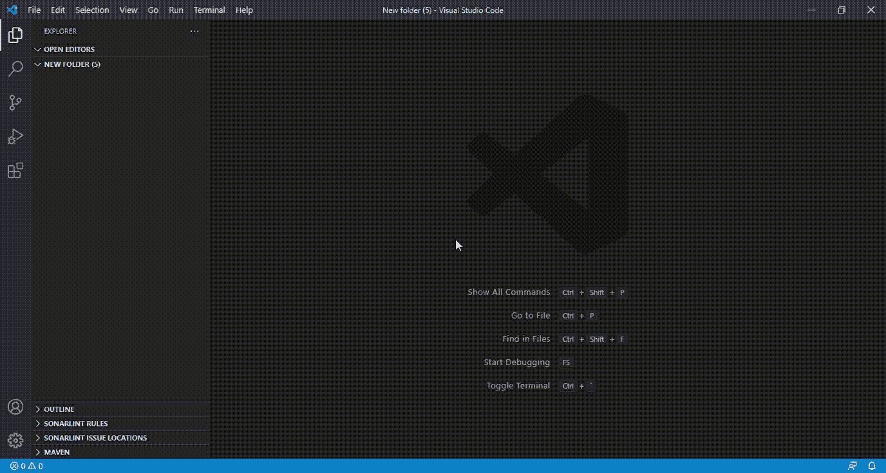
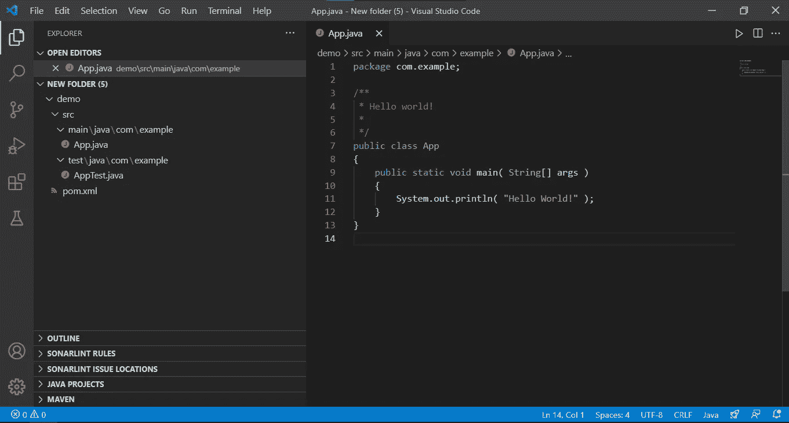
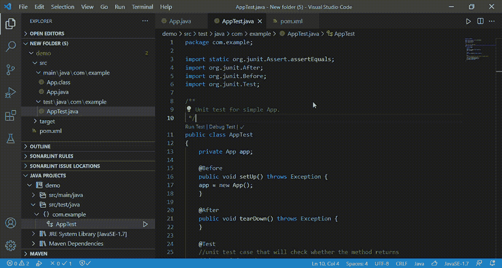
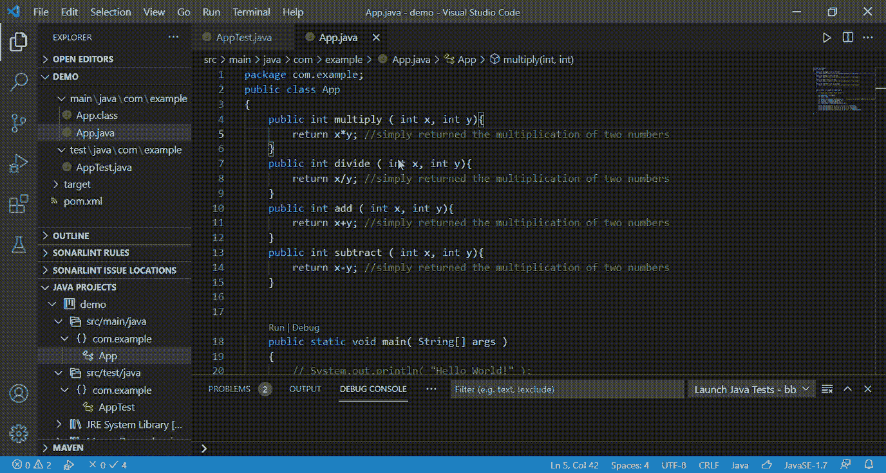

# 软件测试:简单 Java 程序的单元测试用例

> 原文：<https://medium.com/geekculture/unit-testing-of-simple-java-programs-b785a164b440?source=collection_archive---------7----------------------->

本文面向任何刚开始使用 java 进行单元测试的人。在这里，我写了三个非常简单的 java 程序和它们对应的测试用例来帮助你理解这个概念。本文将涵盖从安装必要的包到运行 Java 程序的第一个单元测试用例的所有内容。

## 为什么要进行单元测试？

如果你是一名计算机科学毕业生或者在职专业人士，你可能会遇到类似于*测试驱动开发*或者 TDD 的术语。根据敏捷[联盟](https://www.agilealliance.org/)，TDD 可以定义为:

> 三种活动紧密交织的编程风格:编码、测试(以编写**单元测试**的形式)和设计。

这意味着编写单元测试用例对于基于 TDD 的软件开发至关重要。我建议单元测试用例应该成为你开发习惯的一部分，因为它可以最大限度地减少开发人员的错误。您不需要依赖测试人员来报告本来可以避免的小错误。有时，我看到单元测试用例通过减少愚蠢的错误帮助我改进工作。所以你看，开发人员中也有一点点测试人员！

## 设置您的系统

让我们从设置您的系统开始。请注意，本文是为一个真正简单的 java 程序运行第一个单元测试用例的快速入门。我敢肯定，一旦您运行了那个错误报告(在接下来的部分中出现)，您将会尝试找到更多的细节。互联网是一个很大的知识中心，你可以找到了解技术细节的材料。

对于本文，我使用的是 Visual Studio (VS)代码。

1.  **安装 Java:** 可以有两种情况。您有 VS 代码但没有配置 java，或者您既没有 VS 代码也没有 java。我强烈推荐你通过[这个](https://code.visualstudio.com/docs/java/java-tutorial#_before-you-begin)链接。如果你属于这两种类型中的任何一种，都非常容易理解。
2.  **启用扩展**:一旦 VS 代码配置了 Java，就需要启用 Java 测试[运行器](https://marketplace.visualstudio.com/items?itemName=vscjava.vscode-java-test)、Red Hat 对 Java 的[语言支持、Java](https://marketplace.visualstudio.com/items?itemName=redhat.java) 扩展的[调试器。这些工具将帮助你运行/调试测试用例，查看测试报告&测试日志，等等。](https://marketplace.visualstudio.com/items?itemName=vscjava.vscode-java-debug)

## 启动 Visual Studio 代码

1.  创建一个文件夹来保存 Java 代码和测试文件。
2.  在顶部目录导航栏上键入“cmd ”,如图 1 所示
3.  按回车键，命令行终端打开。然后输入“代码”
4.  按回车键，瞧！您刚刚启动了 VS 代码工作区。那很酷，不是吗？



Figure 1: Directory Navigation bar with “cmd”

## 创建 Java 项目



GIF 1: Creating Java Project

1.  停留在上面提到的 VS 代码页上，按 Ctrl+Shift+p
2.  然后选择“java:创建 java 项目”。
3.  按照提示进行操作，并不断选择必要的细节。
4.  Maven 是一个主要用于 Java 项目的构建自动化工具。在这个演示中，我选择了 Maven。你可以用其他的选项来配置 Java 项目，比如 Gradle 等等。
5.  完成所有工作后，您的新项目应该是可见的，如下所示:



Figure 2: Java Project in VS Code

## 运行测试用例

在运行任何文件之前，我强烈建议您彻底检查一下 Java 项目。尝试花一些时间了解项目结构，然后继续下一步。此外，整个教程的代码可以在 Github [库](https://github.com/semicolon123/Software-Testing/tree/main/Unit-testing-in-java)中找到。

1.  首先，运行包含主要代码的 java 文件。运行一个文件有许多方法。其中一个是右键点击代码文件，选择“运行 java”。
2.  现在，您应该在终端中看到预期的输出。
3.  在这个项目中，你会看到一些变化，比如类文件的创建(毕竟是 java！)，在类上面添加了运行测试和调试测试快捷方式(或者，CodeLens ),以及我们以前安装的扩展的方法定义。
4.  运行 java 测试文件(本演示中的【AppTest.java】T2，安装的扩展将添加 codeLens，如 Run Test | Debug Test |。复选标记显示测试报告。这个报告包含了各种细节，比如通过或者失败的测试用例，以及重新运行测试用例，等等。
5.  就是这样！对于这个例子，我们只有一个测试用例，即“shouldAnswerWithTrue ”,它碰巧成功通过了！你肯定应该试验给出不同输入的代码，看看你的测试用例是否失败。继续，花一些时间，回来看看将为其生成测试用例的其他一些简单的 java 代码。

## 编写第一个单元测试用例

在这个例子中，我考虑了一个简单的 java 程序，它计算两个数的乘积并打印出来。

下面给出的是单元测试用例，用于检查这样生成的产品是否正确。

```
package com.example;
import static org.junit.Assert.assertEquals;
import org.junit.After;
import org.junit.Before;
import org.junit.Test;public class AppTest
{
private App app;@Before
public void setUp() throws Exception {
app = new App();
}@After
public void tearDown() throws Exception {
}@Test// unit test case that will check whether the method returns the 
// anticipated output or notpublic void testMultiplication() {
int result = app.multiply(10, 5);
assertEquals(result,40);
}
}
```

如果你注意到我在测试文件中提到的，assertEquals 方法中的 40 显然是错误的，因为 10 和 5 的乘积应该是 50。让我们看看这个单元测试用例运行时会发生什么。



GIF 2: Running the first test case

我希望现在您已经知道为什么会出现这个错误了。尝试纠正并运行前面提到的代码。

## 多个测试案例

我在 java 文件中添加了更多的方法，并在测试文件中添加了相应的单元测试用例。测试文件如下所示:

```
@Test
//unit test case that will check whether the method returns
//the anticipated output or notpublic void testMultiplication() {
int result = app.multiply(10, 5);
assertEquals(result,40);
}public void testDivision() {
int result1 = app.divide(10, 5);
assertEquals(result1,40);
}public void testAddition() {
int result2 = app.add(10, 5);
assertEquals(result2,40);
}public void testSubtraction() {
int result3 = app.subtract(10, 5);
assertEquals(result3,40);
}
```

让我们看看这些测试用例是什么样子的。



GIF 3: More unit test cases

## 结论

这篇文章肯定没有涵盖单元测试的所有方面，但是对于那些希望现在就开始编写 java 单元测试用例的人来说无疑是有用的。我只包括了最简单的例子，但是你可以写更复杂的例子。我当然会尝试写更多的文章来涵盖边界值分析或相关概念。目前，我希望当前的文章对您有用。

还有，你可以在 [Twitter](https://twitter.com/SwatiRajwal) 和 [LinkedIn](https://www.linkedin.com/in/swati-r-84682b12b/) 上问我一个问题！

谢谢你。