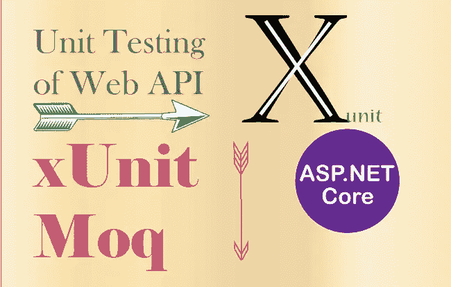

# 在 ASP.NET 核心中使用 XUnit 和 MOQ 进行单元测试

> 原文：<https://medium.com/geekculture/unit-testing-using-xunit-and-moq-in-asp-net-core-af6346fc2dc7?source=collection_archive---------3----------------------->

Unit Testing. Xunit , Moq

当您不能将您想要测试的类与系统的其余部分隔离开来时，编写单元测试可能是困难的、耗时的和缓慢的。在这门课中，嘲讽。NET 核心单元测试与 Moq:入门，您将学习如何创建模拟，并使用它们作为您想要测试的类的依赖项。首先，您将发现如何配置模拟的方法和属性来返回特定的…