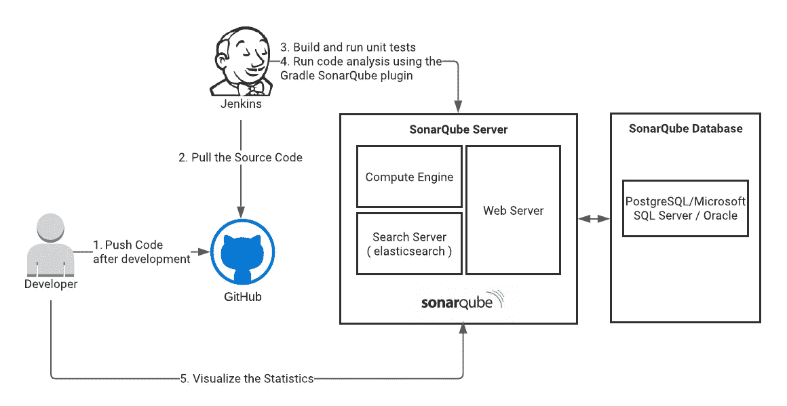
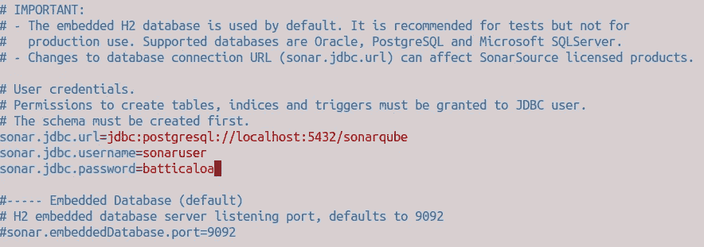
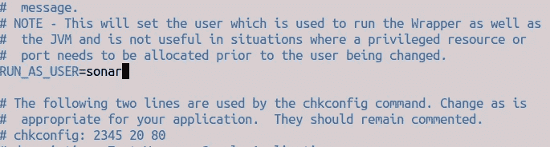
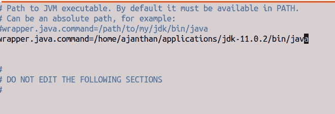
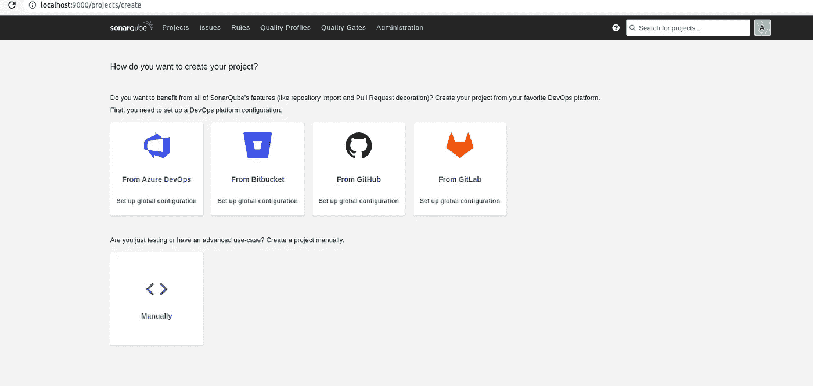

# 用 SonarQube 对 Spring Boot 微服务进行单元测试覆盖和源代码分析

> 原文：<https://medium.com/geekculture/unit-tests-coverage-and-source-code-analysis-for-spring-boot-microservices-with-sonarqube-464a0d730edc?source=collection_archive---------5----------------------->

本文将解释我们如何通过 Jenkins 集成 SonarQube 来检查单元测试覆盖率和源代码分析。在这里，我们将创建一个 Spring Boot 微服务，并为我们的控制器编写单元测试，在使用 gradle 构建 Jenkins 的同时，将使用 Gradle 的“sonar cube”插件将数据推送到 sonar cube，然后从 SonarQube UI 进行分析。

## 1.我们要设置什么

## 2.设置 SonarQube

当我们取 SonarQube 时，它主要有两个部分。

1.  SonarQube 服务器:包含计算引擎、搜索服务器和网络服务器。
2.  sonar cube 数据库:帮助存储 sonar cube 实例的配置和项目的质量快照。

在这个设置中，我将设置 SonarQube 服务器和 PostgreSQL 数据库。请注意，SonarQube 也可以支持 Microsoft SQL Server 和 Oracle。要了解更多支持的版本，请参考[本](https://docs3.sonarqube.org/latest/requirements/requirements/)。

**安装 PostgreSQL**

按照以下步骤，为 SonarQube 启动并创建一个用户。

现在我们需要为 SonarQube 设置数据库模式。为此，请遵循以下步骤并执行命令。

**安装 sonar cube**

下载最新版本。

提取并重命名文件夹。

添加一个用户和组，作为 SonarQube 的独立用户运行。

**将 SonarQube 连接到数据库**

前往 sudo vim/home/ajanthan/applications/sonar cube/sonar cube/conf/sonar . properties

转到 sudo vim/home/ajanthan/applications/sonar cube/sonar cube/bin/Linux-x86–64/sonar . sh

要作为服务运行，

转到 sudo vim/etc/systemd/system/sonar . service 并添加以下内容:

开始执行下面的命令，有时如果你使用不同的 java 安装目录，那么你也需要更新下面的文件。

前往 sudo vim/home/ajanthan/applications/sonar cube/sonar cube/conf/wrapper . conf

执行以下命令启动并检查状态。

进入 [http://localhost:9000](http://localhost:9000) 然后你会被引导到登录页面，在输入默认的 admin:admin 之后你就可以进入控制台了。

## 3.设置微服务项目

Spring Boot 本身编写单元测试的选择是基于 spring-boot-starter-test 依赖关系来编写。这包括我们在编写单元测试时使用的所有依赖库。如果我们需要除此之外的任何其他库，我们可以添加它们以及依赖项。

**JUnit 5:**Java 应用程序单元测试的事实标准。

**春季测试& Spring Boot 测试:**Spring Boot 应用的实用程序和集成测试支持。

**AssertJ:** 一个流畅的断言库。

**Hamcrest:** 匹配器对象库(也称为约束或谓词)。

**Mockito:** 一个 Java 嘲讽框架。

JSON assert:JSON 的断言库。

**JSON path:**JSON 的 XPath。

还要注意 WebClient 单元测试，之前我们使用 Mockito 库模拟 WebClient 调用，但是使用 MockWebServer 有更好的选择，这已经在这里讨论过。

**build . gradle 的配置**

这里主要使用了两个插件，jacoco 用于生成 sonar cube 可以读取的代码覆盖报告，sonar cube 插件用于推送代码分析配置。

这将启用基于 xml 的报告，可以在构建目录下查看。

这是为了说明在我们执行。/gradlew test 调用 jacocoTestReport 任务来生成报告。

最后，将下面的配置传递给 SonarQube，提到了报告的排除和路径。

## **4。设置 Jenkins 管道**

使用下面的管道脚本创建管道。

## 5.在 SonarQube 中验证

现在登录 SonarQube 实例，查看项目并检查统计数据。

## 参考

[1][https://www.baeldung.com/spring-mocking-webclient](https://www.baeldung.com/spring-mocking-webclient)

[2][https://docs . sonar qube . org/latest/architecture/architecture-integration/](https://docs.sonarqube.org/latest/architecture/architecture-integration/)

[3][https://blog . dev genius . io/spring-boot-deep-dive-on-unit-testing-92 bbdf 549594](https://blog.devgenius.io/spring-boot-deep-dive-on-unit-testing-92bbdf549594)