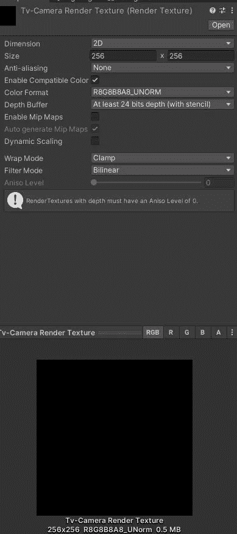
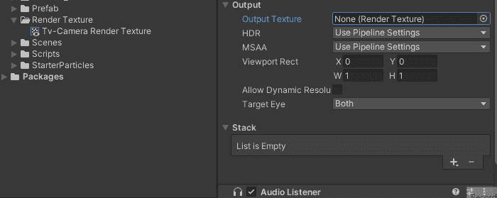
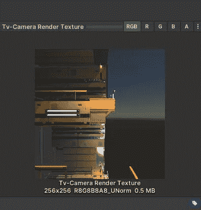
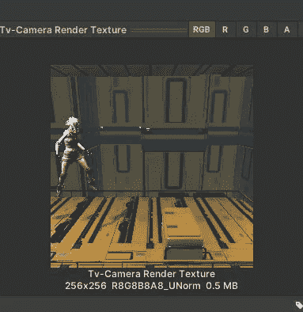
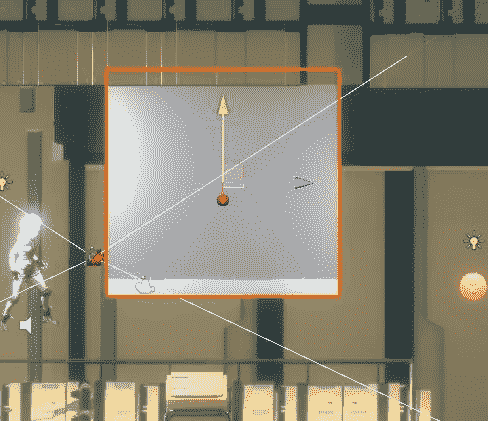
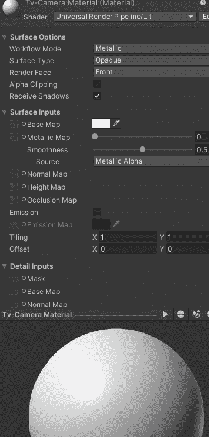
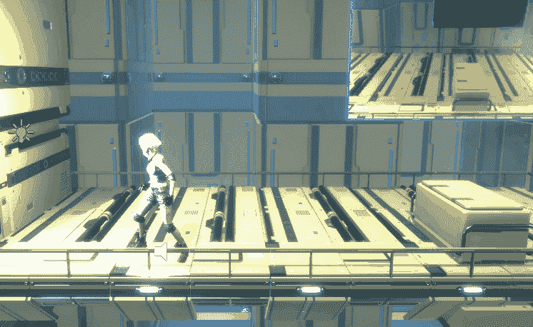

# Unity 功能 101:渲染纹理第 1 部分(游戏内电视摄像机)

> 原文：<https://medium.com/geekculture/unity-features-101-render-textures-part-1-in-game-tv-camera-5aab6979bed2?source=collection_archive---------10----------------------->

ender textures 是 Unity 中一个很棒的功能，有着无限的潜力。渲染纹理是一种在运行时更新的纹理。

你可以用它来做很多很酷的事情，比如游戏中的电视摄像头或者迷你地图。在这篇文章中，我们将看到如何创建一个渲染纹理，它的设置，以及如何创建一个游戏中的电视摄像机。

> 创建渲染纹理

要创建渲染纹理，只需进入**创建>渲染纹理。**

Render Texture Inspector

这将在项目文件中创建新的渲染纹理。

尺寸中最重要的设置是像素，它也决定了纹理的长宽比。在我们的例子中，它是一个 256x256 的正方形渲染纹理。您也可以添加抗锯齿和深度缓冲设置，但这些会影响您的游戏性能。其他设置就像任何其他纹理。

> 游戏中的电视摄像机

首先在你的场景中创建一个新的摄像机，我们称之为电视摄像机。选择您的电视摄像机，在摄像机的**输出**部分，您可以更改**输出纹理**。将先前创建的渲染纹理拖动到相机的输出纹理中。

Drag your render texture into the new camera’s output texture

这里有一个小的 gif 来演示如何…

Drag your render texture into the new camera’s output texture

如果做得正确，选择你的渲染纹理，你应该看到新创建的相机所看到的预览。

现在调整你的电视摄像机来看你想要的比赛的任何部分。这里有一个快速的提示，选择你的电视摄像机，然后调整你的场景视图到摄像机应该看到的，然后按**“CTRL”+“Shift”+F**，这将改变摄像机的变换以显示你想要的。

正如你所看到的，这也改变了渲染纹理的预览。

现在，为了在游戏过程中显示它，我们应该将这个渲染纹理添加到场景中的游戏对象中。

为此，让我们创建一个 **Qaud** 作为我们的游戏内电视，转到 **Create > 3D > Quad** 并将其重命名为 too Tv Camera Display。下一个位置，将这个方块缩放到游戏中你喜欢的任何位置。

Quad placement

接下来，让我们创建一个材质来保存渲染纹理，这样我们就可以将它应用到四边形中。在你的项目文件中，转到**创建>材质**并将其重命名为 Tv-Camera 材质。

现在最重要的步骤是将你的渲染纹理拖到这个材质的**底图**中。这将允许材质在游戏过程中渲染纹理。

正如你在材质预览中看到的，它现在正在将电视摄像机看到的任何东西渲染到这个材质上。

最后，把这个材料拖到你的四轴飞行器上。

In-Game Tv-Camera Renderer

你可以看到，现在我们有了一个游戏内电视摄像机，你可以用它来做任何事情，比如为你的游戏创建一个迷你安全摄像系统。

*注:以上截图来自一款名为* ***的 Lea 冒险*** *的原型，你可以通过这个链接测试出来:*[*Lea 冒险| smelle . io*](https://simmer.io/@NovusXDev/adventures-of-lea)*。*