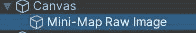
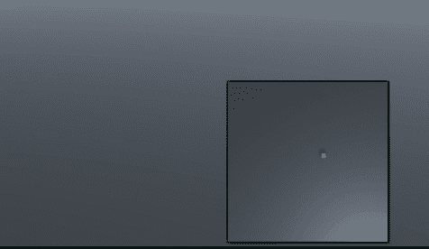
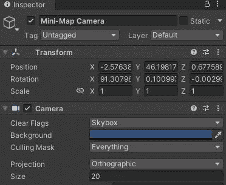
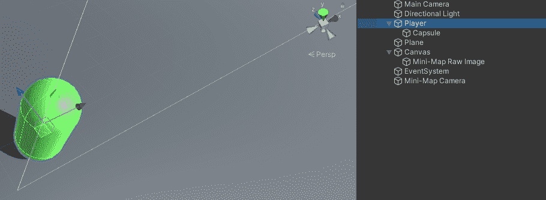
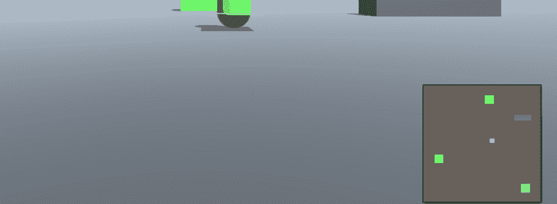

# Unity 功能 101:渲染纹理第 2 部分(游戏中的 2D 小地图)

> 原文：<https://medium.com/geekculture/unity-features-101-render-textures-part-2-in-game-2d-mini-map-e5be2cb25ce2?source=collection_archive---------14----------------------->

在第 1 部分中，我们开始了解渲染纹理，并使用它们来创建游戏中的电视摄像机；在这里阅读第一部分: [Unity 特性 101:渲染纹理第一部分(游戏内电视摄像头)](/geekculture/unity-features-101-render-textures-part-1-in-game-tv-camera-5aab6979bed2)。在这一部分，我们将看看如何创建一个游戏中的 2D 小地图。

> 2D 小地图设置

A.让我们创建一个图像，它将在您的 UI 中保存小地图。如果创建一个简单的 UI 图像，它将不起作用，因为一个 UI 图像只能接受一个 sprite。相反，创建一个 ***UI 原始图像*** ，它可以接受渲染图像。

UI Raw Image

使用**创建> UI > Raw 图像**并在画布上放置和缩放它。

B.按照我们在第 1 部分中所学的，**创建一个渲染纹理**和一个**新相机**，并将其 ***目标纹理*** e 设置为新创建的渲染纹理。分别重命名为*小地图渲染纹理*和*小地图相机*。

C.将小地图相机的位置设置在世界地图的上方，以便从上面看到玩家和环境。我们应该开始看到它变成这样= >

Minimap

D.你应该已经注意到小地图相机有点奇怪。它有一定的透视性，人物和建筑在小地图上并不显示为图标。让我们修理它。

1.  将小地图相机的投影从透视改为正投影，并根据您的需要设置其大小。

Orthographic

2.玩家图标(可以应用于场景中的任何对象):如果游戏是 2D，创建一个正方形精灵作为玩家的子游戏，或者如果这是一个 3D 游戏，创建一个子四边形(或任何你想要的)，并设置其变换，以便迷你摄像机可以看到它。

In my case I created a quad minimap icon.

3.为了让小地图相机只看到图标，创建一个新的**层**称之为**小地图**并分配给小地图图标。选择玩家的小地图图标，并将其图层设置为小地图。

4.最后，选择你的小地图相机，将**剔除遮罩**从**一切**更改为**小地图**，这样小地图相机只能渲染小地图图标。

> 结果:

2D Minimap

这个例子中的 2D 小地图有几棵树、一栋房子和一个玩家。从这里开始，你可以用你的小地图做任何你想做的事情，让它变得更加无神论地令人愉快。