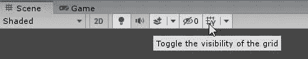
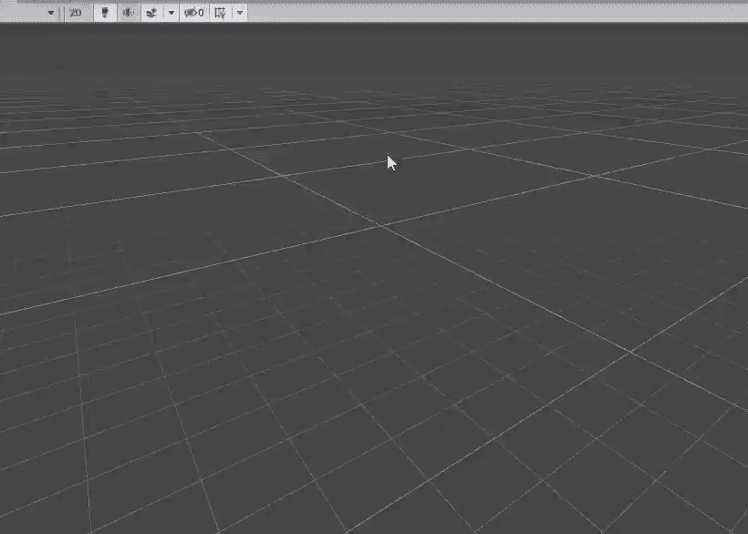
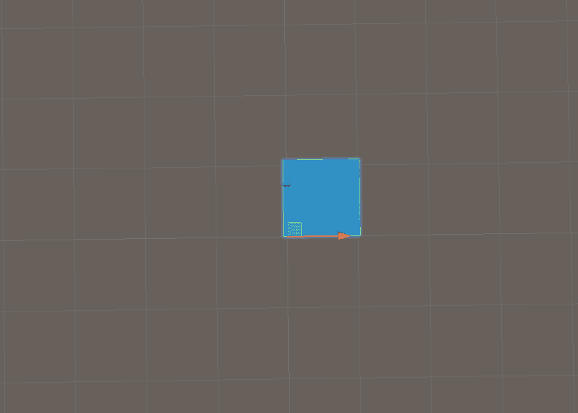
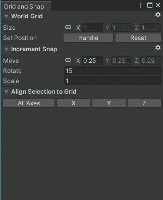
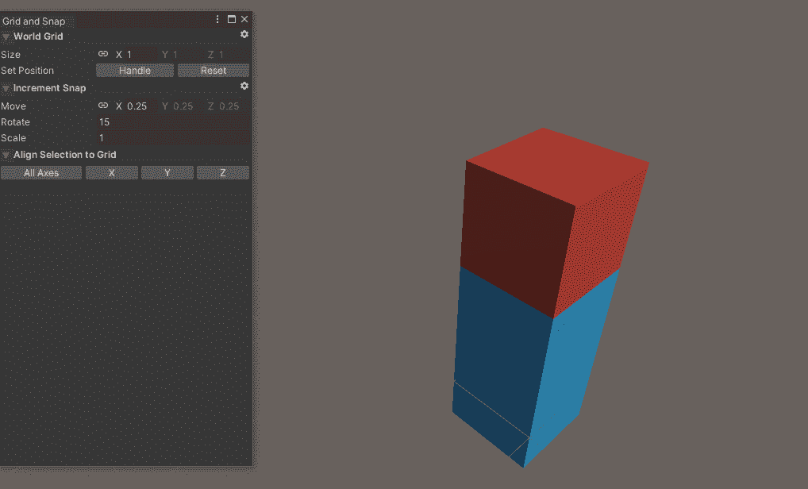
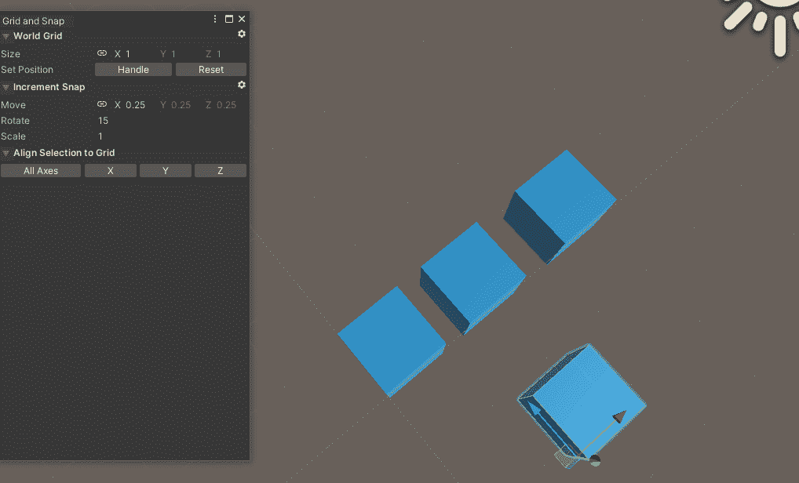

# Unity 功能 101: Unity 网格(Unity 2020+)

> 原文：<https://medium.com/geekculture/unity-features-101-unity-grid-unity-2020-3b495da85190?source=collection_archive---------1----------------------->

今天我发布了一个新的系列，这个系列将会解释很多你可能知道或者不知道的 Unity 特性，以及一些隐藏的小宝石。所以，让我们从这个系列的第一个特性开始:Unity Grid。

> 统一网格

unity grid 是 Unity 2020+中提供的内置布局(以前称为 Pro-Grid，不是内置的)。只要你在全局视图中移动对象，网格可以帮助你对齐任何游戏对象，并使其与网格对齐。

要切换网格的可见性，只需在场景视图中按以下按钮。

在这里，您可以看到它在发挥作用…

Unity Grid Visibility Toggle

因此，unity 网格的主要目标是捕捉一个对象，为了能够自由捕捉，那么你必须首先选择一个游戏对象，然后点击全局附近的磁铁按钮。

Grid Magnet

现在磁铁已启用，当您四处移动对象时，它将根据网格设置吸附到位置。

Snapping and Incremental Snapping

正如你所看到的，你可以移动，对象将捕捉，你也可以增量捕捉游戏对象，即移动它的小捕捉，而不是正常的大捕捉。要增量捕捉对象，您可以按“ **CTRL** ”并移动它。这也适用于对象的旋转和缩放。

## 网格设置

要打开网格设置，您必须单击网格可见性开关附近的箭头，然后按下 3 个点并打开编辑设置。

Grid Settings

这些设置允许您根据项目需要更改网格大小。您甚至可以在 X、Y 和 Z 轴上设置不同的尺寸。如果你在建一栋房子，而墙比宽度高得多，这是很有用的。

在这里，您还可以对位置、旋转和缩放进行增量捕捉。

该设置有两个有用的功能:设置网格位置和将选区与网格对齐。

***设置网格位置选项*** 允许您根据所选对象设置网格的位置。假设你有一栋 3 层楼的建筑，你想在 3d 楼层开始抓拍；您可以根据 3d 楼板本身设定网格的位置，而不是将网格保持在 0，0，0 位置。

Set Grid Position

正如你所看到的，网格被设置到红色物体的位置，你可以通过按“重置”来轻松地重置网格位置。

***将选区对齐网格*** 允许您将未对齐的对象对齐网格。假设你有三个彼此靠近的物体，但是没有捕捉。只需按下按钮，它们就会与网格对齐。

Align Objects

因此，在这里，所选对象与最近的捕捉点对齐。