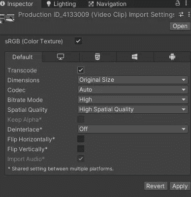
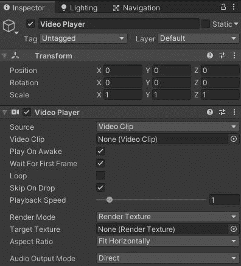
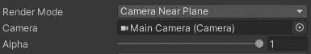
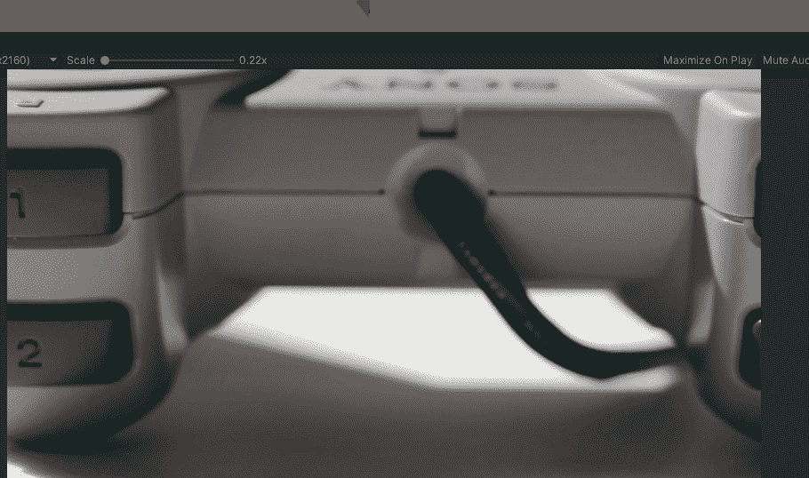
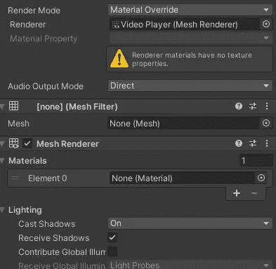
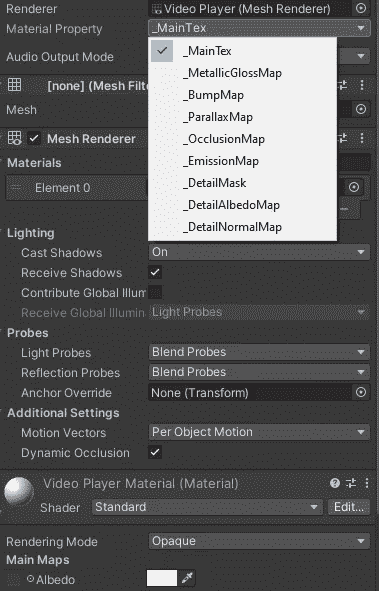
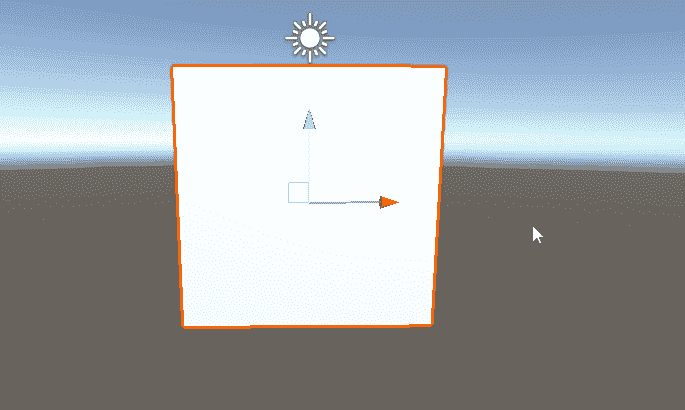
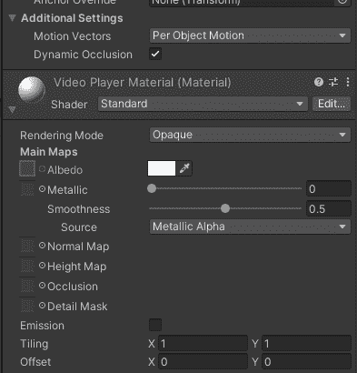
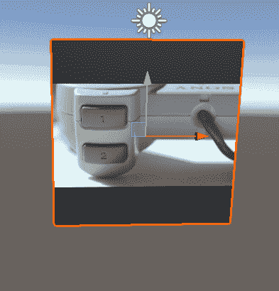

# Unity 功能 101:视频播放器

> 原文：<https://medium.com/geekculture/unity-features-101-video-player-5370f421816e?source=collection_archive---------4----------------------->

继续我们的系列([列表:Unity 特性](https://novusxdev.medium.com/list/unity-features-673aaa534a5e))，今天我们将接触一个你们中的一些人可能想做但不知道如何在 Unity 中实现的特性。

在我的情况下，在你的开发过程中，你想在运行时/游戏中播放视频。在能够做到这一点的时候，你会想要使用 ***Unity 的视频播放器*** 。视频播放器有许多使用案例；也许是过场动画，也许是教程，甚至是运行视频的游戏内电视。

> 导入视频剪辑和视频设置

Unity 几乎支持所有类型的视频格式。因此，首先，将您的视频剪辑放入您的*资产*文件夹。

Video Settings

最重要的设置是“ ***【转码】*** ”。当您选中此设置时，Unity 将能够根据您的目标平台对视频剪辑进行重新编码。例如，如果您正在为 Playstation 制作游戏，但 Playstation 不支持您的视频剪辑格式，那么在打开代码转换的情况下，Unity 会重新编码您的视频剪辑，以便在 Playstation 上工作。其余的设置不言自明。

> 视频播放器组件

在场景中创建一个空的游戏对象，并将视频播放器组件添加到其中。

首先，将您的视频剪辑添加到组件的*空视频剪辑*中。接下来，您可以检查设置，并添加循环，如果你想要的。

这里最重要的设置是渲染模式；该组件将如何在游戏中渲染和播放你的视频剪辑。

## 渲染模式:相机远平面/近平面

这两种渲染模式几乎是播放全屏过场动画的默认模式。在近平面或远平面之间选择允许你在过场动画前面显示任何东西。

如果您选择这些渲染模式，那么组件将要求您选择一个相机。把你的主相机拖进去，如果你想的话，设置透明度 alpha 值。

按 play 开始游戏，你就有了，一个全屏过场动画。

## 渲染模式:材质覆盖

在这种模式下，视频播放器组件将覆盖具有渲染器(网格渲染器)的对象的材质，以便在游戏过程中显示视频剪辑。

1.  向视频播放器游戏对象添加网格过滤器和网格渲染器组件。这将自动将该渲染器添加到视频播放器的渲染器模式。

Adding a mesh filter and a renderer

2.在你的资源中创建一个新的材质，将其命名为 VideoPlayerMaterial，并拖动到添加的网格渲染器的材质上。

3.添加材质后，需要更改的最重要的设置是视频播放器组件中的材质属性。

这将允许您选择要使用材质的哪个属性来渲染视频剪辑。在我的情况下，这是一个标准的材料，所以保持它的 _mainTex 应该做的。

4.最后，在网格过滤器中选择一个网格。我将选择一个四边形来显示视频剪辑。现在按下 Play，是的，视频剪辑现在直接在 Quad 上播放。

一个小提示:如果视频剪辑看起来不成比例，那么它与视频剪辑的长宽比有关。只需调整视频播放器游戏对象的比例，以匹配剪辑的纵横比，然后视频会看起来很好，很流畅。

## 渲染模式:渲染纹理

我们已经在之前的( [Unity 特性 101:渲染纹理](/geekculture/unity-features-101-render-textures-part-1-in-game-tv-camera-5aab6979bed2))中介绍过 Unity 中的渲染纹理，所以让我们在这里使用它们来显示一个视频剪辑。

1.  在您的资产中创建一个 ***渲染纹理*** ，并将其拖动到您的视频播放器组件中。

2.将网格过滤器和网格渲染器留在视频播放器游戏对象上，现在将新创建的渲染纹理拖动到视频播放器材质中。在我的例子中，是视频播放器材料的反照率。

Drag the render texture

基本上就是这样，现在按下播放键，它应该会正常播放渲染纹理的四边形渲染。

请注意，正在渲染的视频的纵横比可以直接从渲染纹理大小设置中调整。使用渲染纹理来渲染视频剪辑是非常强大的，因为它是一种纹理。所以你可以用它在游戏电视上播放它，或者为它创建一个着色器，甚至通过代码操纵它。

正如我们在这篇文章中看到的，在 Unity 中播放你想要的任何视频剪辑、显示过场动画甚至教程都是相当容易的。