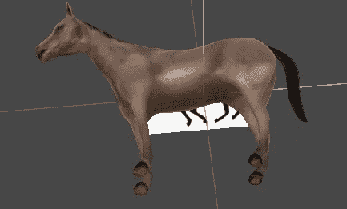
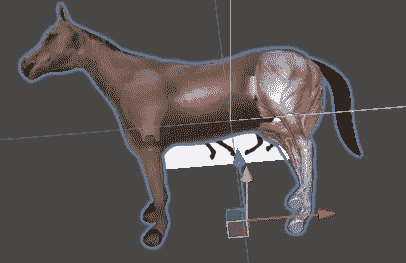
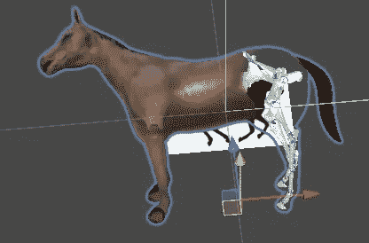

# 动画状态下的 Unity 导航

> 原文：<https://medium.com/geekculture/unity-navigation-through-animator-states-a00fbfc16728?source=collection_archive---------18----------------------->

## 如何团结

## 一个丑陋的和一个聪明的方式通过动画状态导航

在这篇文章中，我的目的是展示如何处理一个相当常见的问题，即如何管理一个 **Unity 动画师的不同**状态**的导航。**

Neigh!