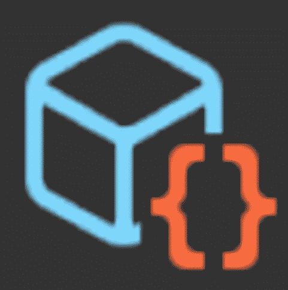

# Unity ScriptableObject 变得简单

> 原文：<https://medium.com/geekculture/unity-scriptableobject-made-easy-91c12f96e6cd?source=collection_archive---------6----------------------->

## 如何团结

## Unity 中可编写脚本的对象的使用和意义

> Unity 中的可脚本化对象是数据容器。

这句话是本文的核心。可脚本化的对象有很大的潜力，可能用 Unity 解决游戏开发中的很多问题。

## `**ScriptableObject Class**`