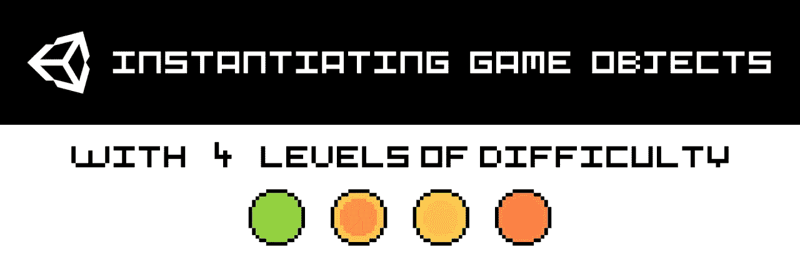

# Unity Shorts #1:实例化游戏对象

> 原文：<https://medium.com/geekculture/unity-shorts-1-instantiating-game-objects-63533c96b381?source=collection_archive---------9----------------------->

## 让我们看看如何在 Unity 中生成游戏对象，有 4 个难度级别！

*本教程有视频和文本两种格式——见下文:)*