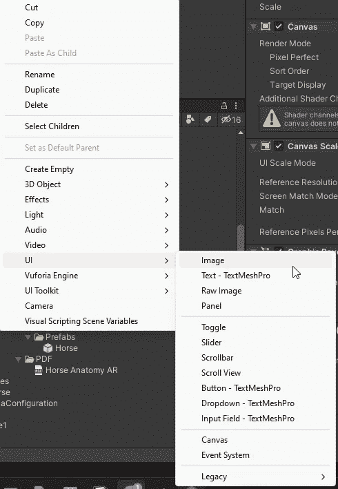

# Unity UI 基础

> 原文：<https://medium.com/geekculture/unity-ui-basics-e0023b77a24d?source=collection_archive---------11----------------------->

## 如何团结

## 学习 Unity UI 的基本概念

嗨伙计们，让我们开始一系列关于 **Unity** **UI** 的文章。

为了热身，让我们从一些基础开始。

要创建一个 **Unity** UI **对象**，您可以在创建上下文菜单中遵循以下步骤:

Creation Context Menu: UI -> Any UI Object