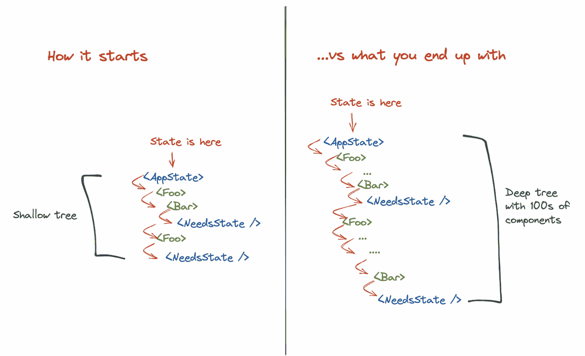
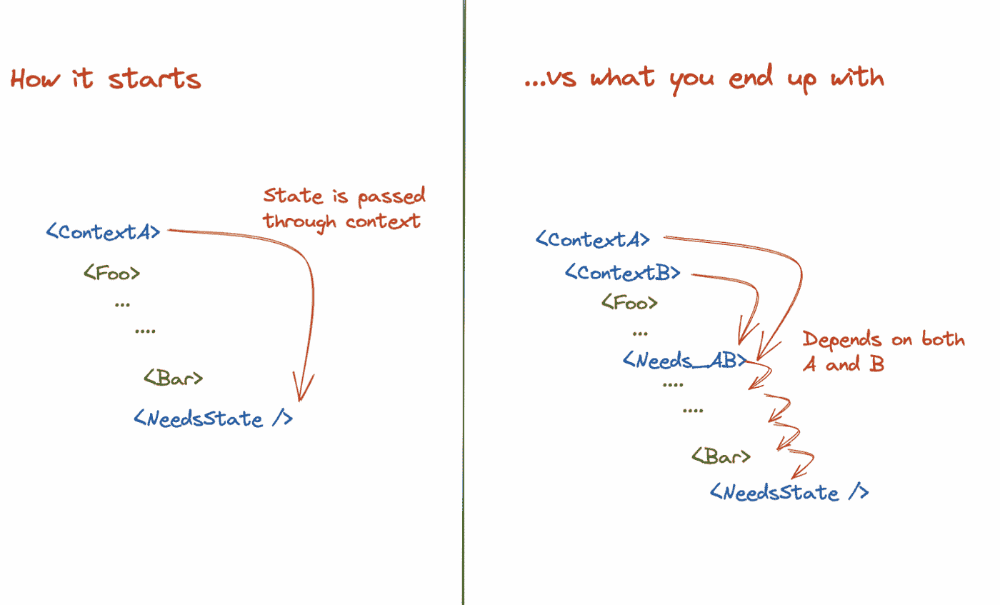
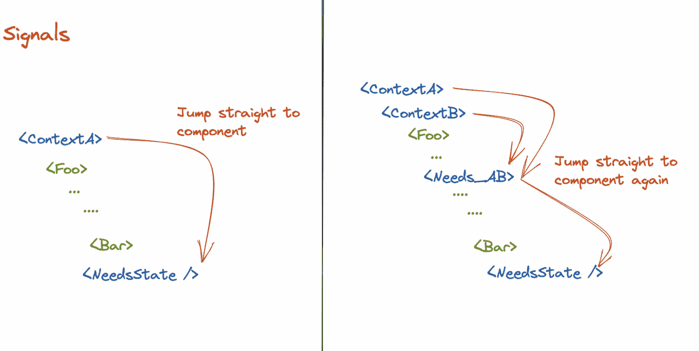
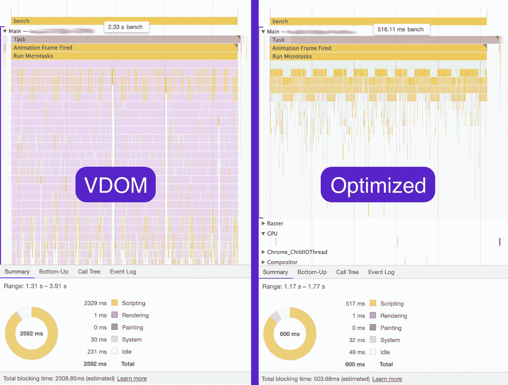

# 通用士兵:Preact 团队对信号库的回顾

> 原文：<https://medium.com/geekculture/universal-soldier-a-review-of-the-signals-library-by-the-preact-team-31bebe9352f8?source=collection_archive---------11----------------------->

## 长期以来，国家经理一直是软件开发人员的一种迷因。有一种流行的观点认为，前端开发人员除了不断地从一个状态经理到另一个状态经理重写项目，而不是专注于解决真正重要和紧急的问题。幸运的是，开源项目的数量和新项目的流量意味着他们可以侥幸逃脱。

我的名字是 [Zhenya](/@evgeniy.valyaev) ，我仍然在 inDrive 的 Quick Experiments 团队中担任前端开发人员。由于我也不喜欢鹤立鸡群，我建议你去看看 Preact 团队的新解决方案 Signals。在这篇文章中，库的创建者断言，现在有大量的应用程序状态管理解决方案，但它们需要与框架进行复杂而耗时的集成。这使得设计过程变得复杂，因为必须时刻牢记特定状态管理器的特殊要求。应用程序开发也变得更加复杂，因为必须投入大量时间和精力来集成状态管理器和渲染库。

不过，有一个解决方案！信号。据其创造者称，该解决方案结合了应用程序开发人员的最佳性能和框架中的轻松实现。剪切下面是对库的详细回顾。

我将从[文档](https://preactjs.com/guide/v10/signals/#api)中跳过所有库的方法(顺便说一下，总共有四个)，取而代之的是，我将尝试描述通过使用新库可以解决的问题。要做到这一点，我们需要分析和理解 React 现有的存储和传输数据的方式存在的问题，库的作者将其大致分为两种类型:

1.本地状态(复杂逻辑工作流的 useState、useReducer ),然后通过 props 进行数据传输。

2.通过上下文的数据传输(useContext)。

# 地方州

所有的 React 应用程序都使用 useState 钩子。用简单的逻辑和小的代码库来处理项目中的事情是足够有效的。但是像那样的情况比较少见。如果您遇到多个组件需要访问同一个状态片段的情况——该状态[被提升](https://reactjs.org/docs/lifting-state-up.html)到一个共同的祖先组件。随着组件数量的增加，这个过程会重复多次。因此，这通常会导致一个[钻柱](https://kentcdodds.com/blog/prop-drilling)问题，以及多个组件或整个树的不必要的重新渲染(如果大部分状态在树的根部)。要移除渲染，可以使用记忆化，但这里有两点需要注意:

1.记忆化只对纯功能组件起作用，即没有任何副作用。

2.记忆对于需要大量计算的函数更有用。在其他情况下，性能优化在最好的情况下是微不足道的，在最坏的情况下，它会导致错误。

因此，对于一个大的代码库，确定在哪里进行优化是一个相当大的挑战(没有关于如何使用它的明确的[规则](https://stackoverflow.com/questions/53074551/when-should-you-not-use-react-memo/56526360#56526360))。在某些情况下，记忆化会对性能产生相反的影响。

除了记忆化，您可以使用另一种策略，即举起一个组件，然后将它作为道具传入，如本文[中详细描述的那样。这种技术相当简单，但是其实现的结果可能相当令人印象深刻。但是，当树中的多个组件必须访问相同的数据，并且处于不同的嵌套级别时，这种方法不是一个选项。](https://kentcdodds.com/blog/optimize-react-re-renders)

结论:当多个组件需要访问同一个状态片段时，很难使用本地状态。“道具训练”和不必要的渲染是您必须处理的副作用，而记忆化并不是解决性能问题的灵丹妙药。

# 语境

在意识到本地状态不是您的一站式解决方案之后，用户开始考虑实现上下文。上下文[不是状态管理工具](https://blog.isquaredsoftware.com/2021/01/context-redux-differences/)，而是阿迪机制；它本身不执行任何“控制”功能。

当不同嵌套级别的组件必须能够访问数据时，上下文非常有用。这消除了钻柱，使得跟踪不同模块之间的数据传输更加容易。有人可能认为这可以解决问题，但事情没那么简单。

当提供者获得一个新值时，它下面的所有组件都被更新，并且必须呈现它们自己。即使是那些仅仅是功能性组件，只“关心”部分数据的组件。这可能会导致潜在的性能问题。

为了解决这个问题，上下文应该尽可能地靠近需要它的地方，而数据在逻辑上是分开的，并存储在不同的状态对象中。有了这种方法，将会有几个提供者。

正如《信号》的作者所强调的，使用上下文的问题在于，随着代码库规模的增加，交换数据所需的组件数量也会增加。业务逻辑不可避免地依赖于几个上下文，这意味着开发人员必须在树中的特定位置实现组件。

在树的中间添加一个上下文消费者不利于性能，因为它增加了当上下文改变时重新呈现的组件的数量。只有记忆可以解决这个问题。尽管如此，它也有其局限性，正如关于本地状态的部分所示。

结论:使用上下文时，有许多细微差别需要考虑。基本的建议是，如果数据(如主题或本地化)很少改变，或者当道具钻探确实成为一个问题时，上下文才是最合适的。

# 信号

如您所见，存储和传输数据的两种方式都需要不同的技术来提高性能。它们在应用程序中本质上是通用的，理想情况下，完美的解决方案应该是默认快速的，并且有一个易于使用的 API。现在我们可以转到应该解决这些问题的库，即信号。

作者写道，该库是独一无二的，因为状态变化会以最有效的方式自动更新组件和用户界面。开发人员不需要为性能优化任务编写代码，因为默认情况下系统速度很快，并且在整个应用程序中不需要记忆或技巧。信号提供了细粒度状态更新的好处，不管状态是全局的，通过 props 或上下文传递的，还是组件本地的。

在引擎盖下，它是这样工作的:通过组件树传递一个包含具有某个值的值属性的(信号)对象，而不是传递一个值。由于组件看到的是信号而不是它的值，因此可以更新信号，而无需重新呈现组件来立即跳转到树中实际访问信号值的特定组件。

库的创建者利用了应用程序状态树通常比组件树小得多的事实。这加快了渲染过程，因为更新状态树需要更少的工作。下面的屏幕截图显示了同一个应用程序被测量两次的轨迹，第一次使用钩子，第二次使用信号:

该库非常通用，可用于多种任务。与钩子不同，它可以在组件内部和外部使用。信号在钩子和类组件旁边也能很好地工作。

该库提供的另一个很大的优势是，它不仅可以与 Preact 一起工作，还可以与 react、Svelte 和许多其他解决方案一起工作，这是标准钩子绝对没有的。特别令人惊奇的是，preact/signals“Core Root”包也可以在 Preact 之外工作！

现在让我们比较 preact/signals-react 与其他状态管理库的权重:

*   preact/signals-core 是根库:1.4kB，无外部依赖。
*   preact/signals——使用 Preact 的钩子:2.4kB，下面:preact/signals-core，没有其他依赖项。
*   preact/signals-react —与 react 一起工作的挂钩:2.4kB，幕后:preact/signals-core 和一个外部依赖项，作为 use-sync-external-store 中的[挂钩](https://reactjs.org/docs/hooks-reference.html#usesyncexternalstore)(实际上是 react 版本 18 中同名的库实现)。

不难看出，preact/signals-react 在质量上比其他库突出，仅次于 nano store——即使如此，也只是略微超过。

有趣的是，preact/signals-react 的工作原理是[覆盖 react 内部的 JSX](https://github.com/preactjs/signals/blob/main/packages/react/src/index.ts#L189) ，本质上是将自己嵌入其中。库开发人员自己承认，这是代码的“拐杖”版本，但它是有效的，这意味着组件不需要修改或包装来支持自动订阅。

React 使用上面提到的 useSyncExternalStore 挂钩，订阅存储，并获得当前“版本”的快照。每当“版本”被升级时，库警告会反应是时候更新组件了。

到目前为止，我使用这个库的经验相当有限。然而，信号可以在 Preact 之外使用，它具有默认的延迟和最佳更新，并且它没有任何依赖性(如在钩子中)，这一事实为它在各种场景中的使用带来了希望。甚至有些与渲染用户界面无关。

例如，[将信号与 post 消息](https://twitter.com/meijer_s/status/1591023964926926850?t=Wgg-C6K-29VoBjo7uQn9rA&s=35)一起使用，可以使不同的浏览器标签或框架相互同步。所以，如果你需要在最困难和复杂的情况下做出反应，我建议你仔细看看信号。希望这个解决方案能帮助你避免浪费时间和压力。

来源:

1.  https://preactjs.com/blog/introducing-signals/
2.  【https://kentcdodds.com/blog/ 
3.  [https://twitter.com/_developit](https://twitter.com/_developit)
4.  [https://reactjs.org/](https://reactjs.org/)
5.  [https://stackoverflow.com/](https://stackoverflow.com/)
6.  [https://blog.isquaredsoftware.com/](https://blog.isquaredsoftware.com/)