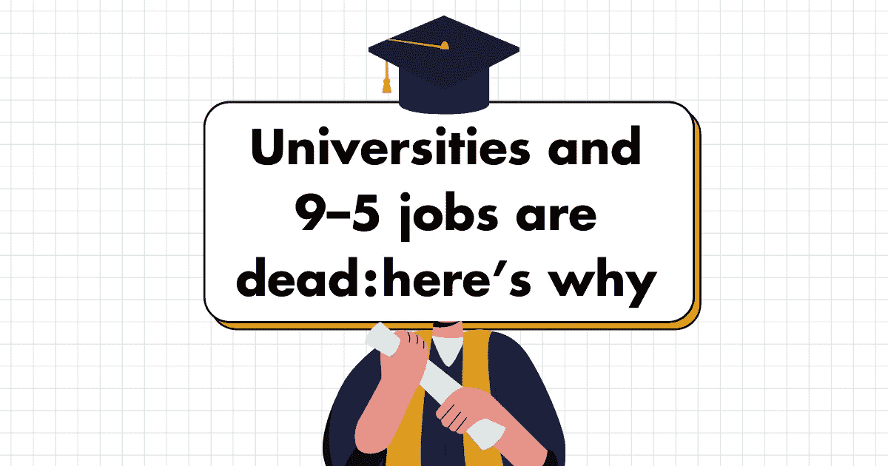

# 大学和朝九晚五的工作已经死亡——原因如下

> 原文：<https://medium.com/geekculture/universities-and-9-5-jobs-are-dead-heres-why-9ad4802f249b?source=collection_archive---------18----------------------->

By me :)

# 什么是 Web3？

Web3 是关于重塑我们的工作方式，灵活的工作时间，在我们贡献的平台上的所有权，同时拥有我们自己的机构。

> 支持者把 Web3 想象成一个不需要我们把个人信息交给脸书和谷歌这样的公司来使用他们的服务的互联网。网络将由区块链技术和人工智能驱动，所有信息都将公布在区块链的公共账本上。(阅读来自 [PCMag](https://www.pcmag.com/how-to/what-is-web3-and-how-will-it-work) 的更多信息)

# Web3 在吗？

大多数情况下不会，也永远不会——一个完全去中心化、不可信的网络状态。由于效率和更好的资源分配，我们需要集中的服务。

> *网络 3 比网络 2 更需要网络 3。*

> 鉴于 web1 成为 web2 的历史，我对 web3 感到奇怪的是，像以太坊这样的技术已经建立了许多与 web1 相同的隐含陷阱。为了使这些技术变得可用，空间正在围绕…平台进行整合。又来了。为你运行服务器的人，迭代出现的新功能。Infura，OpenSea，比特币基地，Etherscan。(阅读更多来自莫邪的批评[这里](https://moxie.org/2022/01/07/web3-first-impressions.html))

# Web3 是如何重新定义教育的？

我们可能还在用纸和笔写笔记，或者在大讲堂里听教授朗读幻灯片，但这种情况会持续下去吗？

> 萨拉夫说:“很长一段时间以来，我们的证书都集中在分数和认证机构的名字上。“相反，如果我们专注于您能够获得的产出和性能，会怎么样？如果我上了一门机器人学的课，我可以把真正的机器人(课程作业)放在链子上，而不是分数。人们可以跟踪这个过程，这是我是谁和我学到了什么的一个更好的指标。”(点击阅读更多关于 EdSurge [的内容)](https://www.edsurge.com/news/2022-01-24-what-could-web3-mean-for-education)

> "汗加密学院，有着一致的经济激励&一个强大的社区，是[兔子洞](https://medium.com/u/97c0983a1ace?source=post_page-----9ad4802f249b--------------------------------)"

## 走进兔子洞

[Rabbit Hole](https://medium.com/u/97c0983a1ace?source=post_page-----9ad4802f249b--------------------------------) 展示了一种方法，通过完成微操作和记录链上的活动，Web3 用户的技能和专业知识得到认可，从而解决[众包工作者面临的]不可见性问题。

From RabbitHole

## 您的加密交易历史记录是新的凭证

你在哪里上的大学或者你上一份工作是什么都不重要。您的声誉现在是基于可证明的微任务，可以在链上验证。

*这是加密凭证。*

# 教育的未来

教育的未来不是家庭学校、训练营或基于群组的课程。

## 这是学习的证明

-通过微型任务在工作中学习(应用学习)

-继续自动构建，以数字方式证明您的学习成果

-在学习的过程中获得网络的所有权

## 我们需要跨越的一些障碍

> web2 不需要教育，因为产品是有护栏的封闭生态系统。

Web3 引入了代理和自我主权，这意味着教育是迫切需要的——没有护栏。

▢不是每个人都知道 Web3

作为一个社区，我们能做的最重要的事情是为所有人提供加密知识。

如果社会是密码文化，我们可以大规模协调。

**▢的学习应该是日常的**

加密教育非常困难，因为用户在使用任何加密应用程序之前需要了解以下内容:

1.钱包

2.网络

3.桥接

4.气体

5.批准/签署邮件

# 拿工资学习应该在这里

> 从玩到赚的下一个演变是学习到赚

今天，成千上万的青少年通过在 Roblox 上创造体验赚了数百万。明天，数以百万计的青少年将通过在加密中学习赚钱来赚取数千英镑。许多人将开始意识到这是一种类似于创造者经济的高等教育的真正替代方式

## Z 世代更喜欢 DAOs——我是这么说的

随着时间的推移，更多的年轻人将加入 DAOs 而不是去上大学

**▢的好处**
1。在世界任何地方都可以访问
2。边赚边学
3。在你做贡献的同时，建立你的连锁简历

> 最大的问题是:Dao 能提供与大学相媲美的社交体验吗？

# 网络工作的未来 3

从玩到赚是链上工作的一个更大类别的子集

随着体力劳动变得自动化，链条上的工作是全球劳动力市场的主要收入来源。

> 未来的工作是一键工作，没有银行账户，就业合同，或以前的凭据要求。

From Web3.smsunarto

## 招聘如何与 Web3 协同工作？

在 web3 中招聘的诀窍是寻找那些有足够好奇心的人，即使没有人告诉他们，他们也会一头扎进兔子洞里。

**兔子试验:**

▢ 你用什么钱包，为什么？
**▢** 您最近使用的协议是什么，为什么？
**▢** 现在密码领域有什么最新的事情发生？

*即使你在 web2 中试图闯入 web3，你也应该能够回答这些问题*

**创业公司有很多学习机会**

> 创业的成功取决于最初的 10 次雇佣=加密网络的成功取决于最初的令牌分配

## 建立社区是关键

大多数进入这个领域的人都是从自上而下的角度考虑加密的(即我们如何将密码添加到现有的东西中)。

然而，很多加密技术的创新来自自下而上的社区(即 Loot， [CryptoKitties](https://medium.com/u/c8b1419b5d28?source=post_page-----9ad4802f249b--------------------------------) )。你花在加密上的时间越多，就越容易识别出谁是为了致富而参与其中的。

小心你与谁结盟。

这个空间需要那些已经达到犹太教最深层次但仍有原创思维的人。你可以帮助建立你的社区到那个水平。

# Web3，NFTs，DAOs 是炒作吗？

> 对使用 NFT 的品牌感到兴奋，就像在 21 世纪初品牌上线时感到兴奋一样。

## NFT 现在是一种炒作——也许吧

作为个人资料图片的 NFTs 将比创建者的 NFTs 大 10 倍。为什么？

人们更愿意成为他们可以集体拥有的部落的一部分，而不是成为个人的粉丝。

## Dao 现在是一种炒作——肯定不是

> 今天的 Dao 感觉很像 2018 年的 NFTs。

少数人知道 NFT 将会很大，但他们对杀手级用例是什么(不是游戏，而是 PFP)的看法是错误的。类似地，社交令牌和 DeFi 协议可能不是 Dao 的致命用例。

**▢道需要更多创新**

具有讽刺意味的是，Dao 中最大的机会是创建中介来帮助它们相互协调。我们需要停止限制我们的想法，即灵知安全+快照+ [不和谐](https://medium.com/u/fddf6af2df19?source=post_page-----9ad4802f249b--------------------------------)是做 DAOs 的最好方式。

肯定有更好的方法，我们不应该害怕尝试新的解决方案。

> 事实是，今天的 Dao 并不是真正去中心化的、自治的或者一个组织——完全地

## 👇评论 Web3 如何重新定义教育和工作？

> 👋**在[媒体](/@pooriaarab)—[LinkedIn](https://www.instagram.com/pooria.arab/)—[Twitter](https://twitter.com/pooria_arab)—[insta gram](https://www.instagram.com/pooria.arab/)—[抖音](https://www.tiktok.com/@pooria.arab)**
> 
> 更多关于 Web3，Crypto，NFTs，DeFi 等的好东西…
> 
> 点击获取 NFT 发布战略