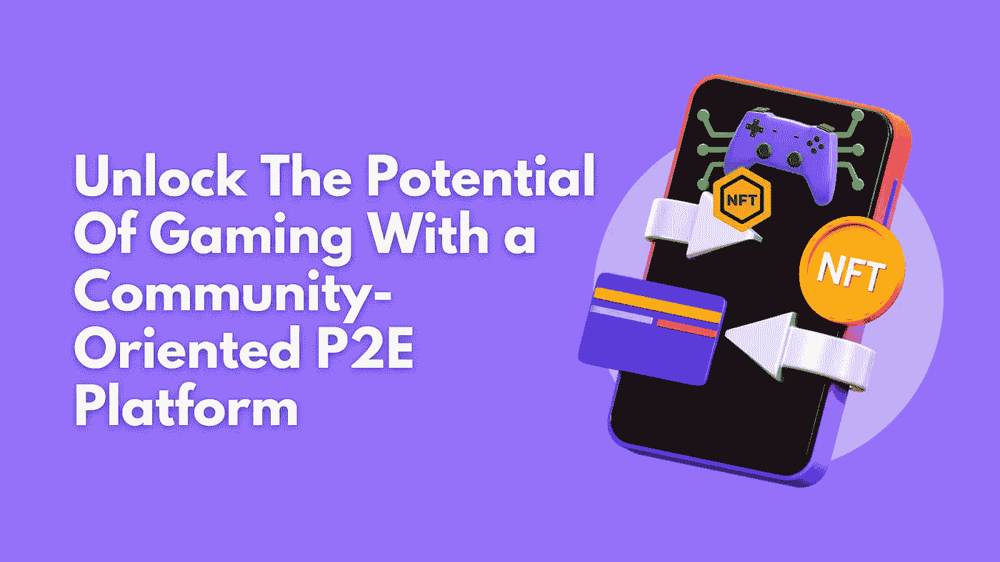

# 借助面向社区的 P2E 平台，释放游戏的潜能

> 原文：<https://medium.com/geekculture/unlock-the-potential-of-gaming-with-a-community-oriented-p2e-platform-5db71bd8636b?source=collection_archive---------17----------------------->

Unlock The Potential Of Gaming With a Community-Oriented P2E Platform

# **信息世界**

游戏描绘了基于游戏行业的几个人的情感。NFT 游戏中心——是一个生态系统，游戏平台的每一个功能都经过精心调整，令人向往。

我们已经看到了更多关于 NFTs 的内容，向游戏行业发展。凭借 1000 亿的净资产和数十亿的用户，在 NFT 游戏中心的帮助下，游戏产业正朝着一个你无法想象的高度发展。

此外，不可替代的、可替代的代币和数字世界的未来愿景都融入了这个生态系统。

**博彩业潜力巨大**

游戏行业已经或多或少地在所有平台上留下了自己的足迹。准确地说，游戏和电脑游戏的故事与社区有着更多的情感联系。

最近的统计表明，美国在游戏上的花费超过 100 亿美元。无论是对游戏机还是手机的依赖，增长都是无止境的。

NFT 游戏中心是一个将传统游戏融入 NFT 游戏平台的空间，引领一个新的开始。

# 为什么创造游戏来赚取 NFT 在线游戏？

与消遣相比，玩赚 NFT 游戏为游戏玩家提供了一种获得高额利润的新途径。在引入 NFT 之前，玩家不能从他们喜爱的游戏中交易他们喜爱的物品，如弹药、防弹衣等。

NFT 游戏方便了很少或没有区块链知识的用户获得有价值的 NFT 东西。

在 P2E，NFT 是游戏中不可或缺的一部分，这需要一个充满活力的思维框架；开发和执行这样一个游戏吸引了更多的人。因此，加入一个专门开发 P2G 游戏的组织是让你的工作变得更容易的正确解决方案。

# Play2Earn 游戏是如何工作的？

好奇设计一个 P2E 游戏吗？

你好奇想知道正确的解决方案吗？

自然，P2G 游戏会奖励你游戏内的收入。在 P2G 游戏中，你可以获得代币，用来在游戏中购买额外的装备、角色、宠物等。

或者，你也可以出售和提取货币。在大多数区块链游戏中，你的角色是复制和发展新的角色。这些角色只不过是在区块链游戏中创造出来的非功能性角色。

然后在游戏中，RollerCoin 等挖掘模型有助于在游戏中创建加密挖掘帝国，钻取真正的加密货币。一旦钱包达到最低余额，你就可以取钱了。

**玩赚游戏开发阶段**

满足市场和用户的需求，如游戏内货币，游戏机制和 NFT 集成等。技术和工具旨在满足他们的所有需求。下面是以下阶段的 [**玩赚 NFT 游戏开发**](https://www.cryptocurrencyscript.com/blog/play-to-earn-game-development) 阶段，

**设计**

首先，在描绘最终产品之前，要考虑项目要求和游戏目标。原型被开发用来描绘角色如何与游戏中的其他元素互动。这包括一个用于交易管理的帐户和一个用于市场的仪表板。

## 发展

游戏的概念和目标是通过对每个元素进行编码来实现的。在开发 P2G 平台时，必须考虑包括加密货币交换、区块链、游戏内货币智能合约，并且必须促进与法定和加密支付系统的交互。

## 质量控制和测试

测试人员必须经历一系列的测试，以解决在玩游戏时出现的错误。错误的或有缺陷的性能使产品无用，并赶走顾客。这个阶段通过将真实玩家和他们的评论封装到游戏机制中来执行 beta 测试。

**部署**

这个阶段在线发行 NFT 游戏。根据产品的大小，部署时间可能从几分钟到几天不等。可靠的游戏服务器、平台服务和数据库都包含在产品部署中。此外，还提供维护服务，以确保游戏的顺利运行。

## 区块链增强了 P2E 游戏平台吗？

是的，区块链是一项很有前途的技术，可以增强游戏平台。让我们如何

1.  **对数字资产的高度控制**

区块链有权将游戏中的数字资产分解，并将其转换为 NFT。由于这种授权，玩家可以拥有游戏中的物品，这些物品可以很容易地转换成另一种形式。

**2。建立一个分散的市场**

区块链的另一个优势是，它支持为游戏玩家创建一个分散的市场，方便他们交易资产和游戏中的物品。玩家通过出售数字物品赚取丰厚的利润。

**3。投资成分的来源**

评估公开市场的价值，它表明游戏中物品的价格将会下降或上升。基于资产价值的增长，游戏中的资产持有者获利。

**4。单一游戏多元宇宙**

像区块链这样有前途的技术有利于开发者建立一个单一的游戏多元宇宙，这是一个现实游戏的集合。它允许角色从一个游戏世界转换到另一个游戏世界。

**5。新的货币化方法**

区块链在为游戏玩家带来新的货币化选择方面发挥着关键作用。对于每一笔用游戏内资产完成的交易，他们可以获得一些百分比，也可以促进货币的增长。

**6。分散式游戏管理**

游戏玩家利用区块链技术将数据分散到多个地点。通过开发一个去中心化的游戏，整个改变游戏的控制权就交给了社区。

**关闭思路**

P2E 是一种新的视频游戏流，有助于游戏玩家通过游戏活动赚取 NFT 和加密货币。通过娱乐赚取具有现实价值的货币是玩赚游戏流行的主要原因。

通过玩游戏来发展 NFT 也是另一大有利可图的资产。游戏已经覆盖了从儿童到老年人的巨大全球市场。最近的统计显示，全球有 27 亿游戏玩家。

统计数据预测，在即将到来的一年，游戏平台将超过 3000 亿美元。明智地选择正确的 P2E 平台，将您的业务提升到一个新的水平。