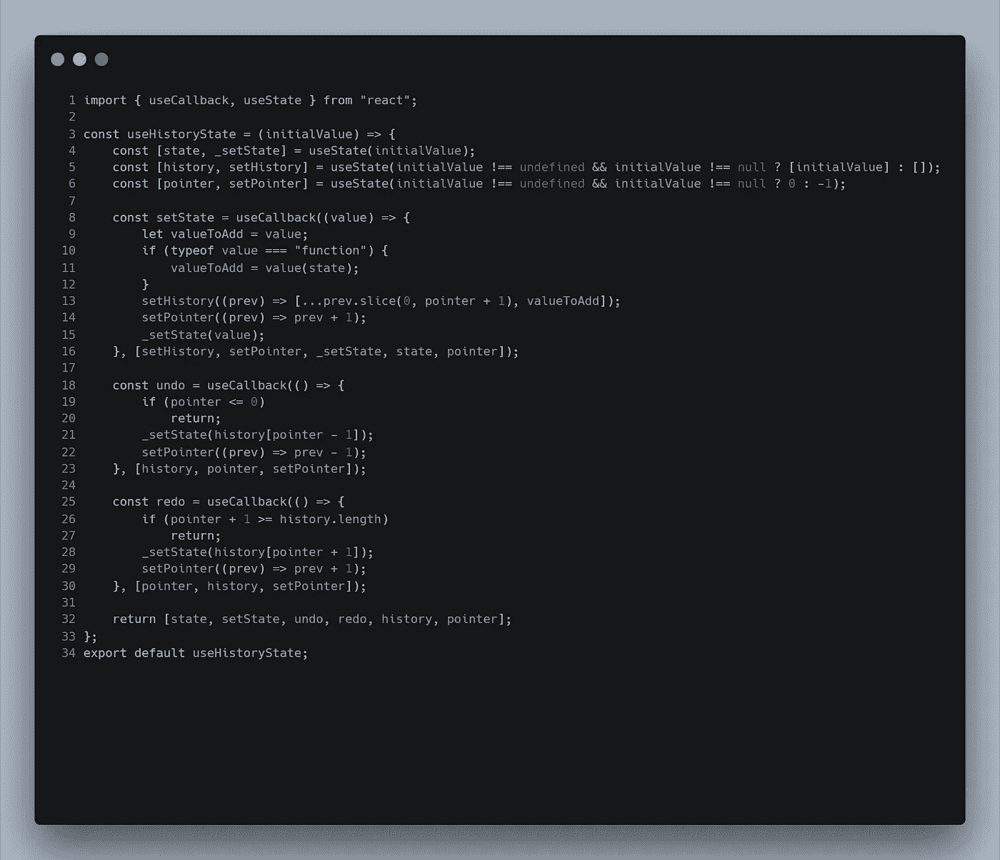

# 用 useHistoryState 释放 React 状态下 CTRL+Z 的力量

> 原文：<https://medium.com/geekculture/unlock-the-power-of-ctrl-z-in-react-state-with-usehistorystate-7f93b7b62924?source=collection_archive---------11----------------------->

CTRL+Z 是开发者最好的朋友。你把你的代码拧到了无法识别的程度？只需 CTRL+Z 一堆的时间，你会回到正轨。

对于每个主要的应用程序来说，CTRL+Z 也是一个基本的快捷方式，用户几乎希望能够通过 CTRL+Z 来撤销一些错误。

大多数 react 应用程序(以及一般的 web 应用程序)并不关心这一点，如果状态改变了，它们就不会跟踪以前的状态。释放这种能力的逻辑非常非常简单:只要保存一个所有状态的数组，一个指针，你就可以开始了。

然而，在每个组件中重写这个逻辑会变得非常乏味。这似乎是定制挂钩的完美候选！

# 定制挂钩

React 有一组[基本钩子](https://reactjs.org/docs/hooks-overview.html)，可以钩住功能组件的状态和生命周期。例如，useState 钩子让你创建一个状态变量，useEffect 让你在依赖关系改变时运行代码等等。

您可以简单地通过编写一个函数将这些基本的挂钩组合成更复杂的挂钩(建议以动词“use”开始这些函数，以便 react 可以检查挂钩的所有[规则是否适用)。](https://reactjs.org/docs/hooks-rules.html)

# 使用历史状态

那么让我们来看看我们自己定制的钩子。我们需要一个钩子，它包含值的状态钩子、状态历史的状态钩子和指针的状态钩子。然后我们只需要写一些函数(为了提高性能，我们将在一些 useCallback 中定义)来处理从外部设置状态、撤销和重做。

让我们对这些函数进行注释，以便理解我们正在做的事情:

*****撤销:*** 非常简单…如果指针小于或等于 0，我们就返回，因为没有什么可撤销的了。否则，我们在指针-1 处用 _setState 将状态设置为历史，并减少指针。**

*****重做:*** 就像撤销…如果指针大于或等于数组长度，我们就返回，因为没有什么可重做的了。否则，我们在指针+1 处将 state with _setState 设置为 history，并增加指针。**

**如果您想复制代码供个人使用，下面是非图像格式的代码:**

**如果你想在你的 Typescript 项目中使用它，我还写了一个 Typescript 版本**