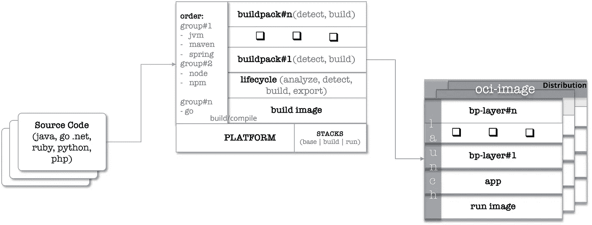

# 解包云原生构建包

> 原文：<https://medium.com/geekculture/unpack-cloud-native-buildpacks-9959b601424b?source=collection_archive---------0----------------------->

## 重构的构建包

在这篇博客中，我们来看看云原生构建包(CNB)的规格和最近宣布的 CNB 的开源实现——**pake to-build packs**。

## 需要一个规范

从源代码创建自包含的可运行工件的艺术并不新鲜。它始于 Heroku，然后云铸造社区采用了它并将其带到企业中。当时 buildpack 技术的规范还没有完全定义，也没有明确提到底层平台。这导致了与底层平台紧密耦合的不同实现。快进到今天——容器技术空间和工具集的出现和成熟，使得 Heroku 和 Pivotal 的人员能够将两个世界的精华带到一个新的统一融合规范——云原生构建包(CNB) v3。

> 根据官方文件，
> 
> CNB 定义了平台、生命周期、许多构建包和应用程序之间的交互
> 
> buildpack 是将应用程序源代码部分或全部转换成可运行工件的软件。
> 
> 生命周期是编排构建包并将结果工件转换成 OCI 映像的软件。
> 
> 平台是编排生命周期的软件，使 buildpack 功能对最终用户(如应用程序开发人员)可用。



CNB

一个定义良好的规范将这项成熟的技术推向了开源社区。除了这个规范，CNB 还提供了类似`pack`的基础设施命令行工具。pack-cli 允许选择多个参考实现来本地测试这项技术，并模拟它在实际平台上的表现。

**paketo-buildpacks**

paketo-buildpacks 是一个参考实现，它利用 CNB 规范为不同的语言运行时构建符合 OCI 规范的映像。在这篇博客中，让我们看看几个参与图像构建的模块层，以及我们如何定制这些层。

**结果:**

*   为 java 应用程序构建一个实验性的小型运行映像堆栈
*   通过将有贡献的模块化构建包放在一起，构建一个元 java 构建包
*   利用元构建包和微型堆栈构建一个定制的构建器
*   使用自定义构建器在本地和平台上构建来自源的标准 OCI 映像

**先决条件:**

*   [pack-cli](https://github.com/buildpacks/pack)
*   [kpack](https://github.com/pivotal/kpack)

**组件:**

build pack——是一种软件(OCI 映像或自包含归档文件),它将应用程序源代码部分或全部转换为可运行的工件。

构建器——是一个软件(OCI 映像),它利用生命周期来编排构建包，并将结果工件转换成 OCI 映像。

stack——是一种软件(OCI 映像),提供在构建和发布阶段利用的构建和运行时环境。

**创建一个小堆栈:**

让我们为 java 应用程序构建一个微小的 run(distroles like)映像，以减小发行版映像的大小。paketo-buildpacks 有多个栈，比如 base、tiny 和 full，这取决于运行时所需的语言。

`build`基础映像由构建器在源代码编译期间使用。它可以包含更多编译源代码所需的包&实用程序。`run`基础图像用于分发。我们不需要在`run`基础映像中打包构建时依赖项。这减少了最终图像的分布足迹。我们可以从 paketo-buildpacks 中获取一个现有的基础映像，并在它的基础上进行构建。或者我们可以基于`ubuntu:bionic`映像从头开始构建我们的基础、构建和运行映像。我们用后者吧。构建堆栈映像的完整源代码和脚本可以在，

> [https://github.com/srinivasa-vasu/cnb/tree/master/stacks](https://github.com/srinivasa-vasu/cnb/tree/master/stacks)

让我们来看看跑垒图像，

```
base_image=humourmind/cnb-base:${version}
run_image=humourmind/cnb-run:${version}
**run_base_image=gcr.io/distroless/base** build_image=humourmind/cnb-build:${version}
stack_id="io.buildpacks.stacks.bionic"
cnb_uid=1000
cnb_gid=1000
docker build -t "${base_image}" "$dir/base"
docker build --build-arg "base_image=${base_image}" --build-arg "stack_id=${stack_id}" --build-arg "cnb_uid=${cnb_uid}" --build-arg "cnb_gid=${cnb_gid}" -t "${build_image}"  "$dir/build"
**docker build --build-arg "base_image=${run_base_image}" --build-arg "stack_id=${stack_id}" --build-arg "cnb_uid=${cnb_uid}" --build-arg "cnb_gid=${cnb_gid}" -t "${run_image}" "$dir/run"**
```

它是用来自**gcr.io/distroless/base.**的发行版基础映像构建的。让我们看看 docker 构建文件，

```
FROM ${*base_image*} AS *tiny-source*FROM ubuntu:bionic AS *builder* COPY --from=*tiny-source* / /tiny/
RUN cp /bin/bash /tiny/bin/
*RUN cp /lib/x86_64-linux-gnu/libtinfo.so.5.9 /tiny/lib/x86_64-linux-gnu/
RUN cp /lib/x86_64-linux-gnu/libtinfo.so.5 /tiny/lib/x86_64-linux-gnu/
RUN cp /lib/x86_64-linux-gnu/libz.so.1 /tiny/lib/x86_64-linux-gnu/
RUN cp /lib/x86_64-linux-gnu/libz.so.1.2.11 /tiny/lib/x86_64-linux-gnu/
RUN cp /lib/x86_64-linux-gnu/libgcc_s.so.1 /tiny/lib/x86_64-linux-gnu/
RUN cp /bin/cat /tiny/bin/
RUN cp /usr/bin/nproc /tiny/usr/bin/
RUN cp /usr/bin/tr /tiny/usr/bin/* RUN echo "cnb:x:${*cnb_uid*}:${*cnb_gid*}:cnb:/home/cnb:/bin/bash" >> /tiny/etc/passwd \
  && echo "cnb:x:${*cnb_gid*}" >> /tiny/etc/group \
  && mkdir -p /tiny/home/cnbFROM ${*base_image*}
COPY --from=*builder* /tiny/ /
ARG *stack_id* USER ${*cnb_uid*}:${*cnb_gid*}
LABEL io.buildpacks.stack.id="${*stack_id*}"
```

最终的发行版基础映像是用贡献的 buildpack 层所需的足够的实用程序/包制作的。这减小了最终分布图像的整体尺寸。这仍然是高度实验性的。

**创建元构建包:**

java 元构建包的完整源代码可以在，

> [https://github.com/srinivasa-vasu/paketo-buildpacks-java](https://github.com/srinivasa-vasu/paketo-buildpacks-java)

```
api = "0.2"[buildpack]
id       = "paketo-buildpacks/java"
name     = "Paketo Java Buildpack"
version  = "1.1.0"
homepage = "https://github.com/srinivasa-vasu/paketo-buildpacks-java"# 1
[[order]]
[[order.group]]
id = 'paketo-buildpacks/bellsoft-liberica'
optional = true
version = '2.3.1'[[order.group]]
id = 'paketo-buildpacks/gradle'
optional = true
version = '1.1.1'[[order.group]]
id = 'paketo-buildpacks/maven'
optional = true
version = '1.1.1'
```

java 的定制元构建包是按照 CNB 规范定义的。`paketo-buildpacks/bellsoft-liberica`对 JRE 运行时层有贡献。以类似的方式，其他层相应地对最终的应用图像有所贡献。

要打包此构建包进行分发，需要 package.toml 文件。按照规范，

```
[buildpack]
uri = "./buildpacks/"dependencies = [
  { image = "gcr.io/paketo-buildpacks/bellsoft-liberica:2.3.1" },
  { image = "gcr.io/paketo-buildpacks/gradle:1.1.1" },
  { image = "gcr.io/paketo-buildpacks/maven:1.1.1" },
  { image = "gcr.io/paketo-buildpacks/sbt:1.1.1" },
  { image = "gcr.io/paketo-buildpacks/executable-jar:1.2.1" },
  { image = "gcr.io/paketo-buildpacks/apache-tomcat:1.1.1" },
  { image = "gcr.io/paketo-buildpacks/dist-zip:1.2.1" },
  { image = "gcr.io/paketo-buildpacks/procfile:1.3.1" },
  { image = "gcr.io/paketo-buildpacks/azure-application-insights:1.1.1" },
  { image = "gcr.io/paketo-buildpacks/debug:1.2.1" },
  { image = "gcr.io/paketo-buildpacks/google-stackdriver:1.1.1" },
  { image = "gcr.io/paketo-buildpacks/jmx:1.1.1" },
  { image = "gcr.io/paketo-buildpacks/spring-boot:1.5.1" },
  { image = "gcr.io/paketo-buildpacks/encrypt-at-rest:1.2.1" },
  { image = "gcr.io/paketo-buildpacks/image-labels:1.0.1" }
]
```

这总结了元构建包的依赖性。每一个都是一个独立的 buildpack 发行版映像。使用 pack-cli 创建标准的 OCI 分布图，

> pack pack-build pack humourmind/paketo-build packs-Java:1 . 1 . 0-package-config package . toml-publish

这将为元构建包创建构建包分发映像`humourmind/paketo-buildpacks-java:1.1.0`,并将其发布到注册表。

**创建构建器:**

让我们利用前面创建的小堆栈和 buildpack 来构建我们自己的定制标准 OCI 构建器映像。完整的源代码可以在，

> [https://github . com/srinivasa-vasu/cnb/tree/master/paketo-build packs](https://github.com/srinivasa-vasu/cnb/tree/master/paketo-buildpacks)

按照规范，

```
description = "Ubuntu bionic base image with paketo-buildpacks for Java"[lifecycle]
  version = "0.7.3"[[buildpacks]]
  id = "paketo-buildpacks/java"
  image = "humourmind/paketo-buildpacks-java@sha256:d1ed1afa05b2bffba43b3befb02a85496019032ba8694f3ad7f78e24079a7180"# 1
[[order]]
group = [
  { id = "paketo-buildpacks/bellsoft-liberica",          version="2.3.1", optional = true },
  { id = "paketo-buildpacks/gradle",                     version="1.1.1", optional = true },
  { id = "paketo-buildpacks/executable-jar",             version="1.2.1", optional = true },
  { id = "paketo-buildpacks/apache-tomcat",              version="1.1.1", optional = true },
  { id = "paketo-buildpacks/dist-zip",                   version="1.2.1", optional = true },
  { id = "paketo-buildpacks/spring-boot",                version="1.5.1", optional = true }
]# 2
[[order]]
group = [
  { id = "paketo-buildpacks/bellsoft-liberica",          version="2.3.1", optional = true },
  { id = "paketo-buildpacks/maven",                      version="1.1.1", optional = true },
  { id = "paketo-buildpacks/executable-jar",             version="1.2.1", optional = true },
  { id = "paketo-buildpacks/apache-tomcat",              version="1.1.1", optional = true },
  { id = "paketo-buildpacks/dist-zip",                   version="1.2.1", optional = true },
  { id = "paketo-buildpacks/spring-boot",                version="1.5.1", optional = true }
][stack]
  *id = "io.buildpacks.stacks.bionic"
  build-image = "humourmind/cnb-build:tiny"
  run-image = "humourmind/cnb-run:tiny"*
```

这个构建器规范包含堆栈映像、生命周期，以将构建包产生的工件编排成 OCI 映像。定义的多个订单组参与决策周期，第一个匹配的订单将由生命周期层编排。整个构建生命周期都在先前创建的堆栈构建基础映像上运行。

为了建立 OCI 的形象，

> pack create-builder humourmind/paketo-Java-builder-tiny:0 . 7 . 3-builder-config builder . toml

这个构建器映像足以与 pack-cli 一起在本地机器上构建 OCI 应用程序映像。要在平台上使用它，需要定义和创建一个 buildpackage 分发层。使用同一个 repo 中打包的 Dockerfile 创建所需的分布层，并将其推送到注册中心。

要创建标准的 OCI 分发构建器映像，

> 码头工人建造。-t humourmind/paketo-Java-builder-tiny:0 . 7 . 3-cn b-f docker file

并将其发布到注册表中。检查这个建造者来推理 BOM 和出处，

> pack inspect-builder humour mind/paketo-Java-builder-tiny:0 . 7 . 3-cnb

**从源创建 OCI 应用程序映像:**

与任何 java 项目一样，最好的起点是 [start.spring.io](https://start.spring.io) 。让我们使用一个用 Spring 创建的示例应用程序。示例应用程序的源代码可以在，

> [https://github.com/srinivasa-vasu/spring-boot-k8s](https://github.com/srinivasa-vasu/spring-boot-k8s)

为了利用定制构建器从源代码构建一个小的 OCI 图像，

```
pack build <registry>/<repo>/<app_name>:<tag> -B humourmind/paketo-java-builder-tiny@sha256:78d04ac5f05ee21a4bfd84d36573483fd04a2ac97c036db1ffd6065ef5e5e229
```

这将创建最终的映像，它包含由适当的参与构建包贡献的层。使用`docker run`在本地测试这个应用。

**将定制构建器重新定位到平台:**

为了在 Kubernetes 平台上测试这一点，可以利用开源的 K8s 本地`kpack`发行版或 Tanzu build 服务——它的商业发行版。我们用 kpack 吧。

让我们为 stack、store (buildpacks)和 builder 创建必要的 k8s 对象。完整的源代码可以在，

> [https://github . com/srinivasa-vasu/cnb/tree/master/k pack/pake to](https://github.com/srinivasa-vasu/cnb/tree/master/kpack/paketo)

*开店:*

```
apiVersion: experimental.kpack.pivotal.io/v1alpha1
kind: Store
metadata:
  name: paketocnb-java-store-tiny
spec:
  sources:
  - image: humourmind/paketo-java-builder-tiny@sha256:78d04ac5f05ee21a4bfd84d36573483fd04a2ac97c036db1ffd6065ef5e5e229
```

这创建了起作用的构建包层存储。Source 提取前面创建的元构建包。

```
**kubectl get store**NAME                        READY
build-service-store         True
**paketocnb-java-store-tiny   True**
```

*创建堆栈:*

```
apiVersion: experimental.kpack.pivotal.io/v1alpha1
kind: Stack
metadata:
  name: paketocnb-java-stack-tiny
spec:
  id: "io.buildpacks.stacks.bionic"
  buildImage:
    image: "humourmind/cnb-build:tiny@sha256:17ed33b3cc4e926cd941fff3d375d01daef5887266c8e7eea5086a69b6d7d3d4"
  runImage:
    image: "humourmind/cnb-run:tiny@sha256:9e069f5c33818c2ddec99d16c7501a9775f005e5cb69072f8dc618d6120f5d46"
```

这将创建一个堆栈，该堆栈有助于使用之前创建的自定义堆栈来构建和运行基础映像。

```
**kubectl get stack**NAME                        READY
build-service-stack         True
**paketocnb-java-stack-tiny   True**
```

*创建构建器:*

```
apiVersion: experimental.kpack.pivotal.io/v1alpha1
kind: CustomClusterBuilder
metadata:
  name: paketocnb-java-builder-tiny
spec:
  # to relocate the builder image
  tag: <registry>/<repo>/<builder>:<tag>
  stack: paketocnb-java-stack-tiny
  store: paketocnb-java-store-tiny
  order:
  - group:
    - id: paketo-buildpacks/bellsoft-liberica
    - id: paketo-buildpacks/gradle
    - id: paketo-buildpacks/executable-jar
    - id: paketo-buildpacks/apache-tomcat
    - id: paketo-buildpacks/dist-zip
    - id: paketo-buildpacks/spring-boot
  - group:
    - id: paketo-buildpacks/bellsoft-liberica
    - id: paketo-buildpacks/maven
    - id: paketo-buildpacks/executable-jar
    - id: paketo-buildpacks/apache-tomcat
    - id: paketo-buildpacks/dist-zip
    - id: paketo-buildpacks/spring-boot
```

这就创建了利用存储和堆栈的定制构建器。

```
**kubectl get CustomClusterBuilder**NAME                          LATESTIMAGE                                                                                                                                             READY
default                       <registry>/<repo>/build-service/default-builder@sha256:9e97c76d205b3f78cecb3753f5039a2ac5af7a31ba681ae9d48be0cc68d35fe6                     True
**paketocnb-java-builder-tiny   <registry>/<repo>/<builder>:<tag>   True**
```

按照 kpack 文档为容器注册中心创建适当的 secret 和 service-account 对象。

*创建图像规格:*

```
apiVersion: build.pivotal.io/v1alpha1
kind: Image
metadata:
  name: k8s-sb-image
spec:
  tag: <registry>/<repo>/<app>:<tag>
  serviceAccount: <sa>
 **builder:
    name: paketocnb-java-builder-tiny
    kind: CustomClusterBuilder**    cacheSize: "8Gi"
  source:
    git:
 **url: https://github.com/srinivasa-vasu/spring-boot-k8s.git**      revision: master
```

这将触发利用 paketo 定制构建器从源代码创建最终的标准 OCI 映像。

```
default/i-oud-native-v1-0-cfebbe85ecce1517a1e4dab2a1b8f537075-build-pod[prepare]: prepare:fetch.go:88: Successfully cloned "[https://github.com/srinivasa-vasu/spring-boot-k8s.git](https://github.com/srinivasa-vasu/spring-boot-k8s.git)" @ "8f63422d11859fa11a3c832ba5a7c07685b96f57" in path "/workspace"
default/i-oud-native-v1-0-cfebbe85ecce1517a1e4dab2a1b8f537075-build-pod[analyze]: Restoring metadata for "paketo-buildpacks/bellsoft-liberica:jvmkill" from app image
default/i-oud-native-v1-0-cfebbe85ecce1517a1e4dab2a1b8f537075-build-pod[analyze]: Restoring metadata for "paketo-buildpacks/bellsoft-liberica:link-local-dns" from app image
default/i-oud-native-v1-0-cfebbe85ecce1517a1e4dab2a1b8f537075-build-pod[analyze]: Restoring metadata for "paketo-buildpacks/bellsoft-liberica:memory-calculator" from app image
default/i-oud-native-v1-0-cfebbe85ecce1517a1e4dab2a1b8f537075-build-pod[analyze]: Restoring metadata for "paketo-buildpacks/bellsoft-liberica:security-providers-configurer" from app image
default/i-oud-native-v1-0-cfebbe85ecce1517a1e4dab2a1b8f537075-build-pod[analyze]: Restoring metadata for "paketo-buildpacks/bellsoft-liberica:class-counter" from app image
default/i-oud-native-v1-0-cfebbe85ecce1517a1e4dab2a1b8f537075-build-pod[analyze]: Restoring metadata for "paketo-buildpacks/bellsoft-liberica:java-security-properties" from app image
default/i-oud-native-v1-0-cfebbe85ecce1517a1e4dab2a1b8f537075-build-pod[analyze]: Restoring metadata for "paketo-buildpacks/bellsoft-liberica:jre" from app image
default/i-oud-native-v1-0-cfebbe85ecce1517a1e4dab2a1b8f537075-build-pod[analyze]: Restoring metadata for "paketo-buildpacks/bellsoft-liberica:jdk" from cache
default/i-oud-native-v1-0-cfebbe85ecce1517a1e4dab2a1b8f537075-build-pod[analyze]: Restoring metadata for "paketo-buildpacks/maven:application" from cache
default/i-oud-native-v1-0-cfebbe85ecce1517a1e4dab2a1b8f537075-build-pod[analyze]: Restoring metadata for "paketo-buildpacks/maven:cache" from cache
default/i-oud-native-v1-0-cfebbe85ecce1517a1e4dab2a1b8f537075-build-pod[analyze]: Restoring metadata for "paketo-buildpacks/maven:maven" from cache
default/i-oud-native-v1-0-cfebbe85ecce1517a1e4dab2a1b8f537075-build-pod[analyze]: Restoring metadata for "paketo-buildpacks/executable-jar:class-path" from app image
default/i-oud-native-v1-0-cfebbe85ecce1517a1e4dab2a1b8f537075-build-pod[build]:
default/i-oud-native-v1-0-cfebbe85ecce1517a1e4dab2a1b8f537075-build-pod[build]: Paketo BellSoft Liberica Buildpack 2.3.1
default/i-oud-native-v1-0-cfebbe85ecce1517a1e4dab2a1b8f537075-build-pod[build]:     Set $BP_JAVA_VERSION to configure the Java version. Default 11.*.
default/i-oud-native-v1-0-cfebbe85ecce1517a1e4dab2a1b8f537075-build-pod[build]:     Set $BPL_HEAD_ROOM to configure the headroom in memory calculation. Default 0.
default/i-oud-native-v1-0-cfebbe85ecce1517a1e4dab2a1b8f537075-build-pod[build]:     Set $BPL_LOADED_CLASS_COUNT to configure the number of loaded classes in memory calculation. Default 35% of classes.
default/i-oud-native-v1-0-cfebbe85ecce1517a1e4dab2a1b8f537075-build-pod[build]:     Set $BPL_THREAD_COUNT to configure the number of threads in memory calculation. Default 250.
default/i-oud-native-v1-0-cfebbe85ecce1517a1e4dab2a1b8f537075-build-pod[build]:   BellSoft Liberica JDK 11.0.7: Reusing cached layer
default/i-oud-native-v1-0-cfebbe85ecce1517a1e4dab2a1b8f537075-build-pod[build]:   BellSoft Liberica JRE 11.0.7: Reusing cached layer
default/i-oud-native-v1-0-cfebbe85ecce1517a1e4dab2a1b8f537075-build-pod[build]:   JVMKill Agent 1.16.0: Reusing cached layer
default/i-oud-native-v1-0-cfebbe85ecce1517a1e4dab2a1b8f537075-build-pod[build]:   Link-Local DNS: Reusing cached layer
default/i-oud-native-v1-0-cfebbe85ecce1517a1e4dab2a1b8f537075-build-pod[build]:   Memory Calculator 4.0.0: Reusing cached layer
default/i-oud-native-v1-0-cfebbe85ecce1517a1e4dab2a1b8f537075-build-pod[build]:   Class Counter: Reusing cached layer
default/i-oud-native-v1-0-cfebbe85ecce1517a1e4dab2a1b8f537075-build-pod[build]:   Java Security Properties: Reusing cached layer
default/i-oud-native-v1-0-cfebbe85ecce1517a1e4dab2a1b8f537075-build-pod[build]:   Security Providers Configurer: Reusing cached layer
default/i-oud-native-v1-0-cfebbe85ecce1517a1e4dab2a1b8f537075-build-pod[build]:
default/i-oud-native-v1-0-cfebbe85ecce1517a1e4dab2a1b8f537075-build-pod[build]: Paketo Maven Buildpack 1.1.1
```

最后，在成功完成后，它将标准 OCI 映像推送到注册中心。

```
export Reusing layer 'paketo-buildpacks/bellsoft-liberica:security-providers-configurer'                                                                                                                                                 │
│ export Adding layer 'paketo-buildpacks/executable-jar:class-path'                                                                                                                                                                        │
│ export Adding 1/1 app layer(s)                                                                                                                                                                                                           │
│ export Adding layer 'config'                                                                                                                                                                                                             │
│ export *** Images (sha256:00e39d0a1cbda2a10f68a84b2f6f49ae68a5ba23733908bf614c5ea1a09338c1):                                                                                                                                             │
│ export       <registry>/<repo>/spring-kloud-native:v1.0                                                                                                                                                                      │
│ export       <registry>/<repo>/spring-kloud-native:v1.0-b4.20200428.110405
```

> **参考资料:**
> **CNB**
> https://buildpacks.io/
> **paketo-build packs**
> https://paketo.io/
> **k pack**
> https://github.com/pivotal/kpack
> **pack-CLI**
> https://github.com/buildpacks/pack
> **来源**
> https://github.com/srinivasa-vasu/cnb
> https://github.com/srinivasa-vasu/paketo-buildpacks-java
> https://github.com/srinivasa-vasu/cnb/tree/master/stacks
> https://github . com/srinivasa-vasu