# 无监督学习和 K-均值聚类背后的直觉

> 原文：<https://medium.com/geekculture/unsupervised-learning-and-the-intuition-behind-k-means-clustering-9805ed89fa0?source=collection_archive---------52----------------------->


Photo by [Omar Flores](https://unsplash.com/@colorflores?utm_source=medium&utm_medium=referral) on [Unsplash](https://unsplash.com?utm_source=medium&utm_medium=referral)

这是我正在从事的系列文章的第八部分，其中我们将讨论和定义介绍性的机器学习算法和概念。在这篇文章的最后，你会找到这个系列的所有前几篇文章。我建议你按顺序读这些。原因很简单，因为我在那里介绍了一些概念，这些概念对于理解本文中讨论的概念至关重要，我将在许多场合引用它们。

今天我们来看看我们第一个(也是唯一一个)无监督学习算法。我们将定义无监督意味着什么，然后看看 K-Means 背后的直觉以及回答一些常见问题。

让我们开始吧。

# 无监督学习算法

在我们之前的所有文章中，我们已经处理了如下所示的训练数据:

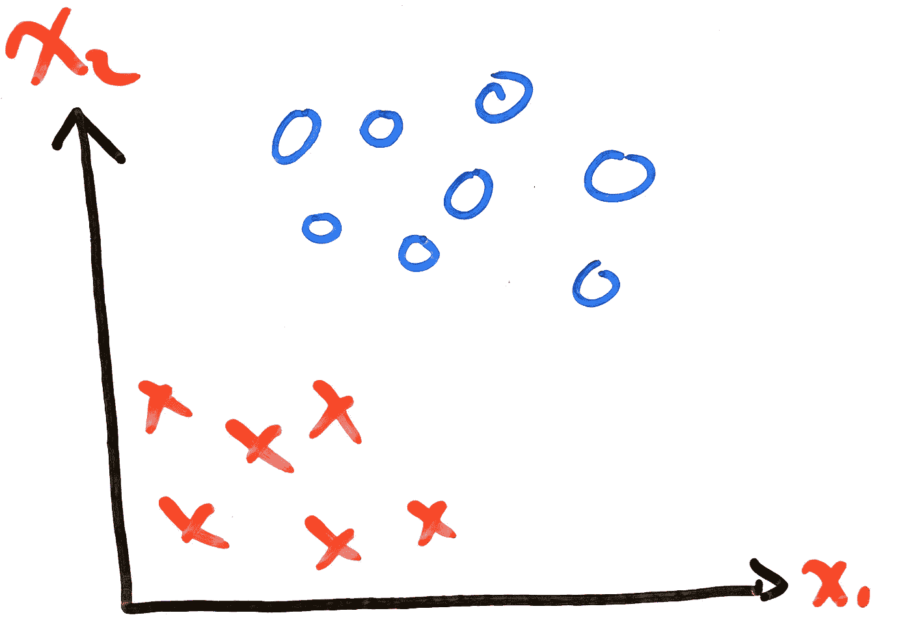

**Figure 1:** Classification Problem with Two Features and Two Classes

其中所有的`{x^(1), x^(2),...x^(m)}`(训练输入)都有各自的`{y^(1),y^(2),...y^(m)}`值(训练标签)，表明**实际的**值是多少。有了这些信息，我们就能够使用训练输入来训练我们的模型，并将我们的**预测值**与实际训练标签进行比较。我们称之为监督学习。在无监督学习中，我们的数据现在看起来如下所示:

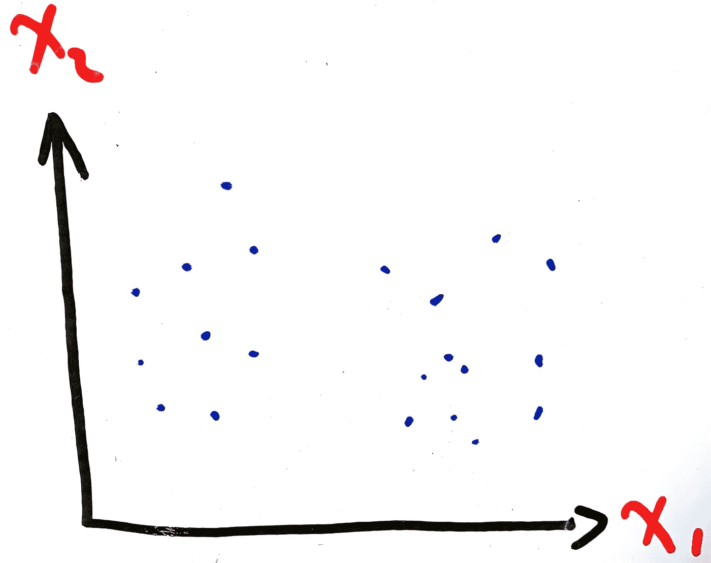

**Figure 2:** Unsupervised Algorithm Training Data Example

我们只有训练输入`{x^(1), x^(2),...x^(m)}`，没有对这些输入标签的理解，也就是没有`{y^(1),y^(2),...y^(m)}`。无监督学习算法的目标是通过基于点之间的相似性创建不同的组，在这些数据中找到某种顺序。这些组被称为**簇**。下面是一个无监督学习算法如何从图 2 所示的训练数据中创建不同聚类的示例:

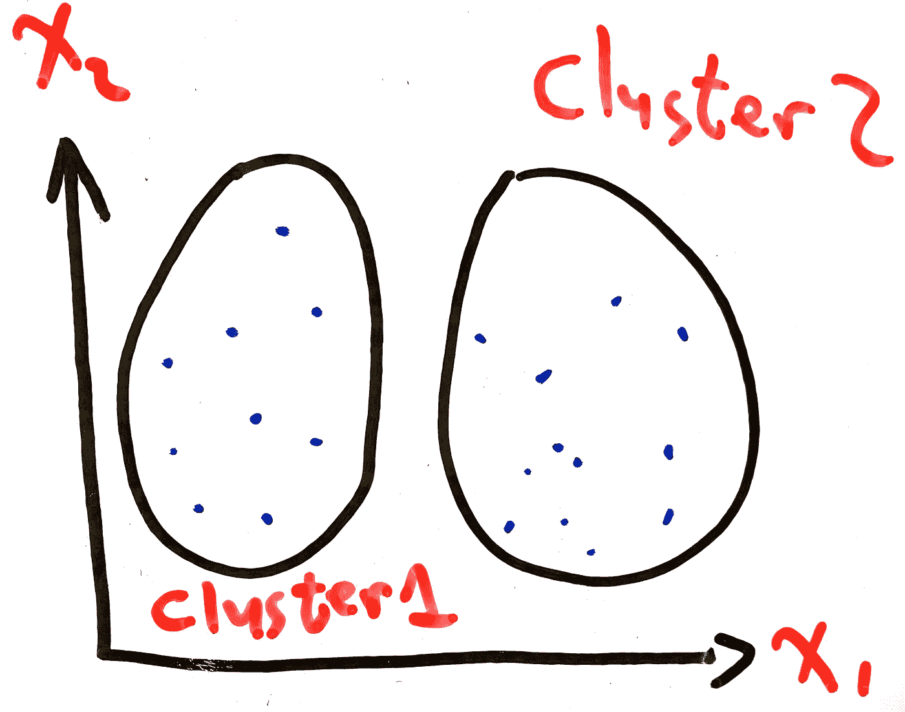

**Figure 3:** Grouping Training Data Into Two Different Clusters

最流行和最常用的聚类算法之一是 K-Means。

# k 均值

## 直觉

理解这个算法的最好方法是通过一个例子。因此，考虑下图:

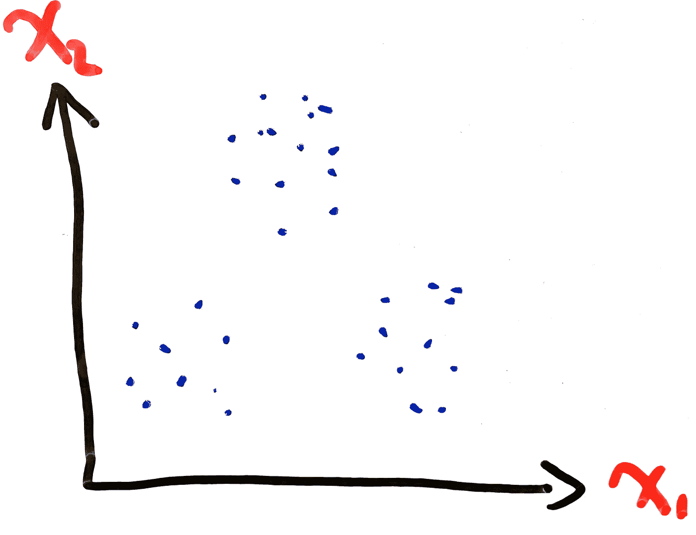

**Figure 4:** Classification Problem with Two Features and Two Classes

我们希望将相似的数据点分组。K-Means 要做的第一件事就是选择`k`任意点。我们将这些点称为**质心**。对于我们的示例，我们将选择`k = 3`，标记为红色、蓝色和黑色十字:

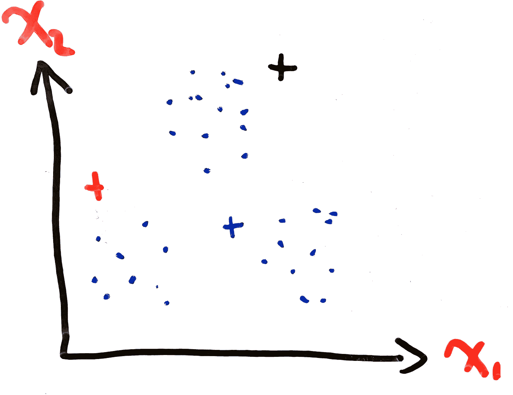

**Figure 4:** K-Means Selecting K Arbitrary Centroids

然后，我们将计算每个训练点到这两个质心的距离，使用您选择的距离方程，例如[欧几里德距离](https://en.wikipedia.org/wiki/Euclidean_distance#:~:text=In%20mathematics%2C%20the%20Euclidean%20distance,being%20called%20the%20Pythagorean%20distance.)。我们将训练点分配给它最接近的质心:

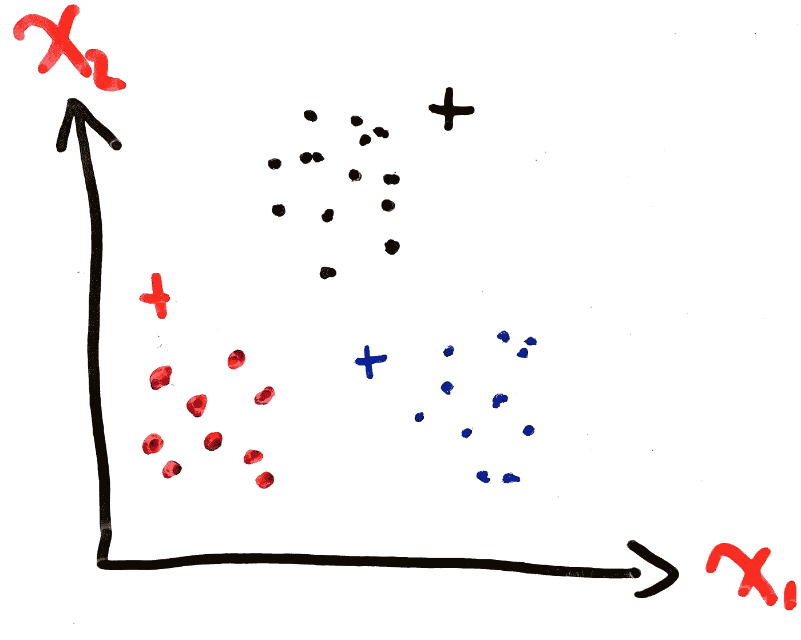

**Figure 5:** K-Means Assigning Training Points to the Closes Centroid

现在，我们通过使用以下公式计算指定给质心的所有训练点的平均值来重新定位质心:

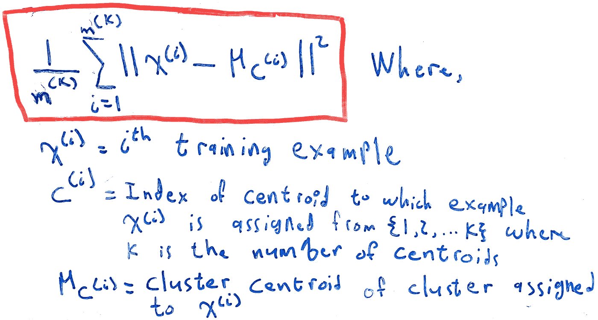

**Figure 5:** K-Means Assigning Training Points to the Closes Centroid

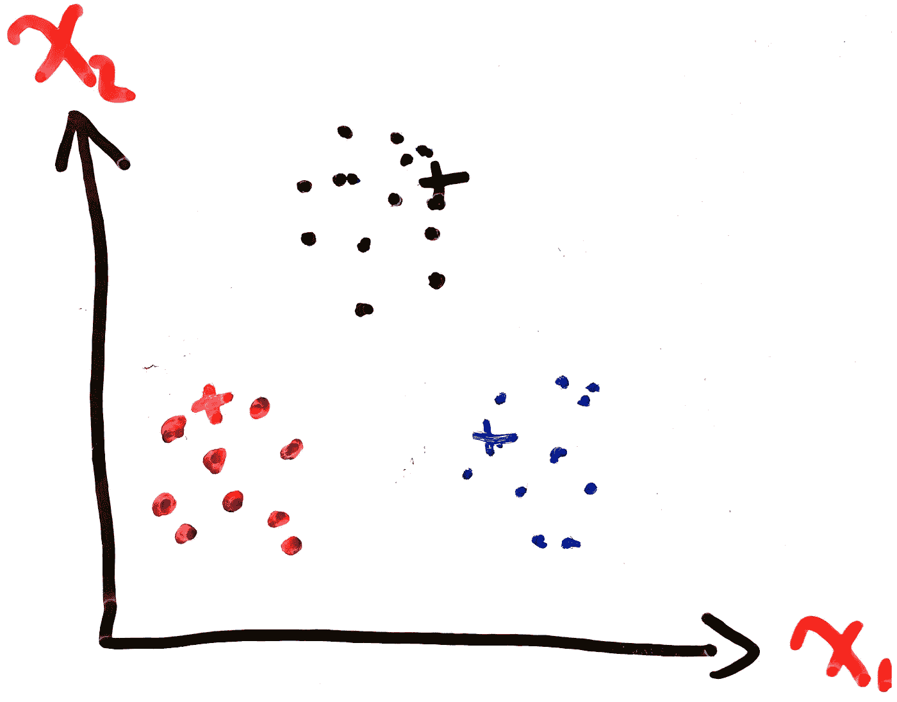

**Figure 6:** K-Means Repositioning the Centroids

在上面的**等式 1** 中，`m^K`表示分配给聚类`K`的训练样本的数量。最后，我们重复该过程，直到我们不再看到质心位置的变化(直到我们收敛)，即从训练点到它们的指定质心的平均距离最小:


**Figure 7:** K-Means Converging

现在你知道了。以下是该算法的官方伪代码，摘自 Coursera 上[吴恩达](https://medium.com/u/592ce2a67248?source=post_page-----9805ed89fa0--------------------------------)的机器学习课程介绍:

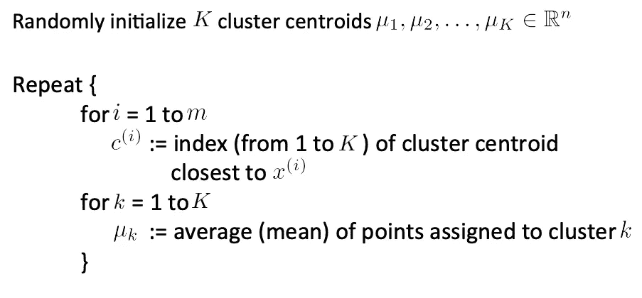

**Figure 8:** K-Means Algorithm Pseudocode

如果您一直关注这个系列，那么您可能会注意到一些奇怪的事情。有一个步骤我们甚至还没有考虑提及。这个算法的代价函数是什么？我们怎么知道什么时候找到了最优解。信不信由你，我们已经在**等式 1** 中引入了 K 均值成本函数。就像我们找到每个训练点与其分配的质心之间的平均距离一样，我们可以找到所有*训练点与其分配的质心之间的平均距离，这为我们提供了模型执行情况的总体指示:*

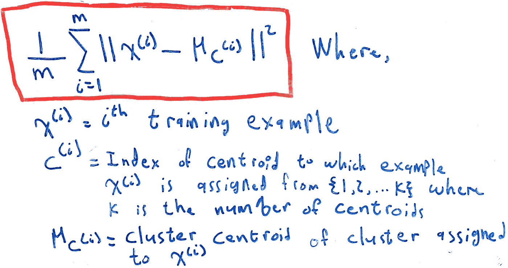

**Equation 2:** Mean of Distance of All Training Points to Their Assigned Centroid

其中`m`现在是总训练点数。这是我们试图最小化的方程，这是 K 均值的成本函数。

# 需要考虑的事项

在结束之前，对于这个算法，我想提出几个常见的问题。

## 我们会一直收敛到全局最优吗？

答案是否定的。请看下图:

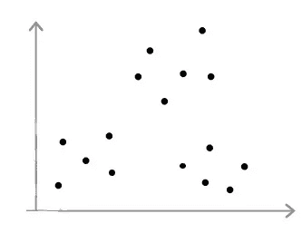

**Figure 9:** Random Points on a Graph

我们在这些训练点上运行 K-Means。根据初始化质心的方式，可以获得以下任何结果:

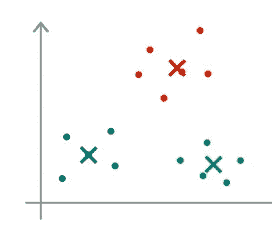

**Figure 10:** Optimal Solution

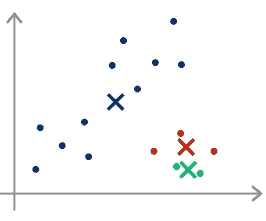

**Figure 11:** Non-Optimal Solution One

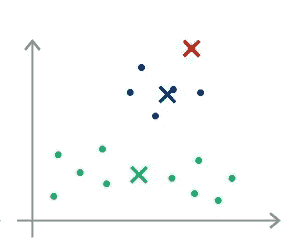

**Figure 12:** Non-Optimal Solution Two

虽然**图 10** 中的图表显然是正确的解决方案，但是 K-Means 很可能收敛到局部最优而不是全局最优，从而给我们留下不准确的结果，如图 11 和 12 所示。从数学上证明这一点很困难，但有一个很好的方法来形象化它。考虑这两点:

```
.     .
.     .
```

如下所示的解决方案(其中`c`是集群):

```
.  c  .
.  c  .
```

是有效的，但更好的解决方案应该是:

```
.     .
c     c
.     .
```

要准确得多。我们可以通过选择正确数量的质心`K`，以及有系统地随机初始化它们，来尽量减少这种情况发生的可能性。

## 如何随机初始化质心？

一种方法是让选择完全随机。虽然这是一个有效的解决方案，但是这是一个非常不稳定和危险的选择质心位置的方法。

最广泛使用的方法是选择`K`训练点，并使用这些坐标作为质心的初始位置。例如，如果我们有:


**Figure 13:** Random Points on a Graph

然后，我们可以选择任意点，并将它们用作质心的初始位置，例如:

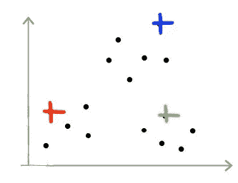

**Figure 14:** Training Points Positions Used as Centroid Initial Positions

注意，这仍然**不能**保证我们不会陷入局部最优，但是它减少了机会。

## 怎么挑 K？

这个问题的最佳答案是，根本没有选择正确 k 的具体方法。有一些技巧，但没有一个保证有效。在一天结束时，选择您的`K`的最佳方式是通过手动浏览您的数据可视化，并决定您认为最佳的决策。

在可用的几种技术中，**肘法**应用最为广泛。它的工作原理是比较集群的成本和数量`K`:

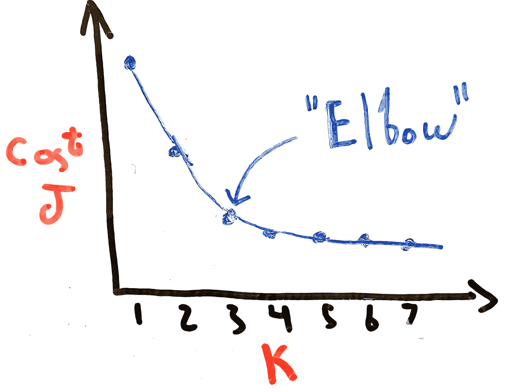

**Figure 15:** Elbow Method Example

在这种情况下，我们看到`K=1`和`K=2`之间以及`K=2`和`K=3`之间的成本显著降低，但之后它开始以慢得多的速度降低，因此我们可以得出结论`K=3`是正确的质心数量。但是，尽管尝试一下这种方法总是值得的，但通常情况下，您的图表看起来会像这样:

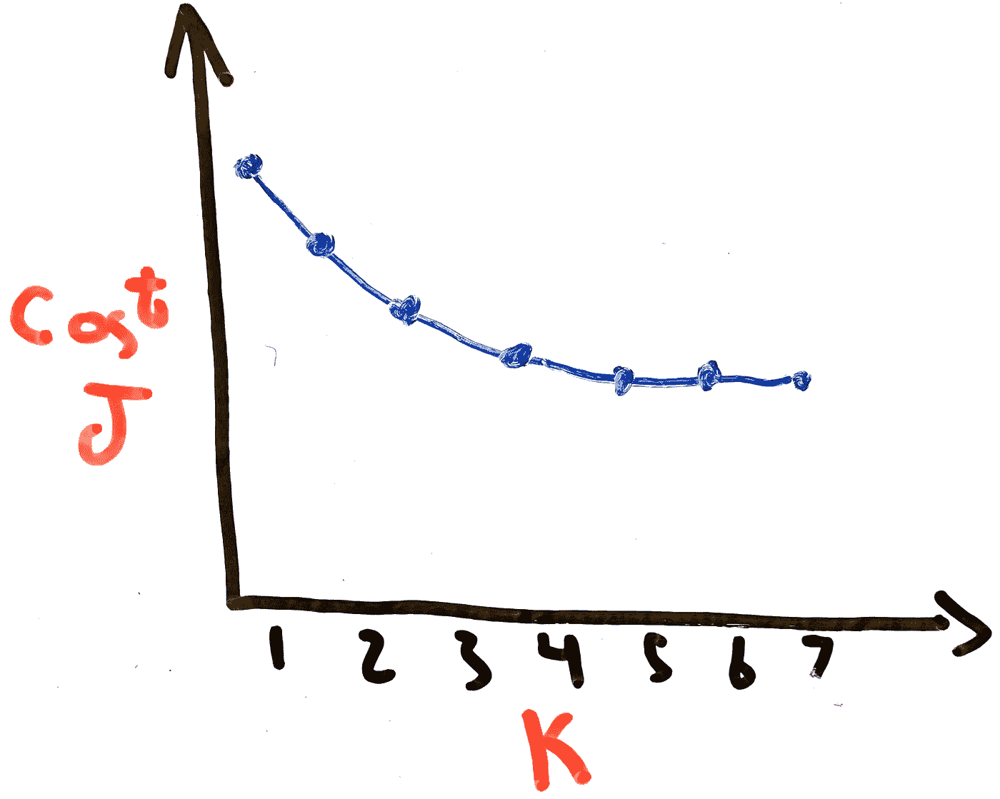

**Figure 16:** Elbow Method Counterexample

其中`K`值之间的误差减少最小，留给我们的信息很少，无法做出有价值的结论。

同样，目前最好的技术是简单地手动查看您的数据。

# 结论

在本文中，我们定义了无监督学习算法的概念。然后，我们采用这个想法，并用它来理解最流行的监督学习算法之一 K-Means 背后的理论。在最后，我们回答了一些算法最常见的问题，并得出结论，尽管有正式的方法，优化超参数的最佳方式是基于可视化手动进行。

在下一篇文章中，我们将讨论降维。

# 过去的文章

1.  **第一部分:** [数据预处理](https://ali-h-khanafer.medium.com/data-pre-processing-ee81bbe5cc77)
2.  **第二部分:** [梯度下降线性回归:直觉与实现](https://ali-h-khanafer.medium.com/linear-regression-using-gradient-descent-intuition-and-implementation-522d43453fc3)
3.  **第三部分:** [使用梯度下降的逻辑回归:直觉和实现](/geekculture/logistic-regression-using-gradient-descent-intuition-and-implementation-36a8498afdcb)
4.  **第四部分— 1:** [神经网络第一部分:术语、动机和直觉](/geekculture/neural-networks-part-1-terminology-motivation-and-intuition-73675fc43947)
5.  **第四部分— 2:** [神经网络第二部分:反向传播和梯度检测](/geekculture/neural-networks-part-2-backpropagation-and-gradient-checking-4f8d1350fb0b)
6.  **第六部分:** [评估你的假设，理解偏差与方差](/geekculture/evaluating-your-hypothesis-and-understanding-bias-vs-variance-86512cce4253)
7.  **第七部分:** [支持向量机和核](/geekculture/support-vector-machines-and-kernels-8b064ee53fc3)

# 无耻的插头

*   **推特:【twitter.com/ali_khanafer2】T22**
*   **领英**:[linkedin.com/in/ali-khanafer-319382152/](https://www.linkedin.com/in/ali-khanafer-319382152/)

# 参考

1.  [吴恩达的机器学习 Coursera 课程](https://www.coursera.org/learn/machine-learning?page=1)
2.  [堆栈溢出:为什么 K-Means 不能给出全局最小值？](https://stackoverflow.com/questions/14577329/why-doesnt-k-means-give-the-global-minima)