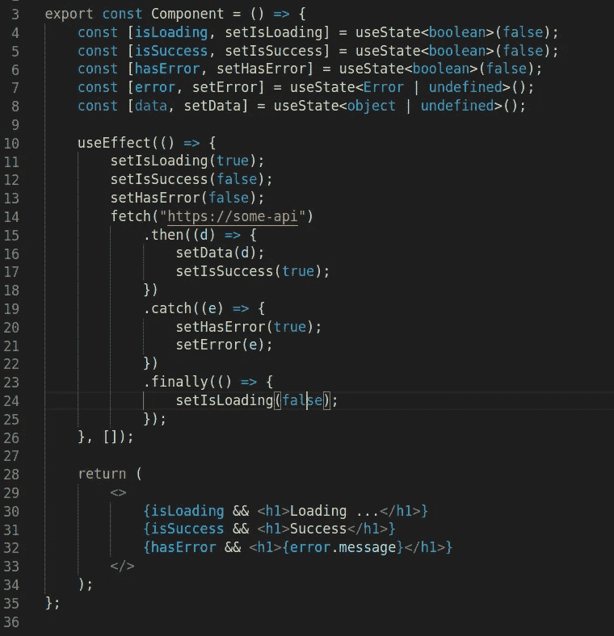
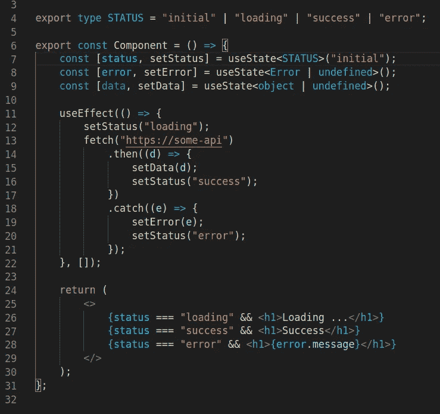
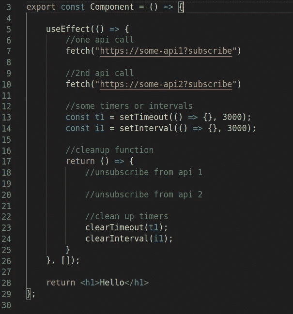
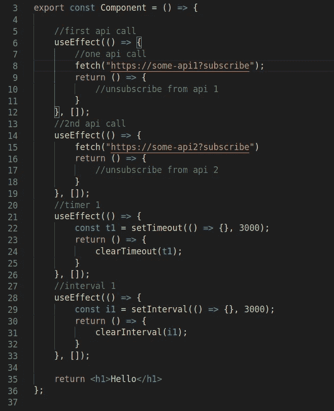

# 编写更好的 React 组件的无数实践

> 原文：<https://medium.com/geekculture/untold-practices-to-write-better-react-components-5593122802ec?source=collection_archive---------0----------------------->

React 是一个声明式的基于组件的库，它只处理一件事，那就是 UI。React 进化了很多。React 中的每一个新功能都让之前流行的功能黯然失色。功能组件比基于类的组件更受欢迎和鼓励。鼓励使用反应上下文来代替状态管理的冗余。无论如何，在这个故事中，我们将看到一些不为人知的实践，它们将减少 React 组件中的混乱。

## 旗帜

我们经常在`isLoading`、`isSuccess`或`hasError`等组件中使用标志。来处理一些功能。那么他们有什么问题呢？让我们看一个例子:



你看出什么不对了吗？是的，一个 API 调用管理多个标志。这是一个非常简单的例子，有一个 API 调用，所有三个标志在每次效果时都被重置。但是有了这三个标志，我可能不得不在现实世界的场景中处理一些选项，比如这些选项可能不会一起改变或者可能不会一起重置。因此，在这种情况下，您必须使用这些标志的组合来了解组件的当前状态或完成某些功能。这将使我们的代码更加混乱。

```
//when its not loading and is success
if (!isLoading && isSuccess) {}//when its not loading and has error
if (!isLoading && hasError) {}
```

现在我们从另一个角度来看待它们。在某个时间点，组件只有一种状态。不是`loading`就是`success`或者`error`

现在让我们来看一个更好的版本:



多个标志的管理被简化为一个标志`status`,代码变得更加清晰易读。而在现实世界中，你不必担心检查多个标志来确定组件的最终状态或实现某些功能。

## 使用效果

我们在函数组件中使用`useEffect`钩子来处理副作用。理想情况下，一个组件应该只做一件事。但现实世界并不是理想世界。让我们看一个例子:



我试图从现实世界的场景中捕捉一些复杂性:p。正如您所看到的问题，在一个`useEffect`调用中做了多件事情。虽然它是可读的，但更难理解和管理。我没有提到依赖项，但是你可以猜到，在依赖项数组中提到所有可能的依赖项会变得很糟糕。在现实世界中，随着时间的推移，随着越来越多的需求出现，情况会变得更加混乱。理想情况下，最好的方法是单个组件只做一件事。所以在理想情况下，我们只有一个有用的东西，在一个组件中。所以我们怎样才能让它更容易管理，更容易理解。让我们来看看更好的版本:



是的，你猜对了。`useEffect`中的单一责任原则。如果你不能让组件只做一件事，至少让`useEffect`只做一件事。对于每一个新的副作用，使用新的`useEffect`。在上面的例子中，虽然组件有更多的代码行，但我一眼就能看出这个`useEffect`只做一件事，只有`blah`和`blah`是它的依赖。如果在某个时间点，你想在你的组件中删除/添加一个新的效果，只需删除/添加它的`useEffect`就可以了，不会牵连到其他的。

## 何时使用独立组件或挂钩

如果一个组件在做不止一件事，那么是时候把它分开了。如果一个东西在不止一个地方被使用，那么是时候把它拿出来，使它成为一个独立的实体。如果那个东西涉及到 UI，就做一个单独的组件，如果只是逻辑/副作用，就做一个单独的钩子。

仅此而已。这几点是我从自己的经历中学到的观点。如果你有问题/异议/更好的练习，请告诉我，我将非常乐意与你一起攀登顶峰。