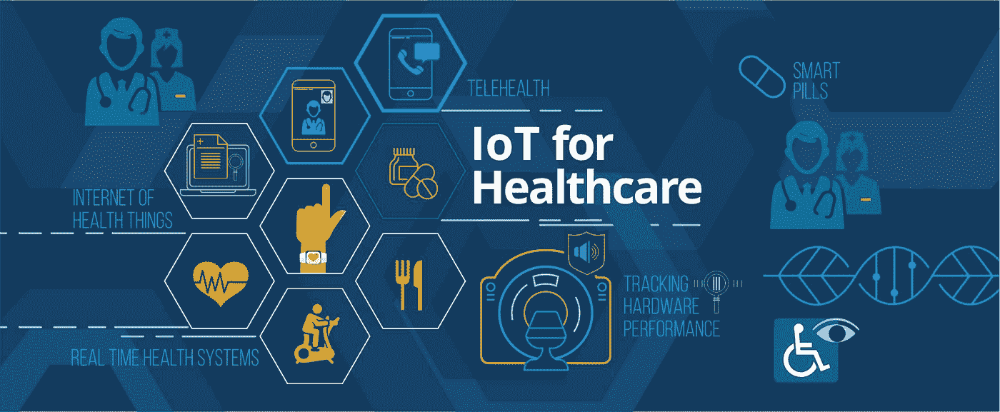
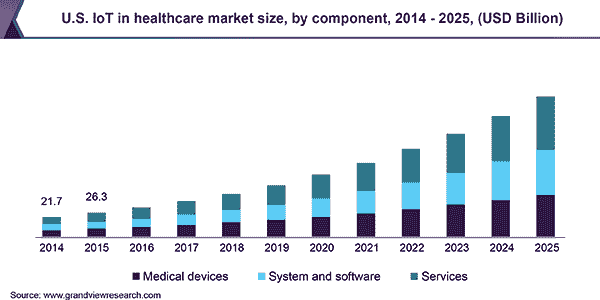
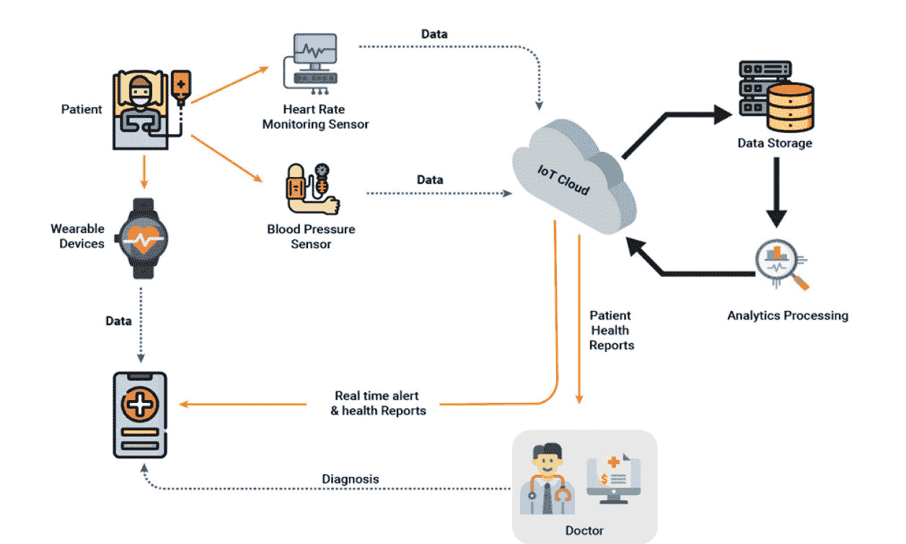
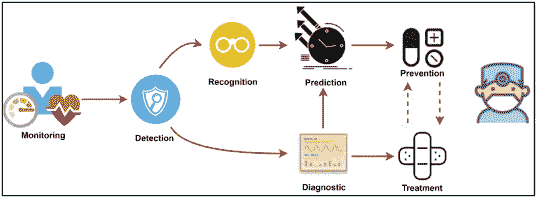
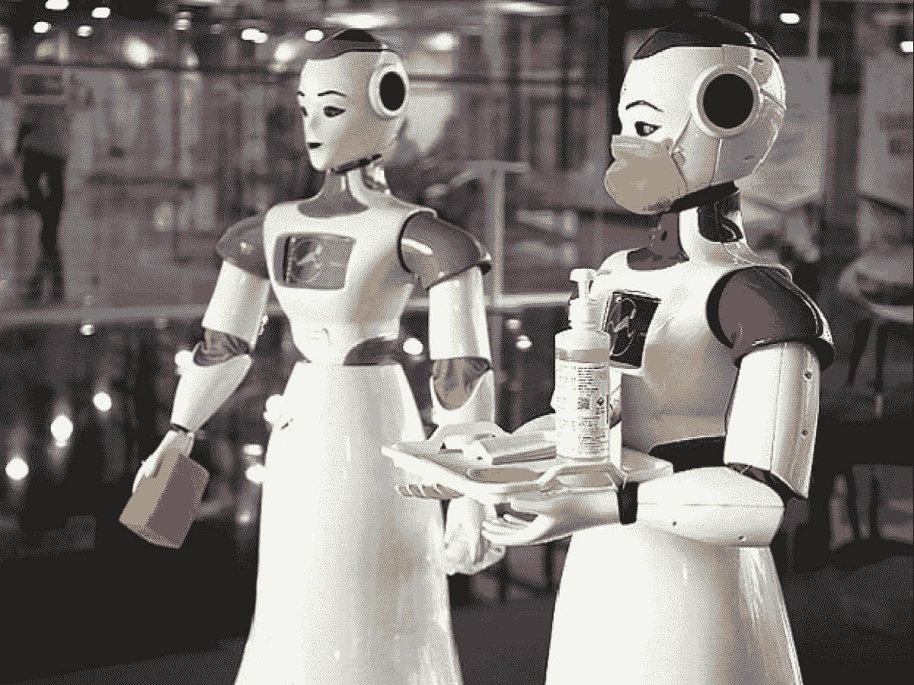
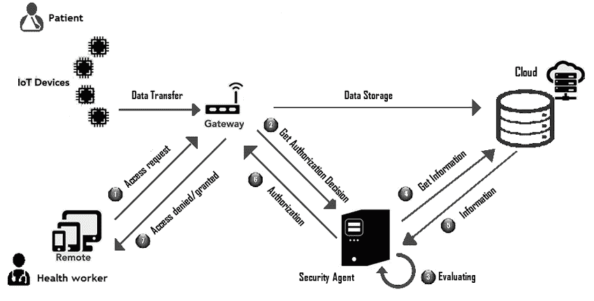

# 在 Covid 19 期间揭示物联网在医疗保健中的作用

> 原文：<https://medium.com/geekculture/unveiling-the-role-of-iot-in-healthcare-during-covid-19-c075819f23b0?source=collection_archive---------27----------------------->

[Image source](/@emorphis.technologies/how-iot-is-boosting-healthcare-application-development-551cb6f5e8e3)

与任何其他技术相比，物联网对医疗保健行业的影响是巨大的，因为它有可能自动化数百个流程。从预测来看，医疗保健市场的全球物联网预计将以 **19.8%** 的速度增长，从 2019 年**的 608.3 亿美元**增长到 2027 年**的 2607.5 亿美元**。

的确，物联网在医疗保健市场的到来使患者护理实践发生了革命性的变化，尤其是在新冠肺炎期间。让我们了解新冠肺炎期间物联网在医疗保健中的作用，以及它如何为医疗保健企业带来机遇。

[Image source](https://www.grandviewresearch.com/industry-analysis/internet-of-things-iot-healthcare-market)

**医疗保健领域物联网的兴起**

在物联网出现之前，患者必须去看医生，并通过电话或文本通信进行联系。此外，保健专家不可能持续监测病人的健康状况并提出建议。

但是，在支持传感器的设备的帮助下，物联网带来了远程监控的便利，这些设备可以将患者的健康相关数据传输给医生和医疗机构，以寻求必要的响应。它可以通过提高护理质量来增加患者的参与度和满意度。

支持患者监测的物联网设备还将通过防止患者再次入院来减少患者的住院需求。会自动降低治疗费用。毫无疑问，物联网可以通过重申患者与医疗保健提供商的互动并重新定义医疗保健空间和设备，从根本上改变医疗保健行业。

目前，每一家**物联网服务公司**都在通过启用大量支持物联网的医疗设备和产品来帮助社会抗击新冠肺炎。智能手表等可穿戴物联网设备可提供与人体相关的必要信息，如血糖水平、心率、血氧水平等。

在新冠肺炎疫情期间，物联网通过实现医生远程监控取得了重大突破。让我们看看疫情时期物联网在医疗保健行业的其他作用。

**物联网如何在新冠肺炎及以后重新定义医疗保健？**

在深入实际流程之前，您需要了解物联网是如何工作的？实际上，医疗环境中装有智能传感器和算法的物联网设备通过云将互联设备和应用程序紧密连接起来，从而对抗疫情。

这就是为什么医疗保健企业竞相雇佣物联网开发人员，为人们提供更具未来感的解决方案。让我们来看看物联网将在医疗保健领域提供的主要服务。

[Image source](https://www.embeddedcomputing.com/application/healthcare/telehealth-healthcare-iot/how-iot-is-transforming-the-healthcare-industry)

**扩展远程医疗**

远程医疗是一个专门从远程位置收集患者信息的过程，无需亲临医院。由于社会距离和锁定被认为是对抗 Covid 的最佳方式，远程医疗被认为是寻求医疗帮助的更安全的方式。

此外，它具有成本效益，因为它降低了旅行成本，并促进了患者与医疗保健专家的互动。想知道哪些设备将用于收集患者的医疗保健信息？嗯！智能手表和其他可穿戴设备可以有效地收集一个人的心率、血压和其他生命体征的信息。

此外，这些设备允许医生监测病人的健康状况。通过 PII(患者身份信息)和 PHI(患者健康信息)实现安全性，这些设备可以在住院治疗中轻松创建、部署和维护。

**以下是支持物联网的可穿戴设备在医疗保健领域发挥作用的方式。**

*   **心率监测-** 根据活动度准确测量患者的心率。
*   **情绪监测**——了解患者的精神状况
*   **患者监护** -了解血压、血糖水平、体温、心率等。

[Image source](https://www.sciencedirect.com/science/article/pii/S1084804520303374)

此外，非穿戴式物联网医疗设备也可用于各种医疗保健目的，如可摄取传感器、连接的隐形眼镜和连接的呼吸器等。由于这种趋势，对这些设备的需求正在增加，企业急于增加生产和采购。

**自动消毒&卫生检查**

机器人和人工智能传感器是科学的主要成就，这些设备正在许多行业中获得巨大的关注。当代机器人能够帮助人类完成各种危险的任务。在医疗中心和受影响的地区引入机器人驱动的消毒将是令人难以置信的。

这不仅可以避免消毒工人接触病毒，也有助于保持地方卫生。此外，非外科手术机器人可以用来清洁和消毒医院的病房。此外，紫外线灯也可以用来清洁机器人使用的地方，因为这些射线如果暴露在外，对人类是有害的。

此外，传感器驱动的手部卫生设备还可以改变医护人员和人们，并提醒他们清洁双手。此外，机器人还可以告诉工作人员，房间消毒后可以安全使用。这意味着在物联网设备和机器人的存在下，消毒将非常高效。

[Image source](https://www.business-standard.com/article/current-affairs/intelligent-robot-for-chemical-free-disinfection-of-public-places-120051200214_1.html)

**实时追踪人与人之间的接触**

新冠肺炎病毒的传播率比任何其他病毒都高，而且它也有可能出现无症状但被感染的人。在这种情况下，找到与感染者接触过的人至关重要，尤其是在潜伏期。

在这种情况下，**物联网应用开发商**开发的物联网设备和应用非常有用。智能手表和智能温度计可以通过跟踪受感染者的体温来提供他们的数据，因为发烧是疾病的首要症状之一。一旦从感染者那里收集到数据，就可以使用人工智能和大数据算法来分析收集到的数据。

使用这种方法，可以识别和限制大多数 Covid 受影响的区域。此外，政府也可以引入适当的隔离检疫方法，有效控制病毒的传播。与此同时，像 RFID(实时定位系统)手镯这样的设备可以帮助跟踪病人在隔离和疗养期间的状况。

从这些设备收集的数据也可以用于了解病毒的性质和进一步的研究和开发。

**数据隐私&保护**

医疗保健行业拥有大量与患者相关的敏感信息。因此，它一直是网络犯罪的主要目标。现在，当我们迈向医疗保健的数字生态系统时，患者的数据和信息也将以数字形式存储在云上。

简而言之，医生和患者之间的数据共享将发生在云上，并且需要采取必要的步骤来保护机密信息。在这种情况下，物联网可用于仅向授权人员和患者提供访问权限。

此外，像健康保险这样的组织可以利用捕获的数据进行承保和理赔操作。这些数据将允许他们了解欺诈索赔，并确定承保前景。简而言之，物联网设备将在定价、索赔处理、风险评估等方面为客户和保险公司带来透明度。

在存在物联网捕获的数据和决策操作的情况下，客户将始终能够正确了解每个决策和结果背后的基本概念。

[**Image source**](https://www.researchgate.net/figure/The-IOT-security-architecture_fig1_321886755)

**包装完毕**

现在你已经明白，物联网如何成为重塑 Covid19 期间或之后医疗设施和患者护理的重要因素。

目前，IoT 已经增加了其在医院环境之外的医疗服务，并帮助许多人解决许多问题。事实上，物联网正在不同物联网行业的 Covid 的各个方面获得巨大的发展势头，并在医疗领域开辟了新的天地。

物联网在医疗领域的融合，带来了医疗成本的巨大舒适度和成本降低。相比传统的医疗方式，物联网医疗设备在该领域带来了许多积极的影响。如果你想利用它的潜力，你可以订阅 [**物联网应用开发服务**](https://www.valuecoders.com/iot-development-company) 并获得未来解决方案来促进患者护理。