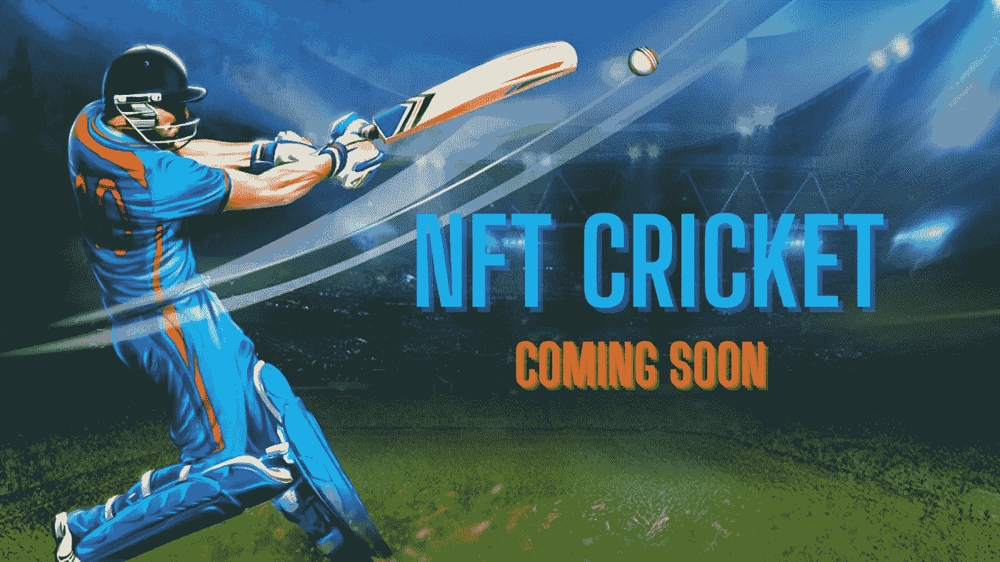

# 即将到来的 NFT |板球 NFT 系列 2022

> 原文：<https://medium.com/geekculture/upcoming-nft-cricket-nft-collections-2022-e196fa6e05d8?source=collection_archive---------17----------------------->

# **即将推出的 NFT 系列**

让我们来看看最值得期待的 [**即将到来的 2022 年 NFT 板球集锦**](https://jump.trade/?fsz=medium_praveen) 。我对这个板球 NFT 收集非常兴奋。

随着加密行业越来越受欢迎，成功和里程碑已经成为同义词。这种尖端的数字技术正在将创新型经济推向新的高度。无论是过去还是现在，数字领域的每一个标题和每一条新闻都是蓬勃发展的数字环境的绝佳补充。这项独一无二的技术有望为人类提供前所未有的灵活性、安全性和透明度，同时保持分散化。

NFT 空间在操作变量和活动方面正在经历巨大的转变。我们看到了向 NFT 游戏的快速转移，元宇宙支持它。游戏玩家可以使用虚拟游戏和实时收入起草工具来享受游戏。由于他们非凡的实时游戏概念，NFT 游戏平台在区块链领域建立了一个令人难以置信的数字社区。

# **NFT 博彩业在数字世界的重要性**

在数字世界中，有许多 NFT 游戏平台。以太网是早期 NFT 游戏的数字化版本。这款游戏是游戏行业数字化转型的催化剂。我们已经看到各种各样的 NFT 游戏来到了区块链王国。2021 年被指定为 NFT 年。与不可替代代币接触的一切都变得有价值。从 Axie Infinity 到 Crypto Kitties，有很多选择。

在数字世界中，有许多不同类型的类别。NBA Top Shot、SoRare 和任何其他基于市场的 NFT 游戏都被视为梦幻游戏行业的高级形式，具有巨大的功能。相比之下，每个 NFT 游戏的基础都是虚拟现实和战斗游戏。

除了战斗类型，还有赛车游戏，如 Zed Run，Power Drift，Revv Racing，以及其他使用 NFT 平台来交换玩家拥有的皮肤，能力和技能素质的游戏。目前，各种现实世界的游戏平台，如[沙盒](https://www.sandbox.game/)、分散的土地、Polkacity 等，都融入了 NFTs 的概念。

# **元宇宙和游戏化板球 NFTs**

体育热空前高涨，无论哪个季节，NFTs 都表现最佳。在数字领域，NFT 已经跨越了许多商业行业。在元宇宙地区，电子竞技部门尚未调查 NFTs 领域。所有其他与体育相关的 NFT 游戏平台，类似于 [NBA top shot](https://nbatopshot.com/) 或 Sorare，都依赖于幻想游戏设置，玩家可以根据实际进行的比赛获得奖励。

让我们以板球运动为例。这是世界上最受欢迎和最受关注的运动之一。这是一项全球运动，世界上大多数国家都喜欢。板球也是一项世界闻名的运动。元宇宙概念的建立是为了取悦板球迷的眼睛。借助虚拟和增强现实技术，元宇宙可以为参与者带来生动的板球比赛。元宇宙的球员被赋予了击球、投球和轻松得分的能力。因此， [**元宇宙 NFT 板球赛**](https://jump.trade/?fsz=medium_praveen) 将成为顶级数字游戏平台。

## **包装完毕，**

创建世界上第一个 NFT 板球游戏的技术在数字领域已经可用。开发令人惊叹的游戏平台的障碍已经被打破。我们曾经有过游戏体验有一天可能会改变的想法和观念，但我们从未想过这是可以实现的。然而，在 Jumptrade 市场的帮助下，实现这一目标是可能的。

这个 NFT 板球市场将有一个 NFT 板球下降和 NFT 板球狂热分子和支持者超级战利品下降的惊人比率。对于板球爱好者和其他人来说，这将是一个体验新事物和独特事物的理想机会。结果就是在平台上注册，开始给钱包注资就完成了。因此，这将是一个千载难逢的机会，现在正是借助 Jump 进入板球生态系统中的 NFTs 和区块链领域的时候。贸易。