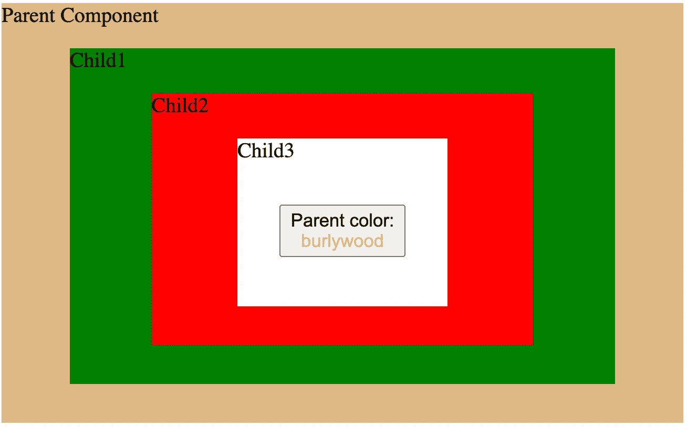
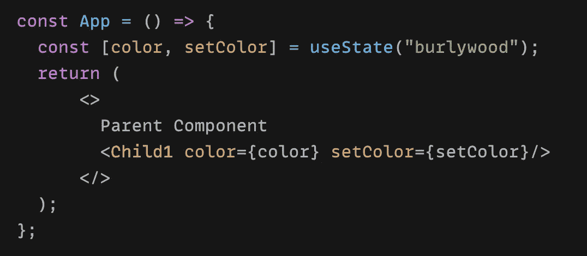
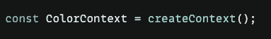
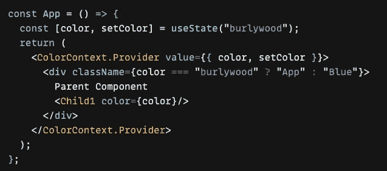
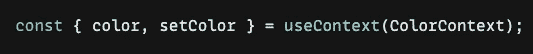
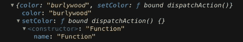
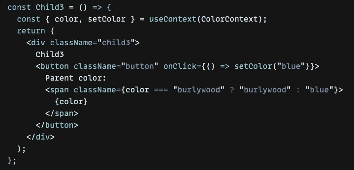
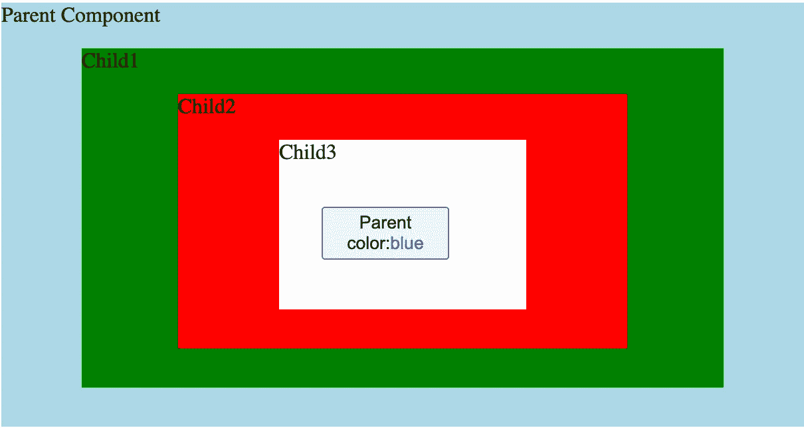
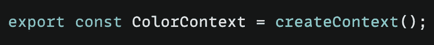
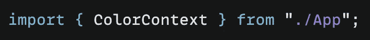

# 用 React 上下文将状态从子节点更新到父节点

> 原文：<https://medium.com/geekculture/update-parent-state-from-child-component-with-react-context-api-a56cf3742428?source=collection_archive---------0----------------------->

— React Context 提供了一种通过组件树传递数据的方法，而不必在每一级☘️手动向下传递属性

A Step By Step Approach To Understanding The React Context

在任何应用中，数据都是必不可少的。我们都知道这一点，在 React 中，**状态**和**道具**是两个非常重要且常用的属性，很容易解释:它们都用来保存数据的状态。

***道具*** *用于组件之间的通信，一种传递数据的方式。由于 React 的数据流是* ***自上而下*** *，所以道具是从父组件传递到子组件的。—是的，我们都知道这一点，但这并不意味着我们不能从子组件中改变父组件的状态*🌸

通常我们将一个**事件**从父组件传递给子组件，子组件接收事件，当事件(方法)被参数调用时，父组件中定义的方法被触发，然后状态被更新。

这听起来很容易，我们可以通过所有组件传递 props 来更新父状态，但是如果我们有下面这样的东西呢？👇

The parent component contains 3 child components

假设父组件有三个嵌套的子组件。在最后一个子组件(Child3)中，有一个按钮显示父组件的颜色:初始颜色是 **Burlywood** 。

为了用这个按钮改变父颜色，我们可以将颜色属性通过所有子组件向下传递到**子组件 3** ，并使用 **onClick** 事件来更新父颜色:

Pass **color** and **setColor** props down, setColor(“blue”) updates parent color

好吧，我们只有 3 个子组件，但是如果我们有 10 个甚至更多呢？我们要让道具变成地狱💥！让我们以简单的方式实现

在这种情况下，我们可以使用 React 钩子:`**useContext**`

> [它接受一个上下文对象(从](https://reactjs.org/docs/hooks-reference.html#usecontext) `[React.createContext](https://reactjs.org/docs/hooks-reference.html#usecontext)` [返回的值)并返回该上下文的当前上下文值。当前上下文值由树中调用组件上方最近的](https://reactjs.org/docs/hooks-reference.html#usecontext) `[<MyContext.Provider>](https://reactjs.org/docs/hooks-reference.html#usecontext)` [的](https://reactjs.org/docs/hooks-reference.html#usecontext) `[value](https://reactjs.org/docs/hooks-reference.html#usecontext)` [属性决定。](https://reactjs.org/docs/hooks-reference.html#usecontext)

我将使用上面的颜色示例，看看如何从子组件更新父状态🦋

第一步，在父组件中创建一个**上下文**，并将返回值包装在一个**提供者**中:

Context object created

*为了使这个上下文模块有用，我们需要使用一个* ***提供者*** *和一个提供值的组件，提供者组件用于向其子组件提供上下文，不管它们有多深*

Provider holds the context value

*👉这里重要的一点是，以后想要使用上下文的所有组件都必须包装在这个提供者组件中，如果您想要更改上下文值，只需更新值属性*

第二步，要使用这个上下文，可以通过两种方式来执行:

第一种方法是使用作为子**上下文提供的渲染函数。消费者组件到上下文实例上可用的特殊组件。类似下面这样的东西:**

*函数 ParentComponent() {*

*回车(*

*<* ***上下文。消费者*** *>*

*{ value =><>{ value }</>}*

*< /* ***语境。*** *>* 消费者

*)}*

我推荐的第二种方法是使用 **useContext(上下文)** React 钩子，它返回上下文的值: *value = useContext(上下文)*。

在这种情况下，我们可以使用 Child3 组件中的上下文值:

*console.log 上下文值:*

We receive **color** and **setColor** from provider in the parent component

我们从父组件中的提供者处获得了 **color** 和 **setColor** ，而没有通过☘️的子 1、子 2 和子 3 传递属性

最后一步，用按钮 **onClick** 函数更新父组件的颜色。在这个简单的例子中，我们只需将颜色设置为“**蓝色**”:

**onClick** function in order to update parent state

现在，当我们单击该按钮时，父组件的背景颜色将变为蓝色✨

Parent colour is now **blue** after button click

🔴重要！那给我带来了很多痛苦！

*   不要忘记导出您的上下文！

export context!

*   不要忘记导入您的上下文！

import context!

就是这样！这看起来很简单，但也许我们应该在决定在应用程序中经常使用上下文之前仔细考虑一下👀

使用上下文的主要思想是允许组件访问一些全局数据，并在全局数据改变时重新呈现。上下文解决了道具钻取问题:当你必须将道具从父组件传递到许多子组件时。

👉另一方面，集成上下文增加了复杂性。**创建上下文**，将所有内容包装在**提供者**中，将 **useContext()** 包装在每个消费者中——这增加了复杂性，使得单元测试组件更加困难。

完整代码[此处](https://codesandbox.io/s/react-usecontext-setstate-9eg87?file=/src/App.js:111-155)，可以随便摆弄:)

# 结论

使用上下文需要 3 个步骤:创建、提供和使用上下文。

当将上下文集成到您的应用程序中时，要考虑到它增加了大量的复杂性。有时候，在层级结构中的 2-3 个级别上练习道具会更好。🙌

感谢阅读！

以上是一个简单的**上下文**用法示例，希望它有趣且有用，如果你对我的其他文章感兴趣，这里有一些链接:

 [## 创建以反应方式嵌入的响应 iframe

### —令人惊讶的是，YouTube 没有相应的嵌入代码🦄，我们来玩 css 吧…

enlear .学院](https://enlear.academy/create-responsive-iframe-embed-in-a-react-way-f52075bf3b04)  [## 以反应方式隐藏和替换滚动时的粘性元素

### —棘手但有趣🍡

medium.com](/geekculture/hide-and-replace-sticky-element-on-scrolling-in-a-react-way-8bc3f04e2a81)  [## 使用会话存储来保持 React 组件中的状态

### 当页面会话结束时，sessionStorage 中的数据将被清除。

javascript.plainenglish.io](https://javascript.plainenglish.io/use-session-storage-to-persist-state-within-a-react-component-206867ef2269)  [## 让我们玩超链接吧

### 创建页面部分的链接很简单，但是如果你有一个固定的标题呢？

enlear .学院](https://enlear.academy/lets-play-with-hyperlinks-338d1be1f6d7)  [## 以反应方式创建分页

### 一个漂亮的分页怎么样？🧚‍♂️

javascript.plainenglish.io](https://javascript.plainenglish.io/create-a-pagination-in-a-react-way-df5c6fe1e0c7)  [## Css 技巧:给背景图片添加颜色和线性渐变

### —一个可以节省您时间的 css 技巧🦋

medium.com](/geekculture/css-trick-add-colour-and-linear-gradient-to-a-background-image-2dd0fe6125a8)  [## 如何防止 React 中嵌套

### 你熟悉这个错误吗？💻

javascript.plainenglish.io](https://javascript.plainenglish.io/prevent-validatedomnesting-button-descendant-error-21d9a34e5984)  [## 用 CSS 防止换行

### —reactcomponent🧚中的 css 技巧

medium.com](/geekculture/prevent-line-breaks-with-css-68a9f066db60)  [## 用对话框覆盖反应电子邮件验证

### —电子邮件验证有时令人头疼，🧊

medium.com](/geekculture/react-email-validation-with-dialog-overlay-472ee564d585)  [## 以反应的方式找到最近的位置

### —️地理定位 API

javascript.plainenglish.io](https://javascript.plainenglish.io/find-the-nearest-location-in-a-react-way-9ed51a999807)  [## 用 gatsby-source-filesystem 和 GraphQL 获取 JSON 数据

### 学习盖茨比第二步

javascript.plainenglish.io](https://javascript.plainenglish.io/sourcing-json-data-with-gatsby-source-filesystem-and-graphql-6fc7cef2a49e)  [## 边做边学——使用 Gatsby 创建您的第一个网站

### 一步一步来，是的。

javascript.plainenglish.io](https://javascript.plainenglish.io/learn-by-doing-use-gatsby-to-create-your-first-site-af7bfb7a8a6f)  [## 您可以使用的 5 个 React 钩子库

### 大三学生的建议——试一试。

javascript.plainenglish.io](https://javascript.plainenglish.io/5-react-hook-libraries-you-could-use-d7f13066ebba)  [## 从音乐到网络开发-我的道路

### 从一个交响乐团的音乐家到一个网页开发者。

javascript.plainenglish.io](https://javascript.plainenglish.io/from-music-to-web-development-my-junior-path-7421e0ddd65)  [## 删除按钮中由换行符引起的多余空白

### —奇怪的断字 CSS👀

medium.com](/geekculture/remove-extra-whitespace-caused-by-a-line-break-within-a-button-e7418f9de96e)