# 更新了如何使用 JavaScript 中的 JSON 数据用 Docx.js 创建多个文档

> 原文：<https://medium.com/geekculture/updated-how-to-create-multiple-documents-with-docx-js-with-json-data-in-javascript-b1924879b288?source=collection_archive---------0----------------------->


我创建了一个关于这个主题的帖子，但这个主题有点过时了，在同一个视频中，人们有点困惑，因为沙盒的代码对他们不起作用，对我来说，我也对 codesanbox 有点不安，但最终我更新了帖子，更新了代码和视频。

如果你想看的话，这是视频

# HTML5 结构和 CSS3

在这种情况下，我只使用了 HTML5 上的一个按钮和一点 Css3 来创建一个带有他的 id 的简单按钮


Creating local html document

它看起来像这样


Creating Button to create Dynamic Documents

# 图书馆

我们需要这些库 File-saver 和 docx.js 在我们的 index.html 中插入的最终版本

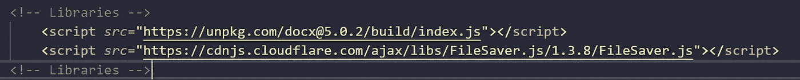

Example Importing libraries

```
<!-- Libraries --><script *src*="https://unpkg.com/docx@5.0.2/build/index.js"></script><script *src*="https://cdnjs.cloudflare.com/ajax/libs/FileSaver.js/1.3.8/FileSaver.js"></script><!-- Libraries -->
```

# JavaScript 的结构

在我们的 app.js 中，首先我们需要获得按钮的 id，然后我们添加一个事件侦听器，在这种情况下是一个 click 事件，最后我们传递了另一个名为 startPDF()的函数

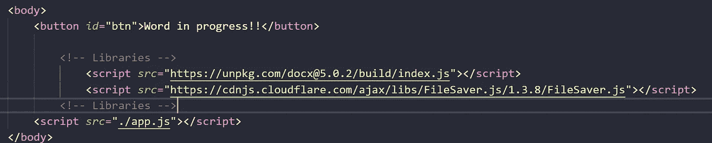

Example Importing libraries

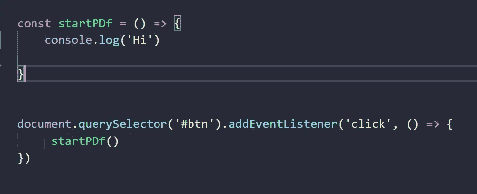

Creating the start function

然后我们需要在插入 doc 实例时创建一个变量


Example create new object of docx

然后，在变量 doc 中，我们需要像这样添加节、段落和文本，在这种情况下，doc 保存我们在其中插入的所有段落和文本，这是文档带给我们的新版本和结构，它需要子代来换行段落，并且在段落内部另一个子代来换行文本，等等

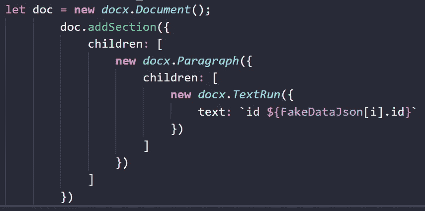

Example how we need to use this structure to create Documents

然后，我们需要导出我们的文档，我们需要使用 Packer 类来等待创建 blob 的承诺，然后将这个 blob 添加到 saveAs()函数中，它只接收两个参数 blob 和文档的名称，在本例中为 hi.docx。

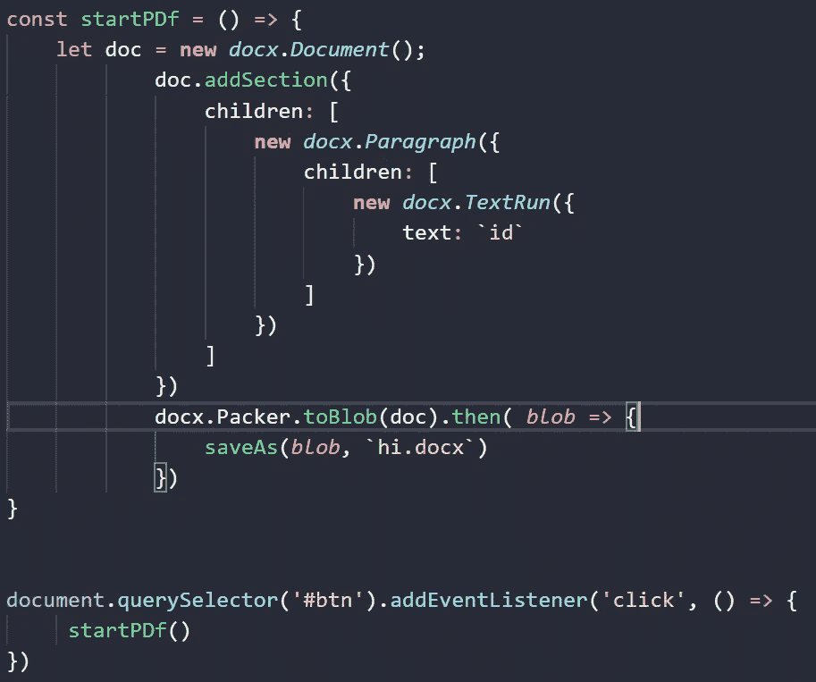

Example using Blob to create the document and export the document with saveAs

然后点击按钮，我们得到了第一份文件


Example The document is created

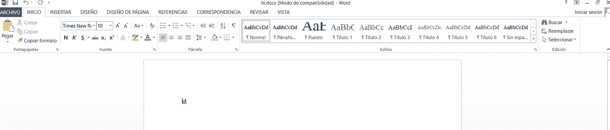

Inside the document

然后，我们需要来自 excel 的信息来创建动态文档，在这种情况下，我们将使用来自 Excel 的信息并粘贴该页面中的信息[https://www.convertcsv.com/csv-to-json.htm](https://www.convertcsv.com/csv-to-json.htm)来创建 JSON 数据，我们将它称为 FakeDataJson

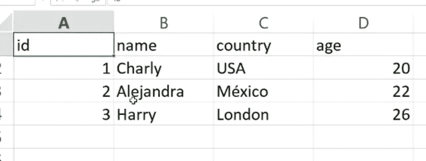

Excel data

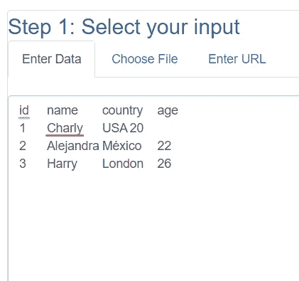

Example Transforming data from Excel to Json

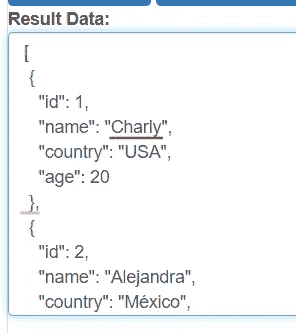

Example JSON Data

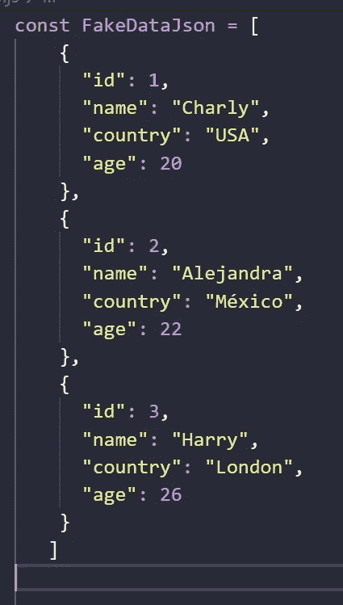

Create a variable with all the JSON data

然后我们创建一个 for 循环，在其中添加一个 auto invoke 函数，在 auto invoke 函数中添加一个 setTimeout，然后添加 DOCX 数据，因为如果不想丢失数据，我们需要稍微延迟 for 循环，以创建正确时间来生成每个文档，当我尝试这样做时，没有延迟，文档的创建非常快，当循环最终结束时，我得到了 4 个 10 个文档。

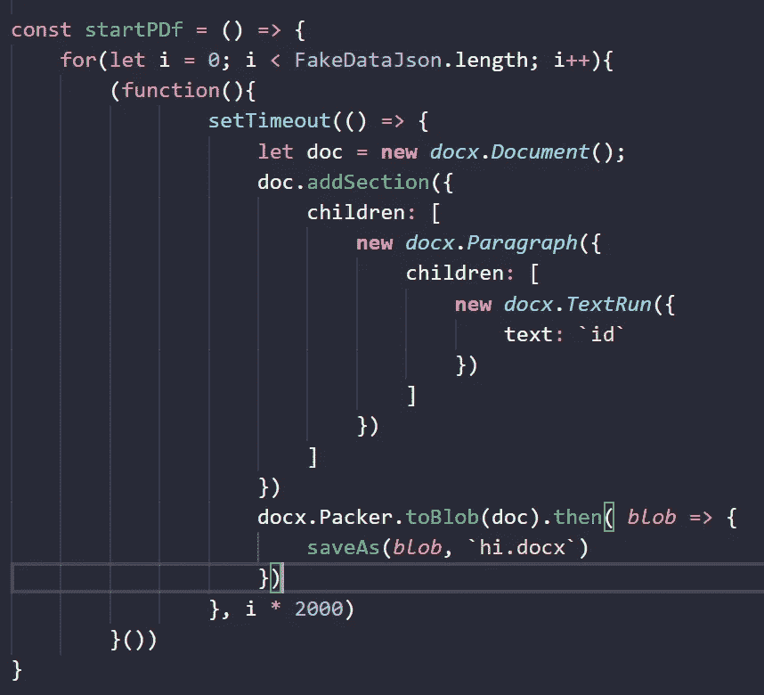

Example Create the dynamic document with autoinvoke function

但是我们需要创建一个接收三个参数的函数，第一个是 doc，第二个是 DOCX，第三个是我们文档的名称

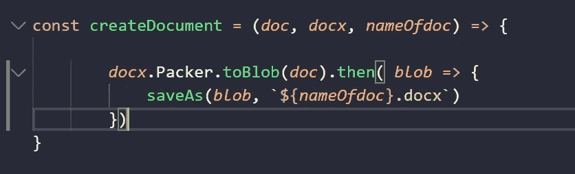

Passing more parameter to create word documents

最后，我们添加了更多的段落，并用 I 和国家、年龄、姓名等完全动态地设置数据变量。

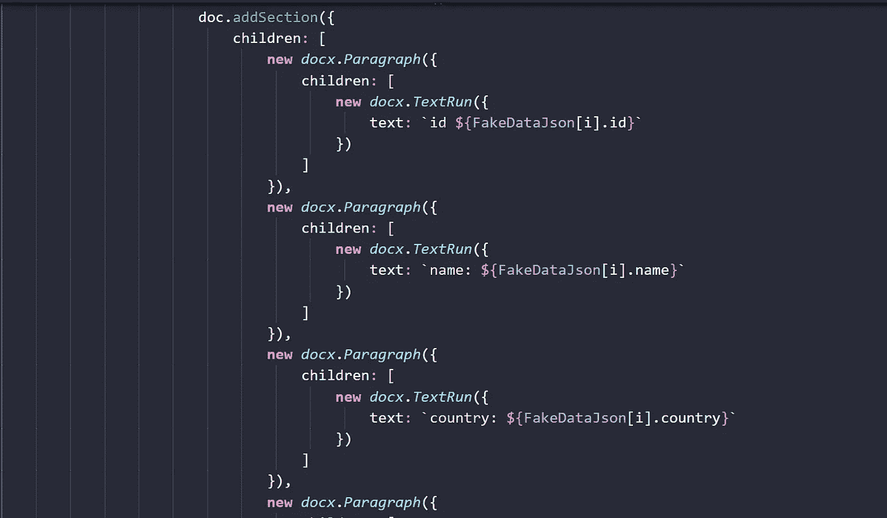

Example adding more variables

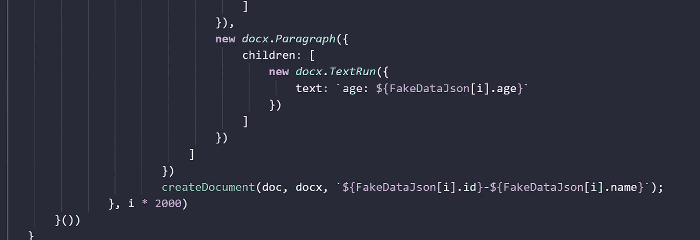

Example adding more variables

是的，我们得到了我们的文件


Example Creating Dynamic documents

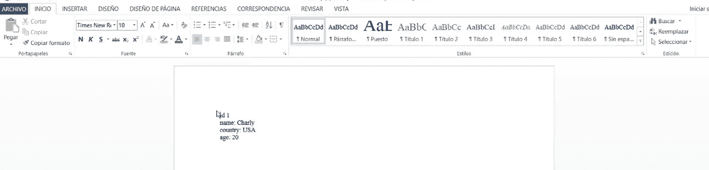

Example inside every document

# 结论

这是我的旧帖子的更新版本:[使用 DOCX Js、文件保存器和来自 EXCEL 或 JSON 的数据创建动态 word 文档](/@olivertate274/create-dynamic-word-documents-using-docx-js-file-saver-and-data-from-an-excel-or-json-dbd5e4ec823f)这是一个创建多个文档的伟大工具，结构比过去的版本更好。

# 来源

【https://medium . com/@ Oliver tate 274/create-dynamic-word-documents-using-docx-js-file-saver-and-data-from-an-excel-or-JSON-DBD 5 E4 EC 823 f
https://docx.js.org/#/
[https://youtu.be/71d7Uo5lsQg](https://youtu.be/71d7Uo5lsQg)
[https://www.convertcsv.com/csv-to-json.htm](https://www.convertcsv.com/csv-to-json.htm)

# 完全码

[https://github.com/rodrigofigueroa/docxjsexample](https://github.com/rodrigofigueroa/docxjsexample)