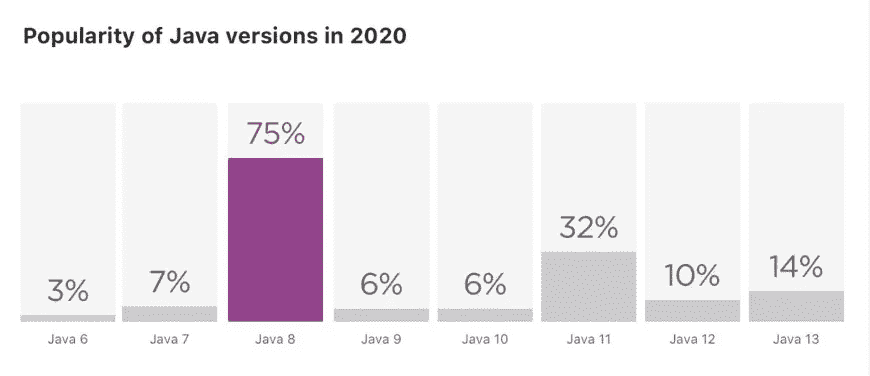

# 更新和常见问题 ShardingSphere 分钟快速入门指南

> 原文：<https://medium.com/geekculture/updates-and-faq-your-1-minute-quick-start-guide-to-shardingsphere-b80bed396b2?source=collection_archive---------23----------------------->

# **背景**

Apache ShardingSphere 是 Apache 顶级项目，也是最受欢迎的开源大数据项目之一。它开始于大约 5 年前，现在 ShardingSphere 的社区中有超过 14K+的明星和 270+的贡献者。

这个成功的项目已经发布并更新了许多版本。Apache ShardingSphere 现在支持许多强大的特性，并不断优化其配置规则。我们希望帮助用户理解所有特性和配置规则，帮助他们快速测试和运行组件，并最终帮助他们实现最佳性能，因此我们决定启动 shardingsphere-example 项目。

shardingsphere-example 是一个独立的 Maven 项目。它保存在 Apache ShardingSphere 的“examples”文件中。链接:

[https://github . com/Apache/sharding sphere/tree/master/examples](https://github.com/apache/shardingsphere/tree/master/examples)

# **模块&解释**

shardingsphere-example 项目包含许多模块。它为用户提供了横向扩展、读写分离、分布式治理、分布式事务、数据加密、提示管理器、影子数据库等功能的指南和配置示例。

还包括 Java API、YAML、Spring Boot、Spring Namespace 等常用工具。除了 ShardingSphere-JDBC，现在我们在 shardingsphere-example 中添加了 ShardingSphere-Proxy 和 ShardingSphere-Parser 的使用示例。你可以很容易地在我们的官方报告中找到 Apache ShardingSphere 的所有特性及其场景，以及它们的灵活配置。下表显示了模块在 shardingsphere-example 中的分布情况。

```
shardingsphere-example├── example-core│ ├── config-utility│ ├── example-api│ ├── example-raw-jdbc│ ├── example-spring-jpa│ └── example-spring-mybatis├── shardingsphere-jdbc-example│ ├── sharding-example│ │ ├── sharding-raw-jdbc-example│ │ ├── sharding-spring-boot-jpa-example│ │ ├── sharding-spring-boot-mybatis-example│ │ ├── sharding-spring-namespace-jpa-example│ │ └── sharding-spring-namespace-mybatis-example│ ├── governance-example│ │ ├── governance-raw-jdbc-example│ │ ├── governance-spring-boot-mybatis-example│ │ └── governance-spring-namespace-mybatis-example│ ├── transaction-example│ │ ├── transaction-2pc-xa-atomikos-raw-jdbc-example│ │ ├── transaction-2pc-xa-bitronix-raw-jdbc-example│ │ ├── transaction-2pc-xa-narayana-raw-jdbc-example│ │ ├── transaction-2pc-xa-spring-boot-example│ │ ├── transaction-2pc-xa-spring-namespace-example│ │ ├── transaction-base-seata-raw-jdbc-example│ │ └── transaction-base-seata-spring-boot-example│ ├── other-feature-example│ │ ├── encrypt-example│ │ │ ├── encrypt-raw-jdbc-example│ │ │ ├── encrypt-spring-boot-mybatis-example│ │ │ └── encrypt-spring-namespace-mybatis-example│ │ ├── hint-example│ │ │ └── hint-raw-jdbc-example│ │ └── shadow-example│ │ │ ├── shadow-raw-jdbc-example│ │ │ ├── shadow-spring-boot-mybatis-example│ │ │ └── shadow-spring-namespace-mybatis-example│ ├── extension-example│ │ └── custom-sharding-algortihm-example├── shardingsphere-parser-example├── shardingsphere-proxy-example│ ├── shardingsphere-proxy-boot-mybatis-example│ └── shardingsphere-proxy-hint-example└── src/resources└── manual_schema.sql
```

**示例-核心**

模块 example-core 包含实体、接口定义和其他公共代码

**sharding sphere-JDBC-示例**

示例模块 ShardingSphere-JDBC 显示了 ShardingSphere-JDBC 要素以及如何使用它们。

**分片示例**

该模块展示了如何使用切分球体-JDBC 在切分、水平缩放、垂直缩放、读写分离以及读写分离加切分等场景中进行横向扩展。

在与 ORM 的集成方面，该模块也为用户提供了 MyBatis 和 JPA 集成的例子。

**治理-示例**

这个模块是关于 JDBC 的分布式治理，包括相关的场景，并结合了一些特性，如分片、读写分离、数据加密、影子数据库。

注意:分布式治理的例子依赖于 Apache Zookeeper。请采用自行付款方式。

**交易示例**

这个模块显示了 JDBC 支持的分布式事务管理的多种方式。用户可以根据自己的应用选择合适的分布式事务协调器。鉴于分布式事务的复杂性，本模块中的所有示例都基于垂直扩展、水平扩展和分片。

注意:使用 Seata 时，请采用自部署。

**其他特征示例**

本模块给出了一些 ShardingSphere-JDBC 特性的示例，即 encrypt(数据加密)、hint(提示管理器)、shadow(影子数据库)。

**加密——例子**

本模块显示数据加密的示例。它还告诉用户如何使用和访问 Java API、YAML、Spring Boot、Spring 命名空间。

**提示示例**

这显示了提示管理器的例子。然而，目前只有 YAML 配置的例子。我们欢迎更多的场景。

**阴影-示例**

这给出了影子数据库的例子，包括它与数据加密、分片和读/写分离相结合的应用。

**扩展-示例**

该模块告诉用户如何使用 ShardingSphere-JDBC 的自定义扩展。用户可以利用 SPI 或 ShardingSphere 提供的其他方式来扩展功能。

**自定义分片算法-示例**

该模块展示了用户如何使用“基于类”和定制他的分片算法。

**sharding sphere-parser-example**

SQLParserEngine 是 Apache ShardingSphere 的 SQL 解析引擎。它也是 ShardingSphere-JDBC 和 ShardingSphere-Proxy 的基础。当用户输入一个 SQL 文本时，SQLParserEngine 会对其进行解析，并使其成为可识别的表达式。那么进行路由或重写之类的增强就没问题了。

随着 5.0.0-alpha 版本的发布，Apache ShardingSphere 的核心特性 SQL Parser 对用户完全开放。他们可以使用 API 并调用 SQLParserEngin。通过这种方式，他们可以在自己的系统中使用如此有效的 SQL 解析来满足更多的业务需求。

在该模块中，用户可以学习如何使用 SQLParserEngine API。它提供了不同语言的语法规则，如 MySQL、PostgreSQL、Oracle、SQL Server 和 SQL 92。

**sharding sphere-proxy-example**

ShardingSphere-Proxy 的示例模块包括常见场景的配置示例，如分片、读写分离和提示管理器。由于 ShardingSphere-Proxy 的特性与 ShardingSphere-JDBC 的特性几乎相同，当用户在 shardingsphere-proxy-example 中找不到想要的示例时，可以参考 shardingsphere-jdbc-example。

**sharding sphere-proxy-boot-mybatis-example**

在该模块中，用户可以学习如何使用代理来配置分片，以及如何使用 SpringBoot + MyBatis 来访问数据。

**sharding sphere-proxy-hint-example**

在本模块中，用户可以了解如何使用代理来配置提示管理器，以及如何使用 Java cliend-end 来访问数据。

# **新优化**

Apache ShardingSphere 5.0.0-beta 版本即将推出，因此社区贡献者也更新了 shardingsphere-example。他们优化了以下内容:

*   JDK 版本
*   组件版本
*   类名
*   配置描述文件
*   SQL 脚本

相关细节如下:

**JDK 版本升级**

根据 JetBrains 的“2020 年的 Java 图片”，Java8 LTS 是 Java 开发者中最受欢迎的版本。



这次更新之后，shardingsphere-example 使用 Java 8 和更新的版本。如果您使用 Java 7 或更早的版本，请先更新您的 JDK 版本。

**字符串依赖升级**

在 shardingsphere-example 中，我们更新了字符串依赖组件。

从 1.5.17 到 2.0.9 版本的弹簧启动版本

springframework 版本从 4.3.20 .发行版升级到 5.0.13 .发行版

从 1.3.0 到 2.0.1 的 mybatis-spring-boot-start 版本

从 1.3.0 到 2.0.1 的 mybatis-spring 版本

**持久性框架升级**

在 sharding-sphere-example 中，我们更新了持久性框架 MyBatis 和 Hibernate。

mybatis 版本从 3.4.2 升级到 3.5.1

从 4.3.11.Final 到 5.2.18.Final 的休眠版本

**连接池升级**

在 sharding-sphere-example 中，我们更新了数据库连接池 HikariCP。

从 HikariCP-java7 到 HikariCP 的 HikariCP artifactId

HikariCP 版本从 2.4.11 升级到 3.4.2

**数据库驱动升级**

在 sharding-sphere-example 中，我们更新了 MySQL 和 PostgreSQL 的数据库连接驱动程序

从 5.1.42 到 5.1.47 的 mysql-connector-java 版本

从 42.2.5.jre7 到 42.2.5 的 postgresql 版本

# **示例**

在本节中，我们给出几个典型的例子，并向您展示如何配置和运行 shardingsphere-example。

项目 shardingsphere-example 中有许多模块。但目前，我们只选择 ShardingSphere-JDBC 的几个热门应用场景。

**准备**

1.Maven 是该项目的 shardingsphere-example 构建工具。请先做好准备；

2.准备 Apache ShardingSphere。如果您还没有下载 Apache ShardingSphere，请先下载并编译它。您可以参考以下内容:

```
git clone [https://github.com/apache/shardingsphere.git](https://github.com/apache/shardingsphere.git)cd shardingspheremvn clean install -Prelease
```

3.将 shardingsphere-example 项目导入您的 IDE

4.准备一个可管理的数据库环境，比如本地 MySQL 实例；

5.如果您需要测试读写分离，请确保您的主从同步正常；

6.执行数据库初始化脚本::examples/src/resources/manual _ schema . SQL

# **场景&示例**

**sharing-spring-boot-mybatis-举例:sharing**

1.  **路径**

examples/sharding sphere-JDBC-example/sharding-example/sharding-spring-boot-mybatis-example

2.**目标**

这个例子展示了使用 ShardingSphere-JDBC 结合 SpringBoot 和 MyBatis 实现分片的应用。分片的目标是将一个表分成四份，均匀地保存在两个不同的数据库中。

3.**准备**

*   配置应用程序.属性
*   将 spring.profiles.active 设置为分片-数据库-表
*   配置应用程序分片数据库表。
*   用您的数据库位置更改 jdbc-url，并设置您的用户 ID、密码等。
*   将 spring . sharding sphere . props . SQL-show 的属性设置为 true

详见[配置手册](https://shardingsphere.apache.org/document/current/cn/user-manual/shardingsphere-jdbc/configuration/spring-boot-starter/sharding/)

4.**运行**

启动时运行:shardingsprinbootmybatisexample . Java

现在，您可以观察日志的逻辑 SQL 和实际 SQL 中所有 SQL 表达式的路由，并了解分片是如何工作的。

# **分片-raw-JDBC-示例:读写拆分**

1.**路径**

examples/sharding sphere-JDBC-example/sharding-example/sharding-raw-JDBC-example

2.**目标**

该示例展示了用户如何使用 YAML 并配置 ShardingSphere-JDBC 的读写分离功能。目标是分离一个写数据库和两个读数据库。

3.**准备**

*   配置 META-INF/读写拆分. yaml
*   用您的数据库位置更改 jdbc-url，并设置您的用户 ID、密码等。
*   将 props.sql-show 设置为 true

详见[配置手册](https://shardingsphere.apache.org/document/current/cn/user-manual/shardingsphere-jdbc/configuration/yaml/readwrite-splitting-/)。

4.**运行**

打开 startup:shardingrawyamlconfigurationexample . javaa，设置 *shardingType 为 shardingType。读写 _ 拆分。*运行创业公司。

现在，您可以观察日志的逻辑 SQL 和实际 SQL 中所有 SQL 表达式的路由，并理解读写拆分是如何工作的。

> 注意:当主从数据库同步失败时，会出现查询错误。

# **自定义分片算法示例:自定义算法**

1.**路径**

examples/sharding sphere-JDBC-example/extension-example/custom-sharding-algorithm-example/class-based-sharding-algorithm-example

2.**目标**

该示例显示了用户如何使用基于 CLASS_BASED 并扩展他们自己的自定义算法。通过这样做，分片球-JDBC 可以基于自定义算法，并在分片路由期间计算分片结果。场景是如何使用自定义分片算法进行横向扩展。

3.**准备**

￮准备您的分片算法，该算法应基于业务需求并使用标准分片算法、复杂密钥分片算法或提示分片算法的任何接口。在该示例中，我们展示了如何使用 classbasedstandardshardingalgorithmmfixture

*   配置元信息/分片数据库
*   用您的数据库位置更改 jdbc-url，并设置您的用户 ID、密码等。
*   将 props.sql-show 设置为 true。

> 注意:对于 shardingAlgorithms，当一个类型是基于 CLASS_BASED 的时候，你可以使用 props 并分配自定义算法的类和绝对路径。这样，配置完成了。

详见[配置手册](https://shardingsphere.apache.org/document/current/cn/user-manual/shardingsphere-jdbc/configuration/built-in-algorithm/sharding/#%E8%87%AA%E5%AE%9A%E4%B9%89%E7%B1%BB%E5%88%86%E7%89%87%E7%AE%97%E6%B3%95)。

4.**跑**

运行启动:YamlClassBasedShardingAlgorithmExample.java

现在您可以使用日志并观察您的数据库。您还可以使用调试和检查自定义算法的输入和输出等方法。

# **总结**

我们的简报到此结束。在未来，我们将与您分享更多 ShardingSphere-JDBC、ShardingSphere-Proxy 和 ShardingSphere-Parser 的示例。

如果您有任何问题或已经发现任何问题，我们期待您对我们的 [GitHub 问题](https://github.com/apache/shardingsphere/issues)的评论，或者您可以提交您的请求并加入我们，或者加入我们的 [Slack 社区](http://apacheshardingsphere.slack.com./)。我们欢迎任何想成为这个顶级项目的一部分并做出贡献的人。欲了解更多信息，请访问我们的[投稿指南](https://shardingsphere.apache.org/community/cn/contribute/)。

# 作者


我是江·，SphereEx 中间件工程师& Apache ShardingSphere 撰稿人。目前，我主要关注 ShardingSphere 数据库中间件及其开源社区。


我叫侯阳，是 SphereEx 的一名中间件工程师。我热爱开源，我想和大家一起为建设一个更好的社区做出贡献。

# ShardingSphere 社区:

sharding sphere Github:[https://github.com/apache/shardingsphere](https://github.com/apache/shardingsphere)

推特:[https://twitter.com/ShardingSphere](https://twitter.com/ShardingSphere)

ShardingSphere 松弛通道:[apacheshardingsphere.slack.com](http://apacheshardingsphere.slack.com)