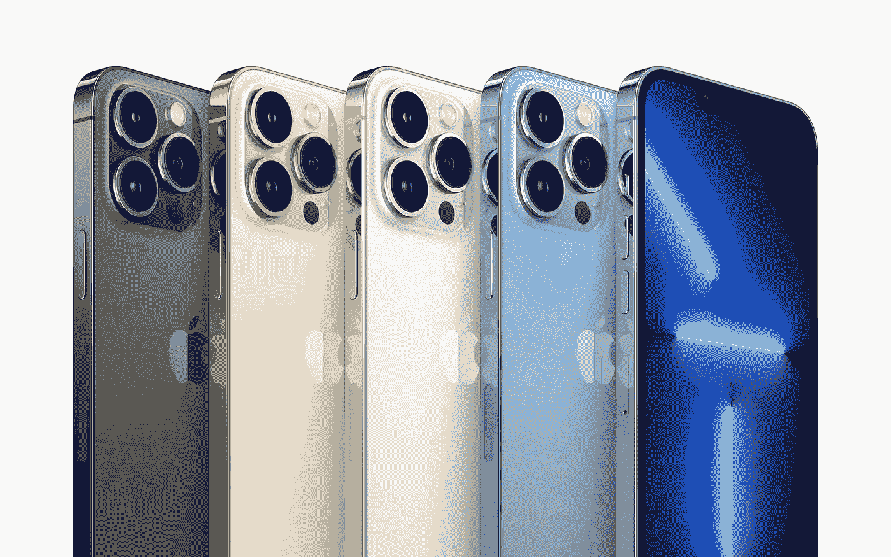

# 升级，不再“升级”

> 原文：<https://medium.com/geekculture/upgrade-do-not-upgrade-anymore-c51435dbda30?source=collection_archive---------22----------------------->

## 2021 年似乎是犹豫不决的一年，我们都不妨喘口气

The iPhone 13 is impressive on paper, but one would have to look really hard to find something most people will ask of it that an iPhone 12, 11 or 10 would not offer in the context of mainstream, everyday use. (Image: Apple)

当然，归咎于新冠肺炎冠状病毒太容易了:在 2020 年春天的几个星期内，硬件和软件的开发变得相当困难，而且像，哦，一个全球性的疫情往往会破坏…