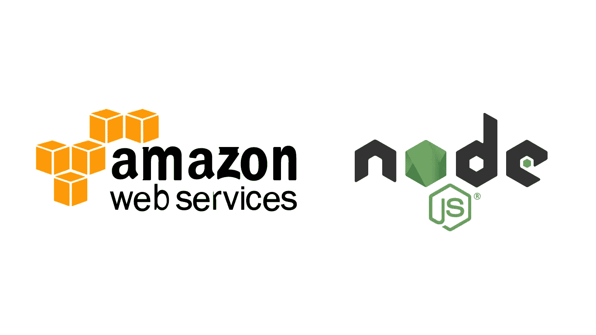
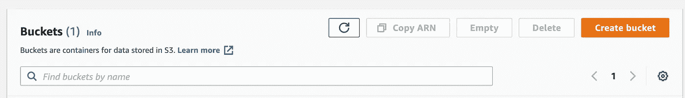
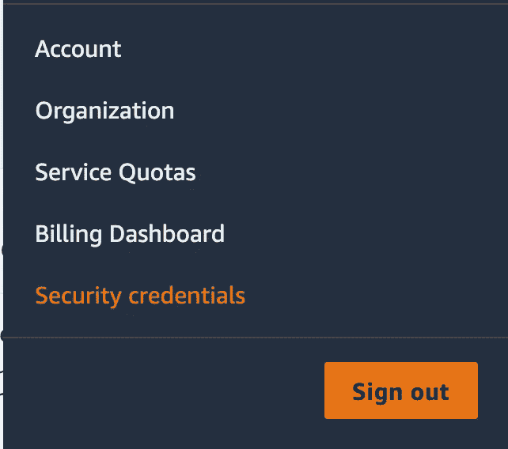
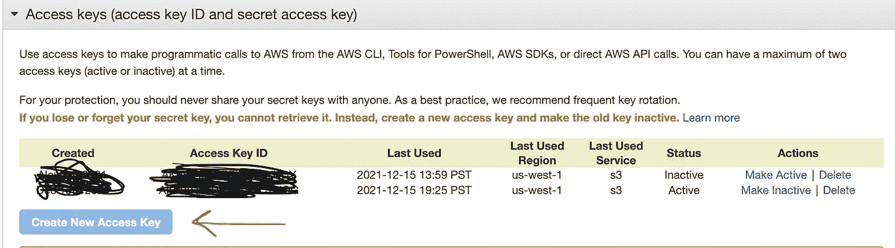

# 使用节点上传、压缩和删除 AWS S3 存储桶中的图像。JS +快递

> 原文：<https://medium.com/geekculture/upload-compress-and-delete-images-in-a-aws-s3-bucket-with-node-js-express-ba29d288b129?source=collection_archive---------1----------------------->

# 本文的目标是

到本文结束时，您将能够创建一个简单的 API 路径来获取图像并将该图像上传到您自己的 AWS S3 桶，然后使用这些图像做一些令人惊奇的事情！

# 首先，一些非代码设置

首先，我们需要创建一个 S3 桶，并制作一些安全凭证，以便能够通过代码与桶进行交互。

## 1.创建您的 S3 桶

*   登录你的 AWS 账户([没有？](https://www.googleadservices.com/pagead/aclk?sa=L&ai=DChcSEwj9oJDT6Yf1AhV9Pa0GHdJ1AJwYABABGgJwdg&ae=2&ohost=www.google.com&cid=CAESQeD2EBzlIbkZbi2WvLeDrpsOwWd2Y8VSyTE2E_JLAuIV7NYP5EvhKF2JcanBIcuAyIqB92Cck7cqAeCSh92mZRnL&sig=AOD64_303eWYo2tN1xHdlx8xPnWQoAhPLw&q&nis=1&adurl&ved=2ahUKEwj8tIjT6Yf1AhWROn0KHW2uDZwQ0Qx6BAgCEAE))然后转到 s3 服务(通过下拉菜单或搜索)。
*   然后，我们需要单击橙色的“创建存储桶”按钮。

*   之后，您将输入您的存储桶名称以及安全设置。选择最适合您应用需求的产品！

## 2.在 AWS 上生成访问密钥

*   在右上角，您将看到您的 AWS 用户名。单击此处，应该会出现一个下拉列表，一旦它单击“安全凭证”

*   然后，您需要单击“访问密钥”下拉菜单，并单击“创建新的访问密钥”

*   还有维奥拉。请将它们写在某个地方，我们将在下一步的代码中用到它们。(应该不言而喻，不分享这些！)

# 我们的服务器代码

为了简单和可读性，代码将全部放在一个文件中。所有代码都有注释，如果你需要一个如何在客户端获取文件的起点，[**这里有一篇我在 React.JS 中写的相关文章**](/geekculture/how-to-upload-and-preview-images-in-react-js-4e22a903f3db)

一如既往，我希望我的文章是一个切入点。如果有些事情令人困惑，或者你想知道为什么我以一种特殊的方式做了一些事情，那么就去玩代码，看一些文档，享受乐趣吧！