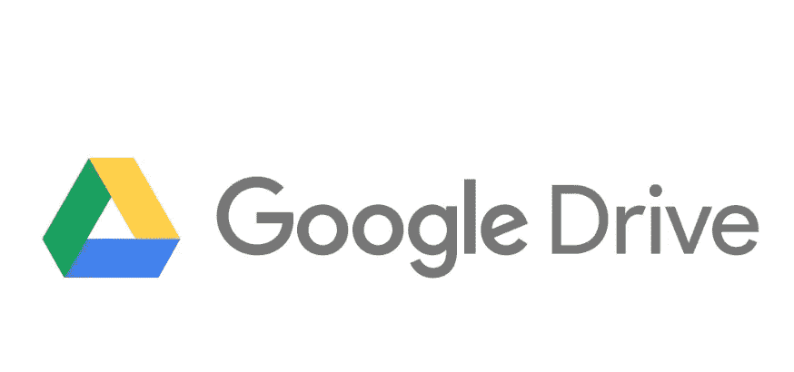
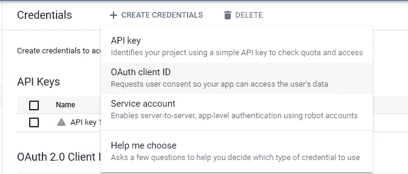
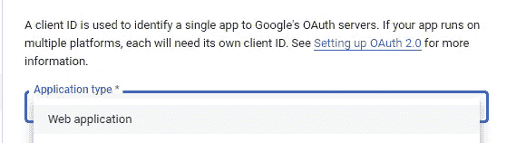
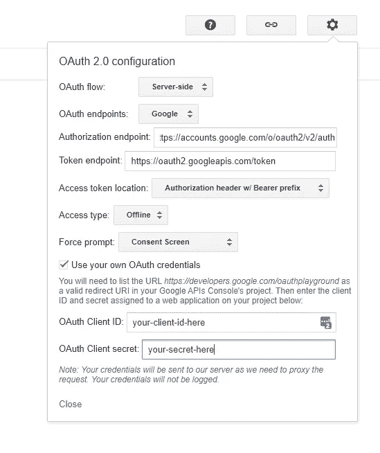
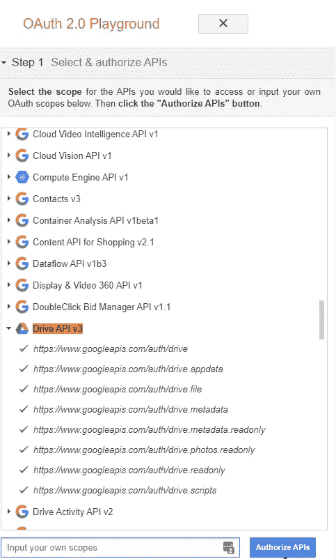
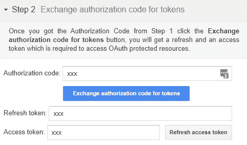

# 用 C#将文件上传到 Google Drive

> 原文：<https://medium.com/geekculture/upload-files-to-google-drive-with-c-c32d5c8a7abc?source=collection_archive---------0----------------------->



在本指南中，我们将逐步解释如何使用 C #编程语言制作一个使用 Google Drive API 上传、删除和列出文件的控制台应用程序。如果您想在 web 应用程序中使用这些示例，可以很容易地扩展它们。

# 1.生成访问令牌。

首先，我们需要创建一些新的凭证。在谷歌云平台上必须有一个账户和一个项目。导航到[https://console.cloud.google.com/apis/credentials](https://console.cloud.google.com/apis/credentials)，选择您的项目并点击**创建凭证**。确保它属于类型 **OAuth 客户端 ID** 。



[https://console.cloud.google.com/apis/credentials](https://console.cloud.google.com/apis/credentials)

接下来，我们选择 **Web 应用程序**并包含[https://developers.google.com/oauthplayground](https://developers.google.com/oauthplayground)作为授权地址。然后按下**创建**按钮。



创建完成后，保存**客户端 ID** 和**客户端密码**。我们保存这些值以备后用，这很重要。

我们已经拥有了生成访问令牌所需的一切。推荐你用 [OAuth 2.0 游乐场](https://developers.google.com/oauthplayground)。

👉[https://developers.google.com/oauthplayground](https://developers.google.com/oauthplayground/)

如果您使用此工具，请在右上角查找设置图标，并选择以下选项:



然后选择**步骤 1** ，点击**授权 API**。在这里，我们使用我们的 Google 帐户进行身份验证，并使用我们之前请求的权限确认访问。



然后，在**步骤 2** 中，我们单击**将授权码兑换为令牌**按钮。就这样，我们将从我们的应用程序中获得连接 Google Drive 所需的访问令牌。



# 2.准备项目。

创建一个新的 C#控制台应用程序项目，并安装 **Google。API . drive . v3**库。

```
$ Install-Package Google.Apis.Drive.v3
or
$ dotnet add package Google.Apis.Drive.v3
```

# 3.初始化驱动服务。

是时候使用我们在前面的步骤中获得的访问令牌、客户端 ID 和客户端密码了。

# 4.创建文件夹。

有了 *DriveService* ，我们可以轻松地与 Google Drive API 进行交互。让我们看一个如何创建文件夹的例子。

# 5.上传文件。

# 6.删除文件。

# 7.列出文件夹中的文件。

在本例中，我们将列出文件夹中包含的文件，但不包括文件夹。我们可以在第 6 行看到这个查询。此外，我们可以在响应中请求额外的信息。第 7 行的例子。

# 下一步是什么

有关更多信息和示例，您可以在此处阅读官方文档:

👉[https://developers . Google . com/drive/API/v3/quick start/dot net](https://developers.google.com/drive/api/v3/quickstart/dotnet)。

我希望这篇关于如何与 Google Drive API 交互的分步指南对您有所帮助。非常感谢您阅读❤️.这篇文章